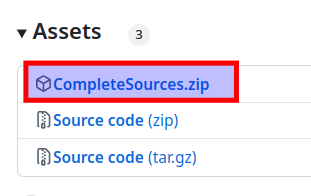

[](https://gitter.im/open-logic/general?utm_source=badge&utm_medium=badge&utm_content=badge)

# Open Logic - A VHDL Standard Library

_Open Logic_ aims to be for HDL projects what _stdlib_ is for C/C++ projects.

_Open Logic_ implements commonly used components in a reusable and vendor/tool-independent way and provide them under a
permissive open source license (LGPL modified for FPGA usage, see [License.txt](./License.txt)), so the code can be used
in commercial projects.

_Open Logic_ is written in VHDL-2008 but can also be used from System Verilog easily.

Browse the [**Entity List**](./doc/EntityList.md) to see what is available.

An [Introduction Video](https://www.youtube.com/watch?v=hh3bS1SiIQs&t=6s) to open logic can be found on the
[Open Logic YouTube channel](https://www.youtube.com/@OpenLogicFPGA). If you are new to Open Logic, this is a good
starting point.

Maintainer: [obruendl](oliver.bruendler@gmx.ch)

If you appreciate the project, consider **supporting it with a small donation**. If you're part of a commercial company
that prefers purchasing services over making voluntary donations, that's no problem. You can also **purchase offerings**
such as **workshops** and **priority support**. Click the button below to visit the sponsors page.

[](https://github.com/sponsors/open-logic)

## Get It

_Open Logic_ includes the submodules below. To make sure submodule sources are included in _Open Logic_, get it
according to the instructions below.

Submodules used:

- [en_cl_fix](https://github.com/enclustra/en_cl_fix) - MIT License

### GIT Clone

To include submodules, it is important to use the _--recursive_ switch:

```shell
git clone --recurse-submodules https://github.com/open-logic/open-logic.git
```

### Download Archive

When downloading the archive from the release page, make sure you download _CompleteSources.zip_ and not one of
the auto-generated archives (in those, submodules are missing):



### FuseSoC

When using FuseSoC (see [HowTo](./doc/HowTo.md)), all dependencies are resolved automatically and not special actions
are required.

## Structure

_Open Logic_ is split into the following areas. You might use all of them or only the ones you need.

- [base](./doc/EntityList.md#base) - basic logic to be used for device internal logic
- [axi](./doc/EntityList.md#axi)  - any components related to AXI4/AXI4-Lite/AXI4-Stream interfaces
  - requires: _base_
- [intf](./doc/EntityList.md#intf)  - any logic related to device external interfaces
  - requires: _base_
- [fix](./doc/EntityList.md#FIX)  - fixed point mathematics incl. bit-true models and co-simulation support
  - requires: _base_ and _en_cl_fix_ ( [./3rdParty/en_cl_fix](./3rdParty/en_cl_fix))

It's suggested that you compile ALL files of the areas you need (plus their dependencies) into one VHDL library. You are
free to choose any library name and you are also free to use the same single library for _Open Logic_ files and
user-code.

## Detailed Documentation

- [Entity List](./doc/EntityList.md)
  - Detailed list of all entities available
  - Includes links to the documentation of each entity
- [Coding Conventions](./doc/Conventions.md)
  - Interesting for the ones to contribute
- [How To...](./doc/HowTo.md)
  - FAQ for all users
  - **It's strongly suggested that every user quickly reads through this**
- Tutorials
  - [Vivado Tutorial](./doc/tutorials/VivadoTutorial.md) - for VHDL and System Verilog
  - [Quartus Tutorial](./doc/tutorials/QuartusTutorial.md) - for VHDL and System Verilog
  - [Efinity Tutorial](./doc/tutorials/EfinityTutorial.md) - for VHDL and System Verilog
  - [Questa Tutorial](./doc/tutorials/QuestasimTutorial.md) - for VHDL and System Verilog
  - [Libero Tutorial](./doc/tutorials/LiberoTutorial.md) - for VHDL and System Verilog
  - [Gowin Tutorial](./doc/tutorials/GowinTutorial.md) - for VHDL and System Verilog
  - [Fixed Point Mathematics Tutorial](./doc/tutorials/OloFixTutorial.md)
    - Fixed-point bit-true modeling in Python
    - _Open Logic_ based fixed-point implementation in HDL
    - Python / VHDL / Verilog co-simulation
- [Instructions for Contributors](./Contributing.md)

## Project Philosophy

_Open Logic_ is not the first open source VHDL library - so you might ask yourself what makes it different and why you
should use this one. The project follows the philosophy below - the decision whether this matches what you are looking
for is yours.

### Trustable Code

Open source HDL projects exist but they are by far not as popular as open source software projects. One main problem is
that there is little trust in open source HDL code. In some cases code quality is not great and in general RTL designers
probably are less used to relying on code from others.

_Open Logic_ aims to provide code that can be trusted - and to provide measures that would indicate if this is the case
for every individual piece of code in the library. The following measures are implemented:

1. Every entity comes with a testbench.
2. The project comes with a CI workflow, which regularly runs all simulations. The badge on the very top of this page
3. indicates if there is a problem. As long as it is green - you know that all testbenches pass. <br>
   
4. Indicators for open issues on every entity. In the documentation of every piece of code, you can find a badge, which
   informs you about the number of issues related to this piece of code and if there are _potential bugs_ (orange color)
   or even _confirmed bugs_ (red color).<br>
   
   
   
5. Indicator for code coverage on every entity. In the documentation of every piece of code, you can find badges stating
   the code coverage. <br>
   
   <br>
   Additionally badges in this readme state when and for which git-commit coverage was last analyzed. <br>
   
   

Note that a non-zero number of issues not necessarily is a bad sign - issues include things like feature requests.
But probably you at least want to check the issues in detail if the color of the _issues badge_ (3) is not green.

### Ease of Use

This goal is self explaining. It is implemented as follows:

- Ease of use instead of feature-creep. Only the logic with a high probability for being used in many places shall go
  into the library. Each block shall only solve one core topic - whatever can be realized externally is not included to
  avoid needless complexity and crowded configuration options.
- Users do not have to care about generics or ports you do not use. Any optional configuration options or ports come
  with a default value - if you do not have a specific need, you can just omit those and a common default value is used.
- One entity for one thing. Many open source HDL libraries provide multiple entities for the same thing with different
  implementations. For users it often is difficult to sort out which one to use. _Open Logic_ instead provides only one
  entity with optional generics to achieve the same thing - unless users do want to optimize details, they don't have to
  care about those details.
- All blocks come with proper markdown documentation. You can easily look up if there is a component that fits your
  needs, how it is implemented and how you can use it.

### Pure VHDL

_Open Logic_ does not rely on vendor specific code (e.g. primitives) and can be compiled to every FPGA. Code is written
with different technologies in mind (e.g. using read-before-write or write-before-read blockRAM, containing synthesis
attributes for different tools) and hence works efficiently on all devices available and is known to be portable to
future device families. Portability to new device families in general does not need any update on the _Open Logic_
library.

Thanks to the _pure VHDL_ philosophy, _Open Logic_ simulates fast and is fully supported by the open-source GHDL
simulator. This is crucial for an open-source project because it allows participating on the development at zero
tool-cost.

## How to Contribute

See [Contributing](./Contributing.md).

## Origin of the Project

The _Open Logic_ project is based on the
[psi_common](https://github.com/paulscherrerinstitute/psi_common/tree/57aa85217e727b5fbddf8f000b270ab77602b03e)
library provided by Paul Scherrer Institute. I would like to give credits to the authors of this library, especially
Benoit Stef, who maintained the project after I left PSI.

I decided to create _Open Logic_ instead of more actively working on the PSI libraries for the following reasons:

- I want to build a true community project which is not owned by one institution (and clearly labeled as such).
- I want full freedom of applying non-backwards compatible changes where required to improve quality.
- I want full freedom to revise any conceptual decisions I do not (anymore) agree with.

For users switching from _psi_common_ to _Open Logic_ there is a [Porting Guide](./doc/PsiCommonPorting.md), which
describes the correspondences between the two libraries.

### Other HDL Standard Libraries

The aim of Open Logic is to simplify designers life - not to rule the world. If you do not find certain functionality in
Open Logic or you are looking for an alternative HDL standard library for other reasons, you might want to check out the
libraries below. **That they are listed here does not imply that they were tested nor does it mean anything regarding
code quality, the presence of documentation, state of maintenance or the degree of testing**. The list is meant as a
summary of alternative libraries that was reported by users and in replies to Open Logic related social media posts.

- [hdl-modules](https://github.com/hdl-modules/hdl-modules)
- [Pile of Cores](https://github.com/VLSI-EDA/PoC)
- [Basejump STL](https://github.com/bespoke-silicon-group/basejump_stl)
- [pulp-platform common-cells](https://github.com/pulp-platform/common_cells)
- [FPGA Design Elements](https://github.com/laforest/FPGADesignElements)
- [SURF](https://github.com/slaclab/surf)
- [PSI Libraries](https://github.com/paulscherrerinstitute/psi_fpga_all)
- [Colibri](https://gitlab.cern.ch/colibri/colibri)

If you are interested in my opinion what the pros and cons of those libraries are compared to Open Logic, contact me
directly: [obruendl](oliver.bruendler@gmx.ch).

If you are aware of any oder HDL standard libraries, please let me know as well so I can extend the list.
