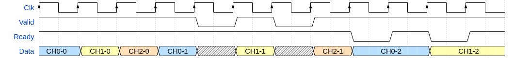
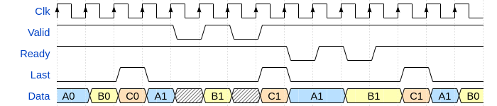
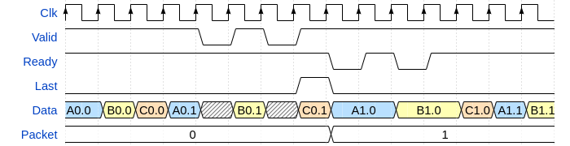

[Back to **Readme**](../Readme.md)

# Open Logic - Coding Conventions

## Naming Conventions

### Entities

All entities are named in the form *olo\_\<area\>\_\<function\>* where *area* is according to the definition in this [Readme.md](../Readme.md) and *function* describes the functionality of the entity.

Example: An asynchronous FIFO (*fifo_async*) in the *base* area would be named *olo_base_fifo_async*.

The naming convention is important to avoid name-clashes when compiling many *Open Logic* files into the same VHDL library (where also user-code may be compiled into).

### Ports

Ports are named in the form *\<interface\>_\<signal\>* .

Usually signals are grouped into interfaces. For example a block may have an AXI4-Stream input interface named *Param* in this case the AXI4-Stream signals *TDATA*, *TVALID* and *TREADY* would be named *Param_TData*, *Param_TValid* and *Param_Tready*.

Ports do not have any *_i* or *_o* suffixes to define their direction. the direction is visible from the entity declaration (keywords *in* and *out*). 

### Functions

Functions shall use *lowerCamelCase*.

### Constants

Constants shall have *_c* suffixes.

### Generics

Generics shall have *_g* suffixes.

### Versions

[Semantic Versioning](https://semver.org/) is used for naming of releases from 1.0.0 onwards.

0.x.y relealses are considered early development and do not increase major version number in case of breaking backward compatibility.

## Coding Convention

### White Spaces

Indentation is done using four whitespaces per level.

## Functional Conventions

### AXI4-Stream Handshaking Signals

Handshaking signals follow the de-facto industry standard AXI4-Stream. You will find the signals *Valid* (TVALID) and *Ready* (TREADY) wherever handshaking is required. However, data-signals (TDATA) might be named differently depending on the functionality of a given component.

### Reset

All resets are synchronous and high-active. 

Synchronous resets were chosen because depending on the use-case, the reset signal may be controlled from ordinary logic (which may contain glitches). For example the reset signal of a FIFO may be used during normal operation to flush the FIFO.

If you need active low resets, you you must invert the reset (to create a high-active reset) external to *Open Logic* entities.

Only the registers containing state shall be reset. Pipeline registers shall not be reset to keep reset fanout low.

Reset shall be implemented as override at the end of the process, not using an *if* at the beginning of the process. See example below:

How reset **SHALL** be implemented:

```
good : process(Clk)
begin
    if rising_edge(Clk) then
        A <= x; 
        B <= y;
        if Rst = '1' then
            A <= '0';
        end if;
    end if;
end;
```

In this implementation, *A* results in a D-FF with reset, B results in a D-FF without reset. Hence reset fanout is low.

How reset shall **NOT** be implemented:

```
bad : procesS(Clk)
begin
    if rising_edge(Clk) then
        if Rst = '1' then
            A <= '0';
        else
            A <= x;
            B <= y;
        end if;
    end if;
end if;
```

In this implementation, *A* results in a D-FF with reset and *B* results in a D-FF with *Rst* as clock enable. Hence reset fanout is needlessly high.

### Default Values

All optional generics and ports have default values. If a user does not need optional ports or generics, he does not have to care about them and find out what would be an appropriate default value.

### TDM (Time Division Multiplexing)

Rules:

-	If multiple signals are transferred TDM (time-division-multiplexed) over the same interface and all signals have the same sample rate, no additional channel indicator is implemented and looping through the channels is implicit (e.g. for a three channel link, samples are transferred in the channel order 0-1-2-0-1-2-…).



The entities blocks can be used to convert between parallel channel handling and TDM:

- [olo_base_wconv_xn2n](./base/olo_base_wconv_xn2n.md) - Parallel to TDM
- [olo_base_wconv_n2xn](./base/olo_base_wconv_n2xn.md) - TMD to Parallel

TDM signals can be difficult to debug because the channel mapping is hard to identify at runtime. It usually is a good idea to mark the last channel for each sample by *Last* as shown in the figure below. This way, it is easily known which data-beat belongs to which channel.



For packetized data, the last channel of the last sample of a packet is marked by *Last*. As a result, the channel mapping can be reconstructed easily at packet boundaries.



## Testbenching

### VUnit

The [VUnit](https://vunit.github.io/) verification framework is used to verify *Open Logic*. All testbenches shall be VUnit testbenches and different test-cases shall be properly separated.

VUnit was chosen because it allows to easily use both, commercial tools like *Questasim* and the open source *GHDL* simulator. Additionally VUnit allows to write well structures test-benches and simplifies regression testing a lot.

### Coverage

A code coverage of 100% is the goal. For code with generics, a representable set of combinations of generics shall be simulated.


