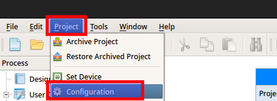
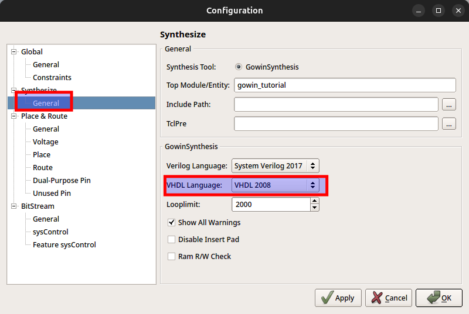
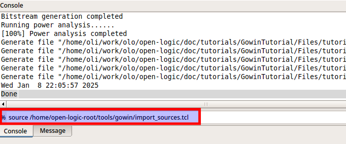
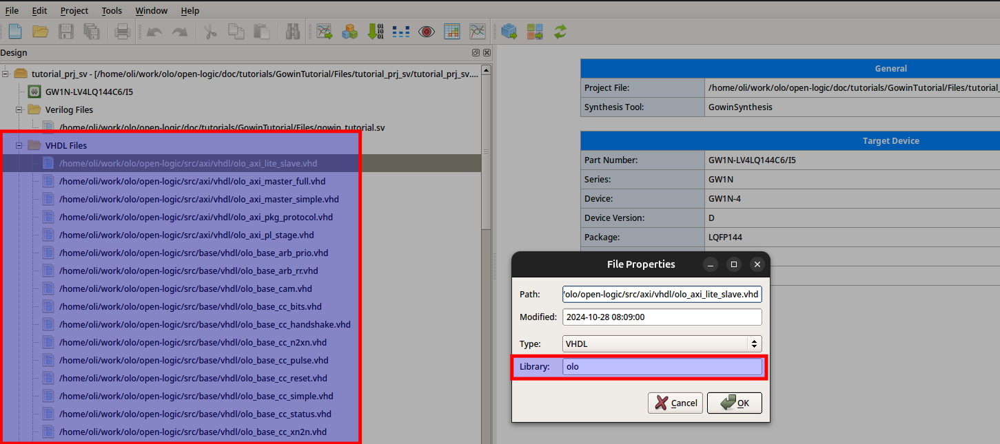
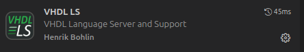

[Back to **Readme**](../Readme.md)

# Open Logic - How To

## Able of Content

AKA Table of Content

- Tool Integration Related
  - [Use Open Logic in a Gowin Project](#use-open-logic-in-a-gowin-project)
  - [Use Open Logic in a Microchip Libero Project](#use-open-logic-in-a-microchip-libero-project)
  - [Use Open Logic in a Questasim Simulation](#use-open-logic-in-a-questasim-simulation)
  - [Use Open Logic in a Efinix Efinity Project](#use-open-logic-in-a-efinix-efinity-project)
  - [Use Open Logic in a AMD Vivado Project](#use-open-logic-in-a-amd-vivado-project)
  - [Use Open Logic in a altera Quartus Project](#use-open-logic-in-a-altera-quartus-project)
  - [Use Open Logic through FuseSoC](#use-open-logic-through-fusesoc)
- Contribution Related
  - [Use the Linter](#use-the-linter)
  - [Use VHDL Language Server](#use-vhdl-language-server)
  - [Run Simulations](#run-simulations)
  - [Analyze Coverage](#analyze-coverage)
  - [Update Badges](#update-badges)

## Use Open Logic in a Gowin Project

There is a script to import all _Open Logic_ sources into a Gowin project.

**Note:** The script does not setup automatic constraints because Gowin does not support scoped constraints (in
contrast to the AMD Vivado tools). For Gowin all constraints must be added manually.

To run the script, follow the steps below:

1. Create a project in Gowin (if it does not yet exist)
2. Set the VHDL language standard to _VHDL2008_.
   Gowin does not recognize the _ieee.math_real_ package for VHDL1993 - which renders many components of Open Logic
   useless.<br>
   <br><br>
   
3. Execute the command `source <open-logic-root>/tools/gowin/import_sources.tcl`
   Replace `<open-logic-root>` by the path of your _Open Logic_ working copy.<br>
   In case you do not need all open-logic files and you don't want to clutter the project, just manually remove the
   files you do not need.<br>
   

That's it. Nothing more.

- All _Open Logic_ sources are configured to be compiled into the library _olo_
  

Because Gowin does not support scoped constraints, **NO** constraints are imported. They have to be created
manually - more information can be found in the documentation of individual _Open Logic_ entities which require
constraints.

## Use Open Logic in a Microchip Libero Project

There is a script to import all _Open Logic_ sources into a Libero project.

**Note:** The script does not setup automatic constraints because Libero does not support scoped constraints (in
contrast to the AMD Vivado tools). For Efinity all constraints must be added manually.

To run the script, follow the steps below:

1. Create a project in Libero (if it does not yet exist)
2. Use the menu entry _Project > Execute script_
   
3. Select the script _\<open-logic-root\>/tools/libero/import_sources.tcl_ and press _Run_.<br>
   **For VHDL, no arguments are required**, which leads to all files being compiled into the default Open Logic library
   _olo_. If you wish to compile them into another library, pass the argument `lib=<library-name>`<br>
   **For Verilog, pass the argument `lib=work`**. When instantiating VHDL entities from Verilog, SynplifyPro only
   searches for them in the library _work_.<br>
   
4. In the _Files_ tab you can now see all Open Logic source files showing up. Links are made to the files in their
   original location, they are not copied into the project. All sources are imported into the library selected (see
   point 3, default is _olo_) and are available to be used.<br>
   In case you do not need all open-logic files and you don't want to clutter the project, just manually remove the
   filesp you do not need.

## Use Open Logic in a Questasim Simulation

There is a script to compile all _Open Logic_ sources into a library _olo_. To run the script, follow the steps below:

1. Open Questasim
2. In the Questasim TCL shell, execute the command `source <open-logic-root>/tools/questa/vcom_sources.tcl`

That's it. Nothing more.

- All _Open Logic_ sources are configured to be compiled into the library _olo_
  

## Use Open Logic in a Efinix Efinity Project

There is a script to import all _Open Logic_ sources into a Efinity project.

**Note:** The script does not setup automatic constraints because Efinity does not support scoped constraints (in
contrast to the AMD Vivado tools). For Efinity all constraints must be added manually.

To run the script, follow the steps below:

1. Create a project in Efinity (if it does not yet exist)
2. Close the project in Efinity. Remember where it is stored on the file-system.
3. Open a terminal window and navigate to _\<open-logic-root\>/tools/efinity_
4. Run the command `python3 ./import_sources.py --project <path-to-project-xml> --library <library-name>`<br>
   Replace `<path-to-project-xml>` by the path to the project file (to the _project.xml_ file,
   NOT the _project.peri.xml_).<br>
   Replace `<library-name>` by the library to compile open-logic sources into (_olo_ for VHDL, _default_ for Verilog)
5. Open the project in Efinity again. You should now see all _Open Logic_ sources being added.<br>
   In case you do not need all open-logic files and you don't want to clutter the project, just manually remove the
   files you do not need.

Two more notes:

- For the usage of _Open Logic_ from Verilog, the _default_ library has to be chosen because Efinity does require the
  top-entity to be in the _default_ library and for Verilog Efinity does only allow using VHDL entities in the same
  library as the module instantiating them. That's why using VHDL entities in any other library (e.g. named _olo_)
  is not possible.
- You can get help regarding the _import_sources.py_ script by calling `python3 ./import_sources.py -h`
- The _import_sources.py_ script does create a backup of the project file, so you can restore it if something goes
  wrong. The backup file is stored under _\<name\>.xml.backup_.

## Use Open Logic in a AMD Vivado Project

There is a script to import all _Open Logic_ sources into a Vivado project and apply all automatic constraints. To run
the script, follow the steps below:

1. Open Vivado and create a project (if not existing yet)
2. Open the TCL shell in Vivado
3. Execute the command `source <open-logic-root>/tools/vivado/import_sources.tcl`
   Replace `<open-logic-root>` by the path of your _Open Logic_ working copy.<br>
   In case you do not need all open-logic files and you don't want to clutter the project, just manually remove the
   files you do not need.

That's it. Nothing more.

- All _Open Logic_ sources are configured to be compiled into the library _olo_
  
- A new constraints file for importing all scoped constraints is added to the Vivado project by the script.
  
  **Note:** Scoped constraints are always imported but only work for usage from VHDL. For Verilog usage, manual
  constraints are required. Refer to the documentation of entities that require constraints (clock-crossings,
  interfaces, etc.)

  

## Use Open Logic in a altera Quartus Project

There is a script to import all _Open Logic_ sources into a Quartus project.

**Note:** The script does not setup automatic constraints because Quartus does not support scoped constraints (in
contrast to the AMD Vivado tools). For Quartus all constraints must be added manually.

To run the script, follow the steps below:

1. Open Quartus and create a project (if not existing yet)
2. Open the TCL shell in Quartus
   
3. Execute the command `source <open-logic-root>/tools/quartus/import_sources.tcl`
   Replace `<open-logic-root>` by the path of your _Open Logic_ working copy.<br>
   In case you do not need all open-logic files and you don't want to clutter the project, just manually remove the
   files you do not need.

That's it. Nothing more.

- All _Open Logic_ sources are configured to be compiled into the library _olo_
  

Because Quartus does not support scoped constraints, **NO** constraints are imported. They have to be created
manually - more information can be found in the documentation of individual _Open Logic_ entities which require
constraints.

## Use Open Logic through FuseSoC

[FuseSoC](https://github.com/olofk/fusesoc) is a package manager and build system for HDL projects. Open Logic supports
fuse-soc. To use Open Logic through fusesoc, just add open logic as a library:

```shell
fusesoc library add open-logic https://github.com/open-logic/open-logic
```

Open Logic is also published into the [FuseSoC standard core library](https://github.com/fusesoc/fusesoc-cores) hence
you can also use Open Logic by adding the standard core library:

```shell
fusesoc library add fusesoc-cores https://github.com/fusesoc/fusesoc-cores
```

Like for all other tool integrations, Open Logic entities are compiled into the library _olo_ and can be
instantiated using e.g. `i_fifo : entity olo.olo_base_fifo_sync`.

**Note:** Sometimes there is some lag in pull-requests to the _fusesoc-cores_ repo and as a result the Open Logic
version available through _fusesoc-cores_ may be a few releases behind. Add Open Logic directly (see above) if you want
to be sure to use the latest release.

You should now get one package listed for every area in Open Logic. You can use the areas
independently (dependencies are modeled in FuseSoC correctly and resolved automatically). You also see the tutorials
being available and buildable through FuseSoC.

```shell
user$ fusesoc core list

Available cores:

Core                                             Cache status  Description
================================================================================
open-logic:open-logic-dev:axi:3.0.2             :      local : local files (release plus WIP); AXI related modules ...
open-logic:open-logic-dev:base:3.0.2            :      local : local files (release plus WIP); Basic Circuitry ...
open-logic:open-logic-dev:intf:3.0.2            :      local : local files (release plus WIP); Interfaces ...
open-logic:open-logic:axi:3.0.2                 :      empty : stable release (downloaded from GitHub); AXI related ...
open-logic:open-logic:base:3.0.2                : downloaded : stable release (downloaded from GitHub); Basic  ...
open-logic:open-logic:intf:3.0.2                : downloaded : stable release (downloaded from GitHub); Interfaces ...
open-logic:tutorials-dev:quartus_tutorial:3.0.2 :      local : local files (release plus WIP); quartus tutorial ...
open-logic:tutorials-dev:vivado_tutorial:3.0.2  :      local : local files (release plus WIP); vivado tutorial ...
open-logic:tutorials:quartus_tutorial:3.0.2     :      empty : stable release (downloaded from GitHub); quartus ...
open-logic:tutorials:vivado_tutorial:3.0.2      : downloaded : stable release (downloaded from GitHub); vivado ...

```

Packages are provided in two libraries:

- Use **open-logic:open-logic** for **downloading the stable release from GitHub**
- Use **open-logic:open-logic-dev** for using the **local files** (the release number mentioned plus all work in
  progress which is not released)
  - This option also allows using content of a feature branch that is checked out.

The commands listed at the very beginning of the section will add the latest release of Open Logic. However, this is not
always exactly what is wanted. Therefore a few alternative scenarios are described below. The `--sync_version` switch
allows selecting the exact version to add.

### Adding a Specific Release

In cases where a project uses a specific release of Open Logic, exactly this version shall be added and not the latest
one. This especially is true in cases where the latest release contains non-backward compatible changes (major version
number increments). Adding a specific version of Open Logic can be achieved be the command below (the example adds
version 2.3.0):

```shell
fusesoc library add --sync-version 2.3.0 open-logic https://github.com/open-logic/open-logic
```

For releases, _open-logic_ and _open-logic-dev_ contain the same files. Normally using **open-logic** is most safe and
therefore recommended.

### Using Newest (not yet Released) Features

In case you want to use features which are not released yet, you can add the corresponding branch. A common case is to
use the _develop_ branch, on which features are integrated prior to release. This can be achieved by below command:

```shell
fusesoc library add --sync-version develop open-logic https://github.com/open-logic/open-logic
```

In this case, the local files - **open-logic-dev** must be used - because this branch is not a stable release.

### Adding Multiple Versions

If you should want to add multiple versions of Open Logic to FuseSoC for any reasons, this can be achieved by using
different names:

```shell
fusesoc library add --sync-version 3.0.1 open-logic-3 https://github.com/open-logic/open-logic
fusesoc library add --sync-version 2.3.0 open-logic-2 https://github.com/open-logic/open-logic
```

### Open Logic Modifications

There are cases where you want to use a modified version of Open Logic through FuseSoC. One example is when actively
working on Open Logic and adding new features. Another case might be if specific patches shall be added to Open Logic,

This can be achieved by manually cloning Open Logic and adding the local copy to FuseSoC. In below example, it is
assumed that a new feature will be implemented on Open Logic on a feature branch.

```shell
git clone https://github.com/open-logic/open-logic open-logic-work
cd open-logic-work
git checkout -b feature/some-new-feature
cd ..
fusesoc library add open-logic open-logic-work
```

In this case, the local files - **open-logic-dev** must be used. It is explicitly required to use the local files.
Downloading a release from GitHub would be exactly what is NOT wanted in this scenario.

## VSCode Integration

Integration of the [Linter](#integrate-linter-with-vscode) and [Simulations](#integrate-simulations-with-vscode) with
VSCode is described in the corresponding sections.

Additionally a configuration [toml](../vhdl_ls.toml) to use the [VHDL-LS](https://github.com/VHDL-LS/rust_hdl_vscode)
extension is provided. This extensions allows live syntax checking and things like "go to declaration". To use
it, simply install the _VHDL-LS_ extension and open the open-logic folder in VSCode. _VHDL-LS_ will automatically
do its job.

## Use the Linter

### Introduction

_Open Logic_ makes use of the [vhdl-style-guide](https://github.com/jeremiah-c-leary/vhdl-style-guide) linter
(short VSG).

VSG can be installed as python package easily:

```shell
pip3 install vsg==3.27
```

**Note:** It is important to install the exactly correct version. Configuration files tend to not work with newer or
older versions.

All VHDL files are linted (production code and test benches).

### Run Linter on Specific File

To run VSG with the correct configuration on a VHDL file the following command can be used:

```shell
vsg -c <root>/lint/config/vsg_config.yml -f <path-to-file>
```

For VUnit verification components a slightly different style applies (see [Conventions](./Conventions.md)). This is
covered by passing an additional config file:

```shell
vsg -c <root>/lint/config/vsg_config.yml <root>/lint/config/vsg_config_overlay_vc.yml -f <path-to-file>
```

Any errors or warnings found will be reported:


VSG is also automatically executed in the CI pipeline and pull requests are only accepted if it succeeds without errors
or warnings.

### Run Linter on All Files

For running VSG on all files, a python script is provided. It can be executed as follows:

```shell
python3 <root>/lint/script/script.py
```

This script automatically applies the correct rules to all files.

By default the script runs linting on all files at once, which is good for CI. For development purposes often it is
tedious to scroll through the long report. Therefore a debug option is provided, which runs VSG file by file and stops
on the first error, which makes errors appearing on the bottom of the log.

```shell
python3 <root>/lint/script/script.py --debug
```

### Integrate Linter with VSCode

A custom task configuration for running the linter on production code VHDL files is provided in
_\<root\>/.vscode/tasks.json_ and loaded automatically if you open the root folder of Open Logic in VSCode.

You can then run the linter for the currently open file by doing: _Ctrl+Shift+P > Tasks: Run Task > Run VSG Lint_

For running VSG on all files, use the _Run VSG Lint - All Files_ variant of the task.

For verification components (with slightly different coding conventions, see [Conventions](./Conventions.md)) use the
_Run VSG Lint - VC_ command.

The results will be properly displayed in the problems tab and you can navigate to the corresponding code line by
clicking on the specific problem.


You can also map this as keyboard shortcut by editing your local _keybindings.json_ file in VSCode. The example below
will map it the Ctrl+Alt+L:

```json
    {
        "key": "ctrl+alt+l",
        "command": "workbench.action.tasks.runTask",
        "args": "Run VSG Lint"
    }
```

## Use VHDL Language Server

VHDL Language Server (VHDL_LS) is a VSCode extension that adds code browsing features for VHDL. It does allow going to
definitions, finding all uses of an entity and many other features known from advanced IDEs.

To use it, install the _VHDL_LS_ extension in VSCode:



_VHDL_LS_ uses a TOML file for configuration (i.e. to know where to look for files). Because _Open Logic_ uses _VUnit_
and the location of _VUnit_ files is installation dependent, the TOML file matching the installation is generated by a
script. To generate it, run the following command from the _\<root\>/sim_ directory:

```sh
python3 run.py --vhdl_ls
```

Note, the command does NOT run simulations. it only creates the TOML file.

When opening the root folder of _Open Logic_ in VSCode, you should now be able to use VHDL_LS. You can try it out
by going to a VHDL file and for some signal in the architecture use _"Go to Declaration"_ from the right-click menu,
which is provided by VHDL_LS.

## Run Simulations

### Introduction

If you want to run simulations on your PC, you need the following prerequisites:

1. _Python 3_ must be installed
2. VUnit must be installed: `pip3 install vunit_hdl`
3. Simulator must be installed and added to the _PATH_ environment variable  
   1. Default choice: [GHDL](https://github.com/ghdl/ghdl/releases)
   2. Alternative (used for code-coverage analysis): Questasim.

### Run Simulations from Commandline

To run the simulations, navigate to _\<root\>/sim_ and execute the following command:

```shell
python3 run.py            # For GHDL
python3 run.py --modelsim # For Modelsim/QuestaSim
python3 run.py --nvc      # For NVC
```

Tipp: For faster runtimes, you may want to use multiple threads to execute simulations. This can be achieved by adding
the argument `-p 16` (16 is the number of threads, you may use any other number fitting your CPU).

You should now see an output indicating that all tests pass.


### Open Simulation Waveforms from Commandline

For debugging purposes, you may want to visualize a test-case in the GUI.

For GHDL and NVC simulations, the GTKWave tool must be installed (it's the GUI to GHDL/NVC). For Questasim a GUI is
included.

To show simulation results in the GUI, navigate to _\<root\>/sim_ and execute the following command:

```shell
python3 run.py <testcase> --gui
```

Where test-case is the exact test-case to display, e.g. "olo_tb.olo_base_cc_bits_tb.D=19-N=20.SimpleTransfer" in above
printscreen.

```shell
python3 run.py olo_tb.olo_base_cc_bits_tb.D=19-N=20.SimpleTransfer --gui
```

The simulator GUI will show up (the example is showing GTKWave - the GHDL/NVC GUI):


### Integrate Simulations with VSCode

A custom task configuration for running the simulations from VSCode is provided in _\<root\>/.vscode/tasks.json_ and
loaded automatically if you open the root folder of Open Logic in VSCode. Note that the configuration is written for
GHDL/GTKWave only.

You can then run the simulations for the currently open file by doing:
_Ctrl+Shift+P > Tasks: Run Task > VUnit - This File_.

If you want to open the waveforms for the simulations executed, use the _VUnit - This File (GUI)_ variant of the
command. Important notes to this command:

- You will be asked on the console to further narrow down which exact configuration(s) you want to run. Press enter to
  run all configurations related to the file selected - not that this could be quite many depending on the file.
- Multiple GTKWave windows are opened. One for every configuration VUnit runs (if there are multiple).
- The waveforms can be update by using the non-GUI command. If you configured your view in GTKWave, you can keep it
  open, re-run _VUnit - This File_ after changes and just update the waveform in GTKWave.

It also is possible to run all simulations in the project, using the _VUnit - All Files_ variant of the command. No GUI
option is provided because this command runs _really a lot_ of simulations.

Any compile errors are properly displayed in the VSCode _Problems_ tab. In below example a semicolon was missed:


You can also map this as keyboard shortcut by editing your local _keybindings.json_ file in VSCode. The example below
will map it to Ctrl+Alt+S:

```json
    {
        "key": "ctrl+alt+s",
        "command": "workbench.action.tasks.runTask",
        "args": "VUnit - This File"
    },
```

## Analyze Coverage

To analyze code-coverage, the Questasim simulator must be used and coverage must be enabled. After simulations with
coverage enabled are ran, the coverage can be reported nicely formated in the console by running the corresponding
python script.

Below commands must be ran from the _\<root\>/sim_ directory:

```shell
python3 run.py --modelsim --coverage
python3 ./AnalyzeCoverage.py 
```

You should now see a clean summary of the statement coverage:


## Update Badges

The issue badges are updated every night using a GitHub workflow.

For the code coverage badges, the situation is a bit more complicated because Questasim is required to produce coverage
and Questasim is non-free and licensed to specific PCs.

In order to update coverage badges, a PC with the following prerequisites is required:

1. Questasim must be installed (including license setup)
2. A credential JSON file giving access to the google cloud storage folder below is required and the path to it must be
   stored in the environment variable _GCS_FILE_:<br>
   [https://storage.googleapis.com/open-logic-badges](https://storage.googleapis.com/open-logic-badges)<br>
   The google cloud storage is maintained by [obruendl](oliver.bruendler@gmx.ch).

To update the coverage badges, simply execute the following commands in the _\<root\>/sim_ directory:

```shell
python3 run.py --modelsim --coverage
python3 ./AnalyzeCoverage.py --badges
```
