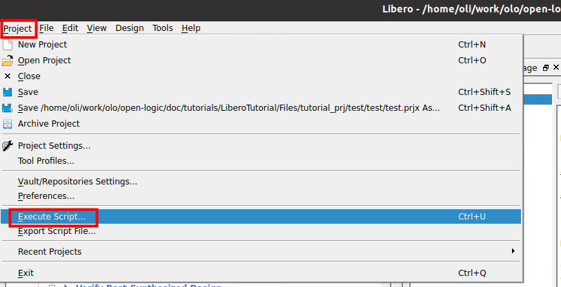
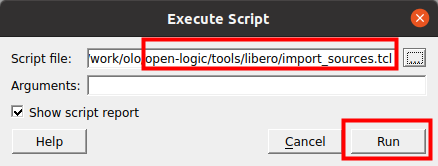
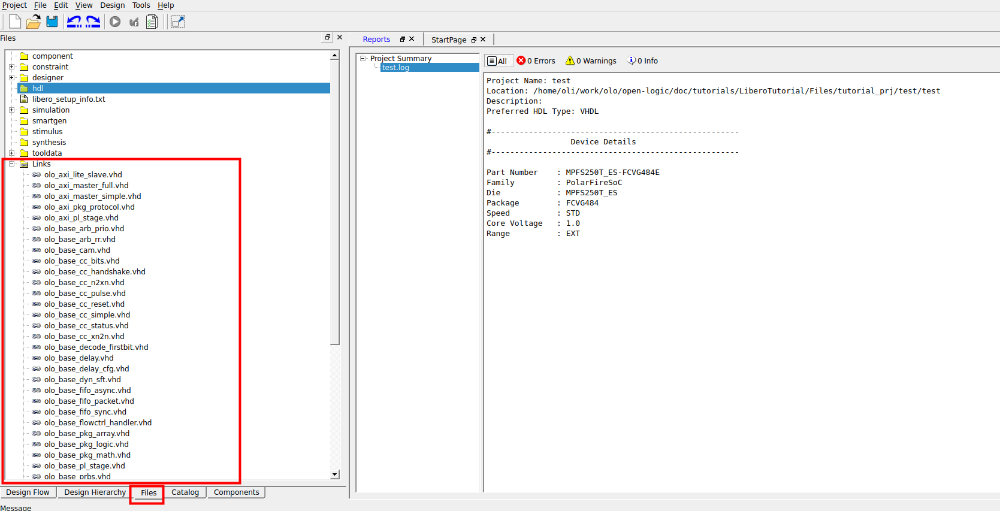
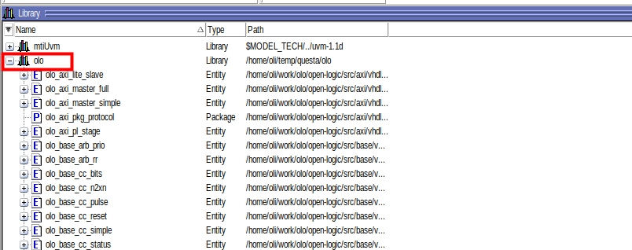
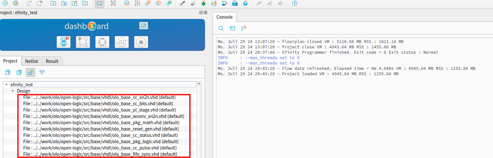
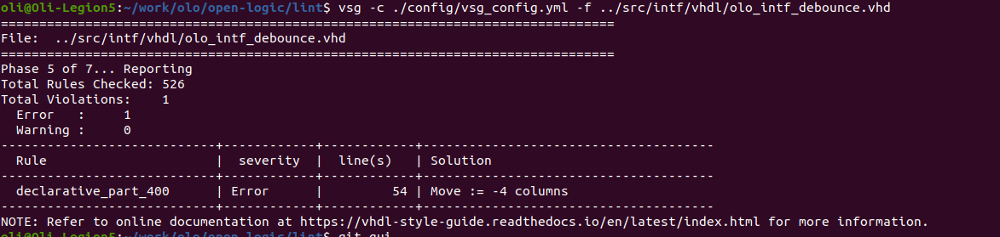
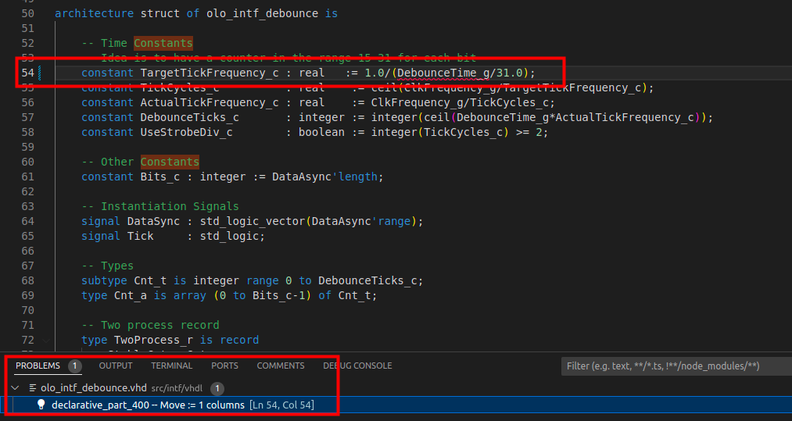
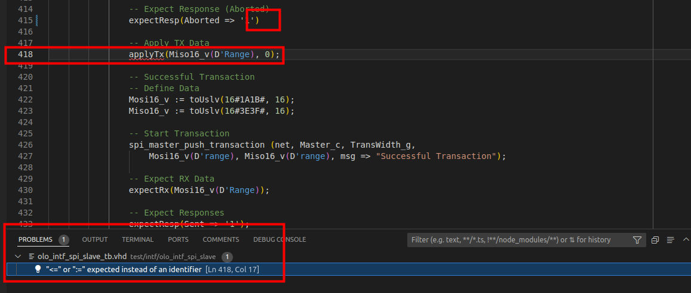

[Back to **Readme**](../Readme.md)

# Open Logic - How To ...

## ... Find what you are looking for

AKA Table of Content

* Tool Integration Related
  * [Use Open Logic in a Microchip Libero Project](#use-open-logic-in-a-microchip-libero-project)
  * [Use Open Logic in a Questasim Simulation](#use-open-logic-in-a-questasim-simulation)
  * [Use Open Logic in a Efinix Efinity Project](#use-open-logic-in-a-efinix-efinity-project)
  * [Use Open Logic in a AMD Vivado Project](#use-open-logic-in-a-amd-vivado-project)
  * [Use Open Logic in a altera Quartus Project](#use-open-logic-in-a-altera-quartus-project)
  * [Use Open Logic through FuseSoC](#use-open-logic-through-fusesoc)
* Contribution Related
  * [Use the Linter](#use-the-linter)
  * [Run Simulations](#run-simulations)
  * [Analyze Coverage](#analyze-coverage)
  * [Update Badges](#update-badges)

## Use Open Logic in a Microchip Libero Project

There is a script to import all *Open Logic* sources into a Libero project.

**Note:** The script does not setup automatic constraints because Libero does not support scoped constraints (in contrast to the AMD Vivado tools). For Efinity all constraints must be added manually.

To run the script, follow the steps below:

1. Create a project in Libero (if it does not yet exist)
2. Use the menu entry *Project > Execute script*
   
3. Select the script *\<open-logic-root\>/tools/libero/import_sources.tcl* and press *Run*.
   
   **For VHDL, no arguments are required**, which leads to all files being compiled into the default Open Logic library *olo*. If you wish to compile them into another library, pass the argument `lib=<library-name>` 
   
   **For Verilog, pass the argument `lib=work`**. When instantiating VHDL entities from Verilog, SynplifyPro only searches for them in the library *work*.
   
4. In the *Files* tab you can now see all Open Logic source files showing up. Links are made to the files in their original location, they are not copied into the project. All sources are imported into the library selected (see point 3, default is *olo*) and are available to be used.
   

## Use Open Logic in a Questasim Simulation

There is a script to compile all *Open Logic* sources into a library *olo*. To run the script, follow the steps below:

1. Open Questasim
2. In the Questasim TCL shell, execute the command `source <open-logic-root>/tools/questa/vcom_sources.tcl`

That's it. Nothing more.

* All *Open Logic* sources are configured to be compiled into the library *olo*
  


## Use Open Logic in a Efinix Efinity Project

There is a script to import all *Open Logic* sources into a Efinity project.

**Note:** The script does not setup automatic constraints because Efinity does not support scoped constraints (in contrast to the AMD Vivado tools). For Efinity all constraints must be added manually.

To run the script, follow the steps below:

1. Create a project in Efinity (if it does not yet exist)
2. Close the project in Efinity. Remember where it is stored on the file-system.
3. Open a terminal window and navigate to *\<open-logic-root\>/tools/efinity*
4. Run the command `python3 ./import_sources.py --project <path-to-project-xml> --library <library-name>`
   Replace `<path-to-project-xml>` by the path to the project file (to the *project.xml* file, NOT the *project.peri.xml* )
   Replace `<library-name>` by the library to compile open-logic sources into (*olo* for VHDL, *default* for Verilog)
5. Open the project in Efinity again. You should now see all *Open Logic* sources being added
   

Two more notes:

* For the usage of *Open Logic* from Verilog, the *default* library has to be chosen because Efinity does require the top-entity to be in the *default* library and for Verilog Efinity does only allow using VHDL entities in the same library as the module instantiating them. That's why using VHDL entities in any other library (e.g. named *olo* ) is not possible.
* You can get help regarding the *import_sources.py* script by calling `python3 ./import_sources.py -h`
* The *import_sources.py* script does create a backup of the project file, so you can restore it if something goes wrong. The backup file is stored under *\<name\>.xml.backup*.

## Use Open Logic in a AMD Vivado Project

There is a script to import all *Open Logic* sources into a Vivado project and apply all automatic constraints. To run the script, follow the steps below:

1. Open Vivado and create a project (if not existing yet)
2. Open the TCL shell in Vivado
3. Execute the command `source <open-logic-root>/tools/vivado/import_sources.tcl`
   Replace `<open-logic-root>` by the path of your *Open Logic* working copy.

That's it. Nothing more.

* All *Open Logic* sources are configured to be compiled into the library *olo*
  
* A new constraints file for importing all scoped constraints is added to the Vivado project by the script.
  
  **Note:** Scoped constraints are always imported but only work for usage from VHDL. For Verilog usage, manual constraints are required. Refer to the documentation of entities that require constraints (clock-crossings, interfaces, etc.)
  

## Use Open Logic in a altera Quartus Project

There is a script to import all *Open Logic* sources into a Quartus project.

**Note:** The script does not setup automatic constraints because Quartus does not support scoped constraints (in contrast to the AMD Vivado tools). For Quartus all constraints must be added manually.

To run the script, follow the steps below:

1. Open Quartus and create a project (if not existing yet)
2. Open the TCL shell in Quartus
   
3. Execute the command `source <open-logic-root>/tools/quartus/import_sources.tcl`
   Replace `<open-logic-root>` by the path of your *Open Logic* working copy.

That's it. Nothing more.

* All *Open Logic* sources are configured to be compiled into the library *olo*
  

Because Quartus does not support scoped constraints, **NO** constraints are important. They have to be created manually - more information can be found in the documentation of individual *Open Logic* entities which require constraints.

## Use Open Logic through FuseSoC

[FuseSoC](https://github.com/olofk/fusesoc) is a package manager and build system for HDL projects. Open Logic supports fuse-soc. To use Open Logic through fusesoc, just add open logic as a library:

```
fusesoc library add open-logic https://github.com/open-logic/open-logic
```

You should now get one package listed for every area in Open Logic. You can us them independently (dependencies are modelled in FuseSoC correctly and resolved automatically). You also see the tutorials being available and buildable through FuseSoC.

```
user$ fusesoc core list

Available cores:

Core                                       Cache status  Description
================================================================================
open-logic:open-logic:axi:2.0             :      empty : AXI related modules 
open-logic:open-logic:base:2.0            : downloaded : Basic Circuitry (e.g. FIFOs, CDCs, ...) 
open-logic:open-logic:intf:2.0            : downloaded : Interfaces (e.g. I2C, synchronizer, SPI, ...) 
open-logic:tutorials:quartus_tutorial:1.0 :      empty : quartus tutorial for open-logic, targetting DE0-CV board
open-logic:tutorials:vivado_tutorial:1.0  :      empty : vivado tutorial for open-logic, targetting Zybo Z7-10 board

```

**Note:** Like for all other tool integrations, Open Logic entities are compiled into the library *olo* and can be instantiated using e.g. `i_fifo : entity olo.olo_base_fifo_sync`.

## Use the Linter

### Introduction

*Open Logic* makes use of the [vhdl-style-guide](https://github.com/jeremiah-c-leary/vhdl-style-guide) linter (short VSG).

VSG can be installed as python package easily:

```
pip3 install vsg==3.27
```

**Note:** It is important to install the exactly correct version. Configuration files tend to not work with newer or older versions.

All VHDL files are linted (production code and test benches). 

### Run Linter on Specific File

To run VSG with the correct configuration on a VHDL file the following command can be used:

```
vsg -c <root>/lint/config/vsg_config.yml -f <path-to-file>
```

For VUnit verification components a slightly different style applies (see [Conventions](./Conventions.md)). This is covered by passing an additional config file:

```
vsg -c <root>/lint/config/vsg_config.yml <root>/lint/config/vsg_config_overlay_vc.yml -f <path-to-file>
```

Any errors or warnings found will be reported:



VSG is also automatically executed in the CI pipeline and pull requests are only accepted if it succeeds without errors or warnings.

### Run Linter on All Files

For running VSG on all files, a python script is provided. It can be executed as follows:

```
python3 <root>/lint/script/script.py
```

This script automatically applies the correct rules to all files.

By default the script runs linting on all files at once, which is good for CI. For development purposes often it is tedious to scroll through the long report. Therefore a debug option is provided, which runs VSG file by file and stops on the first error, which makes errors appearing on the bottom of the log.

```
python3 <root>/lint/script/script.py --debug
```

### Integrate Linter with VSCode

A custom task configuration for running the linter on production code VHDL files is provided in *\<root\>/.vscode/tasks.json* and loaded automatically if you open the root folder of Open Logic in VSCode.

You can then run the linter for the currently open file by doing: *Ctrl+Shift+P > Tasks: Run Task > Run VSG Lint*

For running VSG on all files, use the *Run VSG Lint - All Files* variant of the task.

For verification components (with slightly different coding conventions, see [Conventions](./Conventions.md)) use the *Run VSG Lint - VC* command.

The results will be properly displayed in the problems tab and you can navigate to the corresponding code line by clicking on the specific problem.



You can also map this as keyboard shortcut by editing your local *keybindings.json* file in VSCode. The example below will map it the Ctrl+Alt+L:

```
    {
        "key": "ctrl+alt+l",
        "command": "workbench.action.tasks.runTask",
        "args": "Run VSG Lint"
    }
```

## Run Simulations

### Introduction

If you want to run simulations on your PC, you need the following prerequisites:

1. *Python 3* must be installed
2. VUnit must be installed: `pip3 install vunit_hdl`
3. Simulator must be installed and added to the *PATH* environment variable  
   1. Default choice: [GHDL](https://github.com/ghdl/ghdl/releases)
   2. Alternative (used for code-coverage analysis): Questasim. 

### Run Simulations from Commandline

To run the simulations, navigate to *\<root\>/sim* and execute the following command:

```
python3 run.py            # For GHDL
python3 run.py --modelsim # For Modelsim/QuestaSim
python3 run.py --nvc      # For NVC
```

Tipp: For faster runtimes, you may want to use multiple threads to execute simulations. This can be achieved by adding the argument `-p 16` (16 is the number of threads, you may use any other number fitting your CPU).

You should now see an output indicating that all tests pass.


### Open Simulation Waveforms from Commandline

For debugging purposes, you may want to visualize a test-case in the GUI. 

For GHDL and NVC simulations, the GTKWave tool must be installed (it's the GUI to GHDL/NVC). For Questasim a GUI is included.

To show simulation results in the GUI, navigate to *\<root\>/sim* and execute the following command:

```
python3 run.py <testcase> --gui
```

Where test-case is the exact test-case to display, e.g. "olo_tb.olo_base_cc_bits_tb.D=19-N=20.SimpleTransfer" in above printscreen.

```
python3 run.py olo_tb.olo_base_cc_bits_tb.D=19-N=20.SimpleTransfer --gui
```

The simulator GUI will show up (the example is showing GTKWave - the GHDL/NVC GUI):


### Integrate Simulations with VSCode

A custom task configuration for running the simulations from VSCode is provided in *\<root\>/.vscode/tasks.json* and loaded automatically if you open the root folder of Open Logic in VSCode. Note that the configuration is written for GHDL/GTKWave only.

You can then run the simulations for the currently open file by doing: *Ctrl+Shift+P > Tasks: Run Task > VUnit - This File*. 

If you want to open the waveforms for the simulations executed, use the *VUnit - This File (GUI)* variant of the command. Important notes to this command:

* You will be asked on the console to further narrow down which exact configuration(s) you want to run. Press enter to run all configurations related to the file selected - not that this could be quite many depending on the file.
* Multiple GTKWave windows are opened. One for every configuration VUnit runs (if there are multiple).
* The waveforms can be update by using the non-GUI command. If you configured your view in GTKWave, you can keep it open, re-run *VUnit - This File* after changes and just update the waveform in GTKWave.

It also is possible to run all simulations in the project, using the *VUnit - All Files* variant of the command. No GUI option is provided because this command runs *really a lot* of simulations.

Any compile errors are properly displayed in the VSCode *Problems* tab. In below example a semicolon was missed:



You can also map this as keyboard shortcut by editing your local *keybindings.json* file in VSCode. The example below will map it to Ctrl+Alt+S:

```
    {
        "key": "ctrl+alt+s",
        "command": "workbench.action.tasks.runTask",
        "args": "VUnit - This File"
    },
```


## Analyze Coverage

To analyze code-coverage, the Questasim simulator must be used and coverage must be enabled. After simulations with coverage enabled are ran, the coverage can be reported nicely formated in the console by running the corresponding python script.

Below commands must be ran from the *\<root\>/sim* directory:

```
python3 run.py --modelsim --coverage
python3 ./AnalyzeCoverage.py 
```

You should now see a clean summary of the statement coverage:


## Update Badges

The issue badges are updated every night using a GitHub workflow.

For the code coverage badges, the situation is a bit more complicated because Questasim is required to produce coverage and Questasim is non-free and licensed to specific PCs.

In order to update coverage badges, a PC with the following prerequisites is required:

1. Questasim must be installed (including license setup)
2. A credential JSON file giving access to the google cloud storage folder below is required and the path to it must be stored in the environment variable *GCS_FILE*: <br>https://storage.googleapis.com/open-logic-badges
   The google cloud storage is maintained by [obruendl](oliver.bruendler@gmx.ch).

To update the coverage badges, simply execute the following commands in the *\<root\>/sim* directory: 

```
python3 run.py --modelsim --coverage
python3 ./AnalyzeCoverage.py --badges
```


