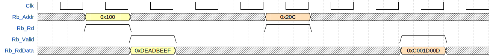

# olo_axi_lite_slave

[Back to **Entity List**](../EntityList.md)

## Status Information

  

VHDL Source: [olo_axi_lite_slave](../../src/axi/vhdl/olo_axi_lite_slave.vhd)

## Description

This component implements a very simple AXI4-Lite slave. It converts AXI4-Lite accesses to a simple address/read/write interface commonly used for mapping register banks and memory.

Below figures shows how write transactions are signaled to user-code. Write transactions do not require an acknowledge. The user code **must** expect them in the speed they arrive.

Below figures shows how read transactions are signaled to user-code. The validity of read-data must be acknowledged by *Rb_RdValid*. If this does not happen within *ReadTimeoutClks_g* an error is signaled to the master who requested the read. Note that the read latency (from *Rb_Rd* to *Rb_Valid*) does not have to be constant.

The *olo_axi_lite_slave* implements a read-timeout. In case the read data is not returned (*Rb_RdValid*) within the timeout specified, an error is signaled on the AXI bus. This mechanism prevents masters from becoming locked for infinite time if a read fails due to user code connected to the *olo_axi_lite_slave*.

The *olo_axi_lite_slave* does not aim for maximum performance. It requires 4 clock cycles per transaction (plus read-latency for read accesses). This is regarded as acceptable because the AXI4-Lite protocol does not aim for maximum performance anyways.

## Generics

| Name              | Type     | Default | Description                                                  |
| :---------------- | :------- | ------- | :----------------------------------------------------------- |
| AxiAddrWidth_g    | positive | 8       | AXI4 address width (width of *AwAddr* and *ArAddr* signals)  |
| AxiDataWidth_g    | positive | 32      | AXI data width (must be a power of 2)                        |
| ReadTimeoutClks_g | positive | 100     | Read timeout in clock cycles (see [Description](#Description)) |
| IdWidth_g         | natural  | 0       | Width of the signals *AwId*, *ArId*, *BId* and *RId* signals in bits. |
| UserWidth_g       | natural  | 0       | Width of the siginals *AwUser*, *ArUser*, *WUser*, *BUser* and *RUser* in bits. |

## Interfaces

### Control

| Name | In/Out | Length | Default | Description                                     |
| :--- | :----- | :----- | ------- | :---------------------------------------------- |
| Clk  | in     | 1      | -       | Clock                                           |
| Rst  | in     | 1      | -       | Reset input (high-active, synchronous to *Clk*) |

### AXI Interfaces

| Name          | In/Out | Length | Default | Description                                                  |
| :------------ | :----- | :----- | ------- | :----------------------------------------------------------- |
| S_AxiLite_... | *      | *      | *       | AXI4-Lite slave interface. For the exact meaning of the signals, refer to the AXI4-Lite protocol specification. |

### Register Interface

| Name       | In/Out | Length             | Default | Description                                                  |
| :--------- | :----- | :----------------- | ------- | :----------------------------------------------------------- |
| Rb_Addr    | out    | *AxiAddrWidth_g*   | -       | Register address to access (as byte address) . E.g. for *AxiDataWidth_g*=32, the 2 LSBs are always zero. |
| Rb_Wr      | out    | 1                  | -       | Write enable for registers                                   |
| Rb_ByteEna | out    | *AxiDataWidth_g*/8 | -       | Write byte enables                                           |
| Rb_WrData  | out    | *AxiDataWidth_g*   | -       | Write data                                                   |
| Rb_Rd      | out    | 1                  | -       | Read enable for registers                                    |
| Rb_RdData  | in     | *AxiDataWidth_g*   | -       | Read data, valid when *Rb_RdValid*='1'                       |
| Rb_RdValid | in     | 1                  | -       | Read valid handshaking signal. Every *Rb_Rd* pulse must be acknowledged by a *Rb_RdValid* pulse together with the valid read data. |

### 

## Architecture

The *olo_axi_lite_slave* is implemented as a single FSM that fetches one *AR* or *AW* command at a time, executes it and sends the response before fetching the next command. The decision for using a single FSM for read and write side was taken to avoid read and write accesses happening in the the same clock cycle and interfering with each other in an unpredictable way.
