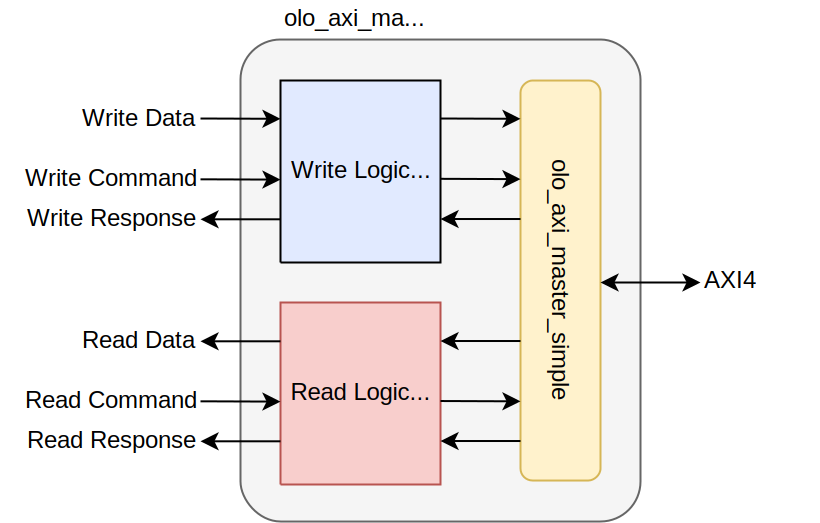
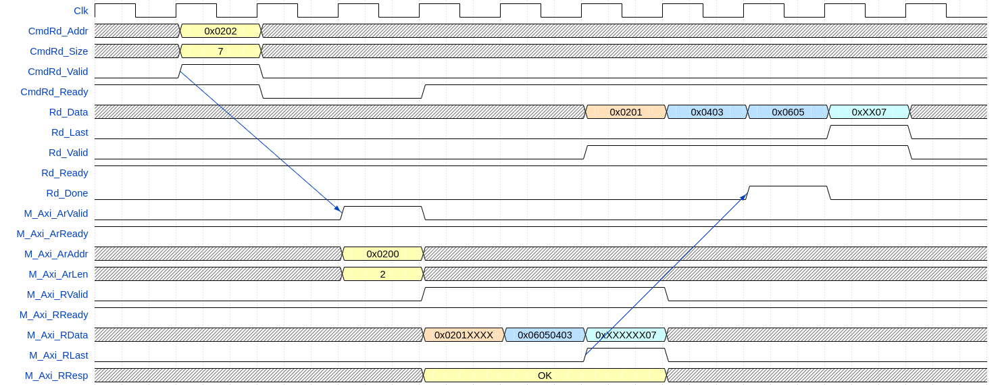
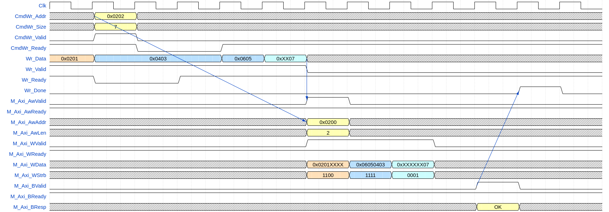

# olo_axi_master_full

[Back to **Entity List**](../EntityList.md)

## Status Information

  

VHDL Source: [olo_axi_master_full](../../src/axi/vhdl/olo_axi_master_full.vhd)

## Description

This entity is a wrapper around [olo_axi_master_simple](olo_axi_master_simple.md) to allow the following things:

* Access to non word-aligned addresses
* Arbitrarily sized (not a multiple of AXI data words) transfers
* AXI data width can be bigger than the data-width of the user interface

Besides the capability for unaligned transfers, the user interface is the same as for [olo_axi_master_simple](olo_axi_master_simple.md) - **please read through the documentation of [olo_axi_master_simple](olo_axi_master_simple.md)**. Important topics covered there are:

* Automatic splitting of transfers at 4kB boundaries
* Automatic splitting of transfers at the maximum bust-size supported by AXI4
* High Latency vs. Low Latency transactions

Important differences between *olo_axi_master_full* and [olo_axi_master_simple](olo_axi_master_simple.md) are:

* Transaction size (*CmdWr_Size*/*CmdRd_Size*) is given in **bytes** not **words**
* Write data cannot be provided before the command (due to the required alignment)
* No byte enables are provided on the user interface because data is aligned automatically.

Note that due to the alignment logic, every command takes at least four clock cycles to process. In most cases there significant bursts are executed this does not matter but for cases where many very small (e.g. single-beat) transactions are required this entity is suboptimal.

Most of the logic in this entity is related to unaligned and odd-sized transfers. So if you only require an AXI data width that is larger than
the user interface data width, you may consider using [olo_axi_master_simple](olo_axi_master_simple.md) along with [olo_base_wconv_n2xn](../base/olo_base_wconv_n2xn.md)/[olo_base_wconv_xn2n](../base/olo_base_wconv_xn2n.md) (width
conversion) to achieve better performance with less resource utilization.

Read and write logic are fully independent. So reads and writes can happen at the same time.

## Generics

| Name                      | Type     | Default | Description                                                  |
| :------------------------ | :------- | ------- | :----------------------------------------------------------- |
| AxiAddrWidth_g            | positive | 32      | AXI4 address width (width of *AwAddr* and *ArAddr* signals) Range: 12 ... 64 |
| AxiDataWidth_g            | positive | 32      | AXI data width (must be a power of 2 of bytes and equal to or an integer multiple of *UserDataWidth_g*) Range: 8 ... 1024 |
| AxiMaxBeats_g             | positive | 256     | Maximum number of beats in one AXI transaction.  Values given by the AXI specification are 16 for AXI-3 and 256 for AXI-4. However, the user may choose any other number for scheduling reasons. Range: 1 ... 256 |
| AxiMaxOpenTransactions_g  | positive | 8       | Maximum number of AXI commands (AW/AR-channel) to send before the first command is completed (outstanding transactions). Range: 1 ... 8 |
| UserTransactionSizeBits_g | positive | 32      | Number of bits used to specify the number of bytes to transfer on the user command interface. This is the only limiting factor for the transfer size requested. Must be smaller or equal to *AxiAddrWidth_g*. |
| DataFifoDepth_g           | positive | 1024    | Number of entries in the read/write data FIFOs (in AXI data words - *AxiDataWidth_g*, not bytes) |
| UserDataWidth_g           | positive | 32      | Width of the user interface for data (*Wr_Data*/*Rd_Data*)   |
| ImplRead_g                | boolean  | true    | Implement read functionality (can be disabled to save resources) |
| ImplWrite_g               | boolean  | true    | Implement write functionality (can be disabled to save resources) |
| RamBehavior_g             | string   | "RBW"   | Block-RAM style (must match FPGA architecture) **"RBW"** Read before write, **"WBR"** Write before read |

## Interfaces

### Control

| Name | In/Out | Length | Default | Description                                     |
| :--- | :----- | :----- | ------- | :---------------------------------------------- |
| Clk  | in     | 1      | -       | Clock                                           |
| Rst  | in     | 1      | -       | Reset input (high-active, synchronous to *Clk*) |

### AXI Interfaces

| Name      | In/Out | Length | Default | Description                                                  |
| :-------- | :----- | :----- | ------- | :----------------------------------------------------------- |
| M_Axi_... | *      | *      | *       | AXI4 master interface. For the exact meaning of the signals, refer to the AXI protocol specification. |

Transaction requests are forwarded from the slave interface to the master interfaces. Responses are forwarded from the master interface to the slave interface.

### User Write Command Interface

| Name         | In/Out | Length                      | Default | Description                                                  |
| :----------- | :----- | :-------------------------- | ------- | :----------------------------------------------------------- |
| CmdWr_Addr   | in     | *AxiAddrWidth_g*            | 0       | Address to start writing at. Unaligned addresses are allowed and data is aligned automatically. |
| CmdWr_Size   | in     | *UserTransactionSizeBits_g* | 0       | Number of bytes in the transfer. Transfers may exceed *AxiMaxBeats_g* and 4k boundaries. Transfers are splitted by the *olo_axi_master_simple* automatically. |
| CmdWr_LowLat | in     | 1                           | '0'     | **'1'** \--\> Low latency mode, **'0'** \--\> High latency mode It is recommended to **not** use low-latency transfers if *AxiDataWidth_g > UserDataWidth_g* because the width conversion limits the bandwidth which would lead to stall-cycles on the AXI bus. |
| CmdWr_Valid  | in     | 1                           | '0'     | AXI-S handshaking signal for *CmdWr*                         |
| CmdWr_Ready  | out    | 1                           | -       | AXI-S handshaking signal for *CmdWr*                         |

### User Write Data Interface

| Name     | In/Out | Length            | Default | Description                       |
| :------- | :----- | :---------------- | ------- | :-------------------------------- |
| Wr_Data  | in     | *UserDataWidth_g* | 0       | Write data                        |
| Wr_Valid | in     | 1                 | '0'     | AXI-S handshaking signal for *Wr* |
| Wr_Ready | out    | 1                 | -       | AXI-S handshaking signal for *Wr* |

### User Read Command Interface

| Name         | In/Out | Length                      | Default | Description                                                  |
| :----------- | :----- | :-------------------------- | ------- | :----------------------------------------------------------- |
| CmdRd_Addr   | in     | *AxiAddrWidth_g*            | 0       | Address to start reading at. Unaligned addresses are allowed and data is aligned automatically. |
| CmdRd_Size   | in     | *UserTransactionSizeBits_g* | 0       | Number of bytes in the transfer Transfers may exceed *AxiMaxBeats_g* and 4k boundaries. Transfers are splitted by the *olo_axi_master_simple* automatically. |
| CmdRd_LowLat | in     | 1                           | '0'     | **'1'** \--\> Low latency mode, **'0'** \--\> High latency mode It is recommended to **not** use low-latency transfers if *AxiDataWidth_g > UserDataWidth_g* because the width conversion limits the bandwidth which would lead to stall-cycles on the AXI bus. |
| CmdRd_Valid  | in     | 1                           | '0'     | AXI-S handshaking signal for *CmdRd*                         |
| CmdRd_Ready  | out    | 1                           | -       | AXI-S handshaking signal for *CmdRd*                         |

### User Read Data Interface

| Name     | In/Out | Length            | Default | Description                                                  |
| :------- | :----- | :---------------- | ------- | :----------------------------------------------------------- |
| Rd_Data  | out    | *UserDataWidth_g* | -       | Read data                                                    |
| Rd_Last  | out    | 1                 | -       | Indicates last word of data related to a *CmdRd* command.  The bit is related to the user command (*CmdRd*) and only set for the last AXI burst related to one user-command. |
| Rd_Valid | out    | 1                 | -       | AXI-S handshaking signal for *Rd*                            |
| Rd_Ready | in     | 1                 | '0'     | AXI-S handshaking signal for *Rd*                            |

### User Response Interface

| Name     | In/Out | Length | Default | Description                                                  |
| :------- | :----- | :----- | ------- | :----------------------------------------------------------- |
| Wr_Done  | out    | 1      | -       | Pulsed high when a write command was completed successfully. |
| Wr_Error | out    | 1      | -       | Pulsed high when a write command was completed but  failed (AXI response from slave indicated an error) |
| Rd_Done  | out    | 1      | -       | Pulsed high when a read command was completed successfully.  |
| Rd_Error | out    | 1      | -       | Pulsed high when a read command was completed but at least one transaction failed (AXI response from slave indicated an error) |

## Architecture

### Overview

The entity is a wrapper around [olo_axi_master_simple](olo_axi_master_simple.md). It controls data alignment and the width conversion between user interface and AXI but uses [olo_axi_master_simple](olo_axi_master_simple.md) to actually execute the transfers.

The only FIFOs present are the ones inside [olo_axi_master_simple](olo_axi_master_simple.md) (see the corresponding documentation). As a result, significant amounts of data cannot be provided before the command because the command determines the alignment required (which is done before the data goes into the FIFO). However, user designs shall not rely on no data being accepted before the command - due to timing optimization a few words of data may be accepted before the command.

In cases where the amount of data to write - and hence the write command *WrCmd_xxx* - is unknown until no more data arrives, above situation is a problem because data is only accepted after the command. In this situation, it is recommended that the user inserts a FIFO (to buffer the data before a command can be generated) external to *olo_axi_master_full*.

The entity implements read and write side completely independent. It is possible to implement only one or the other direction of transfers.

### Transaction Types

For simplicity, only burst transactions are shown. However, of course also single-word transactions are supported.

Note that latencies and delays may be drawn shorter than they actually are to keep the waveforms small. However, all relationship between signals are correct.

For all figures, an AXI-width of 32 bits and a user data width of 16 bits is assumed to keep the figures simple.

For simplicity reasons, only transfers that consist of one AXI transaction are shown. For the user interface, larger transactions (consisting of multiple AXI bursts) do behave exactly the same.

For all transactions, user data is right-aligned. The byte at the start address specified in the command is the LSB of the user input/output data.

Note that the transaction examples focus on data-alignment. For anything else, refer to the documentation of [olo_axi_master_simple](olo_axi_master_simple.md).

#### Read Transaction

The example below shows a read transaction.

 <i>Read transaction </i></\p>

The read command together with the address of the first used byte and the size of the data required in bytes is asserted. The *olo_axi_master_full* then calculates the word-aligned AXI start address (0x0200) and the number of AXI-beats required (3 \--\> *M\_Axi\_ArLen*=2) and asserts the AXI AR-command.

The received data is aligned correctly in order to have the first byte the user requested as LSB of the first *Rd_Data* word. Unused trailing bytes may have any value, they shall never be interpreted.

Note that the *Rd\_Done* signal is asserted as soon as all data is read from AXI, even if the data was not yet consumed on the *Rd_Data* interface.

#### Write Transaction

The example below shows a read transaction.

Note that a high-latency write (AXI commands only sent after data is in buffer) is shown in this figure.

 <i> Write transaction </i></\p>

In this example, the user provides some data before the command. The first word is accepted before the command, all other data is not accepted before the command is known. Then the write command together with the address of the first byte to write and the size of the data is provided. The *olo_axi_master_full* then calculates the word-aligned AXI start address (0x0200) and the number of AXI-beats required (3 \--\> *M\_Axi\_ArLen*=2) and asserts the AXI AW-command.

The user data is automatically aligned to the alignment of the AXI bus.

Unused bytes may have any value, which is fine because the corresponding strobe signal is set to low. The same applies to the user interface: unused trailing bytes can have any value and do not influence the transaction.

As soon as the write response from AXI is received, the *Wr\_Done* signal is asserted.
