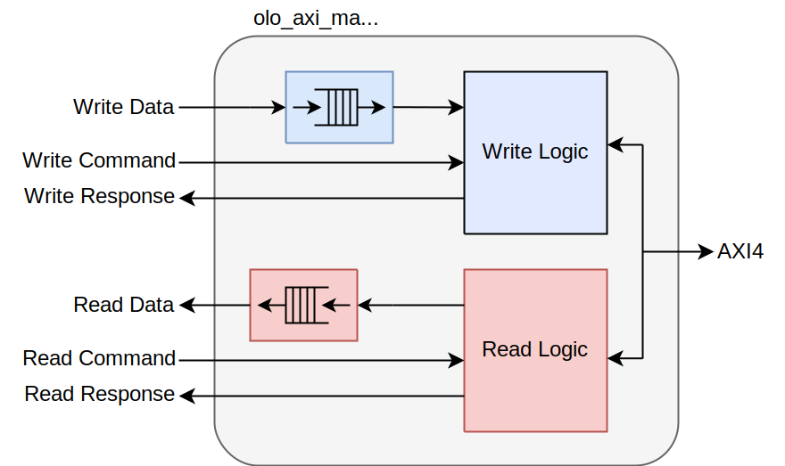
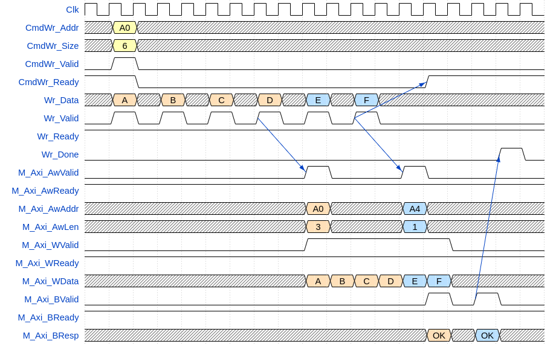
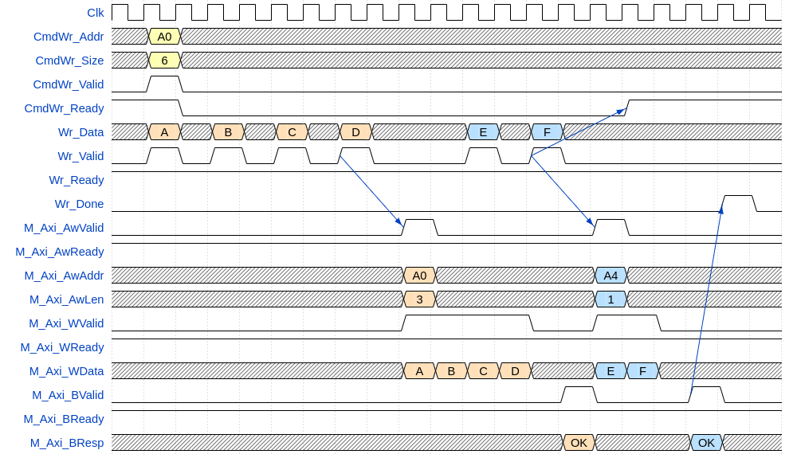
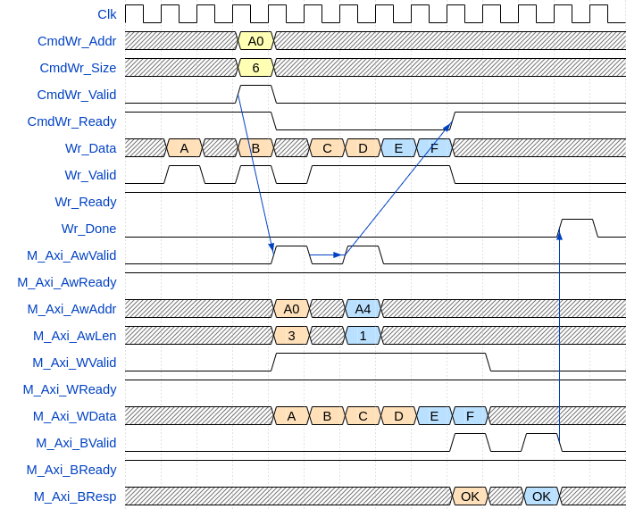
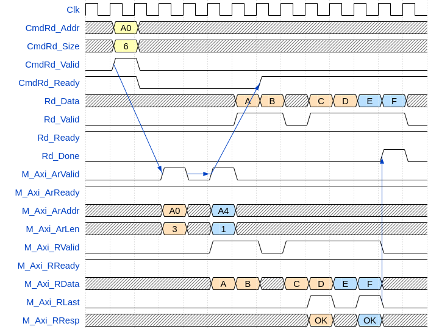
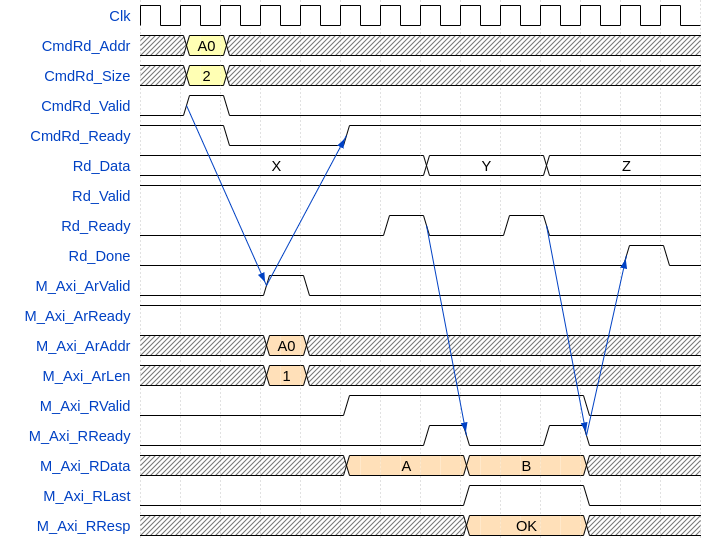
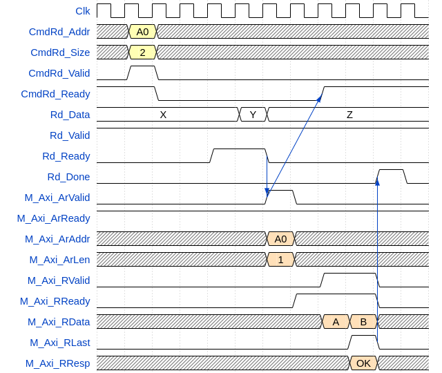

# olo_axi_master_simple

[Back to **Entity List**](../EntityList.md)

## Status Information

  

VHDL Source: [olo_axi_master_simple](../../src/axi/vhdl/olo_axi_master_simple.vhd)

## Description

### Overview

This entity executes transactions requested through a simple command interface on an AXI4 bus according to all specifications. This entity
includes FIFOs to buffer read- and write-data but not for the commands.

The user can request transaction of any size and they will get split automatically in order to not exceed AXI bust size and not burst over 4kB boundaries (prohibited by the AXI4 specification). The response is sent to the user when his whole command is executed (which may involve multiple AXI transactions).

For each command there are two operation modes:

-   High Latency

    -   The AXI-master only starts the command after sufficient data
        (write-case) or space (read-case) is available in the
        corresponding data FIFO

    -   This ensures that commands can be executed without blocking the
        AXI bus.

    -   This approach leads to more latency, since he user has to handle
        data before the command is sent.

    -   Suggested default.

-   Low Latency

    -   The AXI-master starts the transaction immediately, with no
        regard on FIFO states.

    -   If the user logic cannot provide the data in-time, the AXI bus
        may get blocked.

    -   This approach leads to lowest latency since the user logic can
        prepare the data on the fly without the transaction being
        delayed.

This entity does not handle unaligned transactions and word-width conversions. The data width of the user interface and the AXI bus are the same and all commands must be aligned to that word-width. This is the reason for the term *simple* in the name of the entity.

Read and write logic are fully independent. Reads and writes can happen at the same time.

There is no required timing relationship between command and data signals. So for writes the user can provide write data before, after or together with the command.

Note that this entity does require a minimum of four clock cycles for every write transaction. **It is not optimal for producing access patterns with many single-beat transactions.**

## Generics

| Name                      | Type     | Default | Description                                                  |
| :------------------------ | :------- | ------- | :----------------------------------------------------------- |
| AxiAddrWidth_g            | positive | 32      | AXI4 address width (width of *AwAddr* and *ArAddr* signals) Range: 12 ... 64 |
| AxiDataWidth_g            | positive | 32      | AXI data width (must be a power of 2 of bytes) Range: 8 ... 1024 |
| AxiMaxBeats_g             | positive | 256     | Maximum number of beats in one AXI transaction.  Values given by the AXI specification are 16 for AXI-3 and 256 for AXI-4. However, the user may choose any other number for scheduling reasons. Range: 1 ... 256 |
| AxiMaxOpenTransactions_g  | positive | 8       | Maximum number of AXI commands (AW/AR-channel) to send before the first command is completed (outstanding transactions). Range: 1 ... 8 |
| UserTransactionSizeBits_g | positive | 24      | Number of bits used to specify the number of beats to transfer on the user command interface. This is the only limiting factor for the transfer size requested. This value must be chosen in a way that a signle user transaction cannot exceed the AXI address range:  *UserTransactionSizeBits_g <= AxiAddrWidth_g-log2(AxiDataWidth_g/8)* |
| DataFifoDepth_g           | positive | 1024    | Number of entries in the read/write data FIFOs (in words, not bytes). Suggested value is at least *2 x AxiMaxBeats_g*.  Values smaller than *AxiMaxBeats_g* can block the entity completely if non-low-latency transfers are requested (because the FIFO never can hold all data of one maximum size burst). The suggestion is *2 x AxiMaxBeats_g* to allow continuous read data-transfer in non-low-latency transfers - with values the next read transaction could only be started after the last transaction is fully read from the FIFO (see [Read FIFO full with High Latency (Default)](#Read-FIFO-full-with-High-Latency-(Default))), which would limit bandwidth. |
| ImplRead_g                | boolean  | true    | Implement read functionality (can be disabled to save resources) |
| ImplWrite_g               | boolean  | true    | Implement write functionality (can be disabled to save resources) |
| RamBehavior_g             | string   | "RBW"   | Block-RAM style (must match FPGA architecture) **"RBW"** Read before write, **"WBR"** Write before read |

## Interfaces

### Control

| Name | In/Out | Length | Default | Description                                     |
| :--- | :----- | :----- | ------- | :---------------------------------------------- |
| Clk  | in     | 1      | -       | Clock                                           |
| Rst  | in     | 1      | -       | Reset input (high-active, synchronous to *Clk*) |

### AXI Interfaces

| Name      | In/Out | Length | Default | Description                                                  |
| :-------- | :----- | :----- | ------- | :----------------------------------------------------------- |
| M_Axi_... | *      | *      | *       | AXI4 master interface. For the exact meaning of the signals, refer to the AXI protocol specification. |

Transaction requests are forwarded from the slave interface to the master interfaces. Responses are forwarded from the master interface to the slave interface.

### User Write Command Interface

| Name         | In/Out | Length                      | Default | Description                                                  |
| :----------- | :----- | :-------------------------- | ------- | :----------------------------------------------------------- |
| CmdWr_Addr   | in     | *AxiAddrWidth_g*            | 0       | Address to start writing at (must be aligned)                |
| CmdWr_Size   | in     | *UserTransactionSizeBits_g* | 0       | Number of beats in the transfer. The number may exceed *AxiMaxBeats_g* and 4k boundaries. Transfers are splitted by the *olo_axi_master_simple* automatically. |
| CmdWr_LowLat | in     | 1                           | '0'     | **'1'** \--\> Low latency mode, **'0'** \--\> High latency mode |
| CmdWr_Valid  | in     | 1                           | '0'     | AXI-S handshaking signal for *CmdWr*                         |
| CmdWr_Ready  | out    | 1                           | -       | AXI-S handshaking signal for *CmdWr*                         |

### User Write Data Interface

| Name     | In/Out | Length             | Default | Description                       |
| :------- | :----- | :----------------- | ------- | :-------------------------------- |
| Wr_Data  | in     | *AxiDataWidth_g*   | 0       | Write data                        |
| Wr_Be    | in     | *AxiDataWidth_g*/8 | 0       | Byte enables for write data       |
| Wr_Valid | in     | 1                  | '0'     | AXI-S handshaking signal for *Wr* |
| Wr_Ready | out    | 1                  | -       | AXI-S handshaking signal for *Wr* |

### User Read Command Interface

| Name         | In/Out | Length                      | Default | Description                                                  |
| :----------- | :----- | :-------------------------- | ------- | :----------------------------------------------------------- |
| CmdRd_Addr   | in     | *AxiAddrWidth_g*            | 0       | Address to start reading at (must be aligned)                |
| CmdRd_Size   | in     | *UserTransactionSizeBits_g* | 0       | Number of beats in the transfer The number may exceed *AxiMaxBeats_g* and 4k boundaries. Transfers are splitted by the *olo_axi_master_simple* automatically. |
| CmdRd_LowLat | in     | 1                           | '0'     | **'1'** \--\> Low latency mode, **'0'** \--\> High latency mode |
| CmdRd_Valid  | in     | 1                           | '0'     | AXI-S handshaking signal for *CmdRd*                         |
| CmdRd_Ready  | out    | 1                           | -       | AXI-S handshaking signal for *CmdRd*                         |

### User Read Data Interface

| Name     | In/Out | Length           | Default | Description                                                  |
| :------- | :----- | :--------------- | ------- | :----------------------------------------------------------- |
| Rd_Data  | out    | *AxiDataWidth_g* | -       | Read data                                                    |
| Rd_Last  | out    | 1                | -       | Indicates last word of data related to a *CmdRd* command.  The bit is related to the user command (*CmdRd*) and only set for the last AXI burst related to one user-command. |
| Rd_Valid | out    | 1                | -       | AXI-S handshaking signal for *Rd*                            |
| Rd_Ready | in     | 1                | '0'     | AXI-S handshaking signal for *Rd*                            |

### User Response Interface

| Name     | In/Out | Length | Default | Description                                                  |
| :------- | :----- | :----- | ------- | :----------------------------------------------------------- |
| Wr_Done  | out    | 1      | -       | Pulsed high when a write command was completed successfully. |
| Wr_Error | out    | 1      | -       | Pulsed high when a write command was completed but  failed (AXI response from slave indicated an error) |
| Rd_Done  | out    | 1      | -       | Pulsed high when a read command was completed successfully.  |
| Rd_Error | out    | 1      | -       | Pulsed high when a read command was completed but at least one transaction failed (AXI response from slave indicated an error) |

### 

## Architecture

### Overview

The entity implements read and write side completely independent. It is possible to implement only one or the other direction of transfers.

### Transaction Types

For simplicity, only burst transactions are shown. However also single-word transactions are supported.

Note that for all examples, the maximum AXI burst length is assumed to be 4 (unusual low) for illustrative reasons. For illustrative reasons a *AxiDataWidth_g*=8 is assumed.

Also note that latencies and delays may be drawn shorter than they actually are to keep the waveforms small. However, all relationship between signals are correct.

#### Write High-Latency (Default)

The example below shows a high latency burst read transaction.

 <i>High latency write </i></\p>

The waveform shows, that the write command (*M\_Axi\_Aw\**) is held back until all data for a burst (4 words) is in the FIFO. The command is then executed.  The next command is executed immediately, because the data is already available when the first transaction completed.

The waveform also clearly shows, that the *CmdWr\_Ready* signals goes high as soon as all AXI-commands related to the user command are sent. However,  at the time *CmdWr\_Ready* goes high, not all data is transferred yet. This only indicates that the next command can be applied and does not have any meaning for the currently processed data.

The *Wr_Done* signal is pulsed as soon as the response of the last AXI transaction is received.

The waveform also shows that a user command is split into two AXI transactions automatically and that the *M\_Axi\_AwAddr* and *M\_Axi\_AwLen* signals are chosen appropriately.

Since the waveform above only shows that the first transaction is delayed according to high-latency operation, a second figure is shown below that shows this behavior also for the second transaction.

 <i>High latency write with delay for second transaction </i></\p>

#### Write Low-Latency

The example below shows a low latency burst read transaction.

 <i> Low latency write </i></\p>

The waveform shows, that in low latency operation, AXI commands are issued as soon as possible independently of the availability of data. Therefore both write commands are issued before even the data for the first one is in the FIFO.

The waveform also shows, that the AXI W-channel is blocked temporarily (*M\_Axi\_WValid* low) due to the data not being available. This situation has a negative impact on the AXI bandwidth and hence shall be avoided usually.

To avoid stalling the AXI bus, it is possible to prefill the write data FIFO. To do so, the write command is sent after the first few data samples are already written into the FIFO. This allows using the FIFO to prevent the AXI bus from stalling.

 <i> Low latency write with FIFO prefill</i></\p>

#### Read

The example below shows a burst read transaction.

 <i> Read transaction </i></\p>

Usually for reads there is enough space in the read FIFO. In this case, the user command directly triggers the transmission of the AXI-command on *M\_Axi\_Ar\**. After all AXI commands are sent, the FSM is ready for the next command.

If the slave is not able to continuously burst data, this is reflected on the read data output. However, a FIFO is present and can compensate this effect if reading of the data is started a few beats after availability of first data.

#### Read FIFO full with Low Latency

The example below shows a burst read transaction in low latency mode. In contrast to the example above, the read FIFO is assumed to be full when the user command is issued.

 <i> Low latency read transaction with FIFO full </i></\p>

Because the command is issued in low-latency mode, the AXI read command is issued immediately. Because the FIFO is full, *M\_Axi\_RReady* is low and the AXI bus is stalled. The pattern of space in the FIFO becoming available is visible on the AXI bus directly.

#### Read FIFO full with High Latency (Default)

The example below shows a burst read transaction in high latency mode.

 <i> Low latency read transaction with FIFO full, high-latency mode </i></\p>

Because the command is issued in high-latency mode, the AXI read command is not issued until enough data is read from the FIFO in order for the command to complete in one burst. If this is the case, the AXI read command is issued and the transfer is completed in one burst with *M\_Axi\_RValid* high all the time.

This has the benefit of not blocking the AXI bus. In contrast to write commands, the high-latency mode does not lead to significantly more latency in the read-case because the user can still immediately read the first data after it was received. As a result, it is recommended to always execute read commands I the high-latency mode unless there is a very good reason for the low-latency mode.
