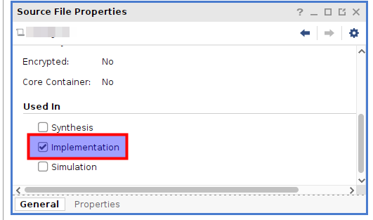

# Clock Crossing Principles

[Back to **Entity List**](../EntityList.md)

## Constraining

### Manual Constraining

All clock-crossings require the following constraints:

```tcl
set_max_delay -from [get_clocks <src-clock>] -to [get_clocks <dst-clock>] -datapath_only <period-of-faster-clock>
set_max_delay -from [get_clocks <dst-clock>] -to [get_clocks <src-clock>] -datapath_only <period-of-faster-clock>
```

**Note:** For altera Quartus, manual constraints are required because automatic constraining (scoped constraints) is not
supported by Quartus.

**Note:** For using _Open Logic_ from Verilog, manual constraints are required. Automatic constraining currently only
works for VHDL.

### Automatic Constraining

For _AMD_ tools (_Vivado_) scoped constraints files exist, which automatically identify all _Open Logic_ clock-crossings
and constrain them correctly. When using the `import_sources.tcl` script to add _Open Logic_ to your project (see
[How To ...](../HowTo.md) section), the constraints are applied automatically.

To alternatively configure usage of the scoped constraints manually , follow the steps below.

1. Create an empty TCL file and add it to the Vivado project as constraint.
2. Enable the TCL file **for implementation only** (see screenshot below)
3. In the TCL file, add a single line `source <path-to-open-logic>/src/base/tcl/constraints_amd.tcl`



## Reset Handling

Most clock crossings need logic in both clock domains to be reset if a reset in one of the two domains is detected. The
logic to transfer a reset from one clock domain to the other and ensure that both clock domains stay in reset at the
same time for at least one clock cycle before resets are released is implemented in
[olo_base_cc_reset](./olo_base_cc_reset.md), which is used within most clock crossings.

Because logic around clock crossings usually must be reset along with them, most clock crossings provide not only reset
inputs (_Xxx_RstIn_) but also reset outputs (_Xxx_RstOut_) on both clock domains. The reset input is the port through
which a reset is requested. The reset output does indicate that a reset is active on the related clock domain (because
of a reset input being requested on one or the other clock domain).

Any logic that must be reset when the clock crossing is reset shall be connected to the reset output signals
(_Xxx_RstOut_).


## Selection Table

Every clock crossing has certain pros and cons. The table below aims to summarize them

| Entity                                              | Async. Clocks | Data | Multi Bits | Valid (Sampled) | Ready | Reset Crossing | 100% Perf. | No RAM |
| --------------------------------------------------- | :-----------: | :--: | :--------: | :-------------: | :---: | :------------: | :--------: | :----: |
| [olo_base_cc_reset](./olo_base_cc_reset.md)         |       x       |      |            |                 |       |       x        |            |   x    |
| [olo_base_cc_bits](./olo_base_cc_bits.md)           |       x       |  x   |            |                 |       |                |     x      |   x    |
| [olo_base_cc_pulse](./olo_base_cc_pulse.md)         |       x       |      |            |        x        |       |       x        |     x      |   x    |
| [olo_base_cc_simple](./olo_base_cc_simple.md)       |       x       |  x   |     x      |        x        |       |       x        |            |   x    |
| [olo_base_cc_status](./olo_base_cc_status.md)       |       x       |  x   |     x      |                 |       |       x        |            |   x    |
| [olo_base_cc_handshake](./olo_base_cc_handshake.md) |       x       |  x   |     x      |        x        |   x   |       x        |            |   x    |
| [olo_base_fifo_async](./olo_base_fifo_async.md)     |       x       |  x   |     x      |        x        |   x   |       x        |     x      |        |
| [olo_base_cc_n2xn](./olo_base_cc_n2xn.md)           |               |  x   |     x      |        x        |   x   |                |     x      |   x    |
| [olo_base_cc_xn2n](./olo_base_cc_xn2n.md)           |               |  x   |     x      |        x        |   x   |                |     x      |   x    |

The meanings of the columns are as follows:

- Async. Clocks
  - Allows fully asynchronous (not phase locked) clocks
- Data
  - Allows transferring data (not only events)
- Multi Bits
  - Allows transferring multi-bits signals safely
- Valid (Samples)
  - Comes with a valid signal (i.e. allows transferring samples without duplication)
- Ready
  - Comes with a ready signal (i.e. supports backpressure)
- Reset Crossing
  - Contains a reset clock crossing
- 100% Perf.
  - Does not enforce any idle cycles.
- No RAM
  - Does not require any RAM resources
