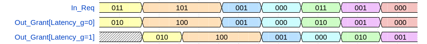
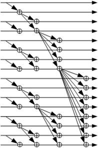

# olo_base_arb_prio

[Back to **Entity List**](../EntityList.md)

## Status Information

  

VHDL Source: [olo_base_arb_prio](../../src/base/vhdl/olo_base_arb_prio.vhd)

## Description

This entity implements a priority arbiter. The left-most bit (highest bit) of the request vector that was asserted is granted (i.e. asserted in the grant  vector). The arbiter is implemented using the very logic-and timing-efficient parallel prefix computation approach.

The arbiter can be implemented with or without an output registers. The waveform below shows its implementation with andwithout output register (*Latency\_g = 0* resp. 1).

## Generics

| Name      | Type     | Default | Description                                                  |
| :-------- | :------- | ------- | :----------------------------------------------------------- |
| Width_g   | positive | -       | Number of requesters (number of bits in *In_Req* and *Out_Grant* vectors) |
| Latency_g | natural  | 1       | Number of output registers (0 means combinatorial output)    |

## Interfaces

### Control

| Name | In/Out | Length | Default | Description                                     |
| :--- | :----- | :----- | ------- | :---------------------------------------------- |
| Clk  | in     | 1      | -       | Clock                                           |
| Rst  | in     | 1      | -       | Reset input (high-active, synchronous to *Clk*) |

### Input Data

| Name   | In/Out | Length    | Default | Description                                                  |
| :----- | :----- | :-------- | ------- | :----------------------------------------------------------- |
| In_Req | in     | *Width_g* | -       | Request vector. The highest (left-most) bit has highest priority. |

### Output Data

| Name      | In/Out | Length    | Default | Description         |
| :-------- | :----- | :-------- | ------- | :------------------ |
| Out_Grant | out    | *Width_g* | N/A     | Grant output signal |

## Architecture

Parallel prefix computation is used to calculate a vector that contains a '1' on the highest-priority bit that was asserted and on all bits with lower priority. The vector then looks for example like this "0001111". The bit to assert in the *Grant* output can then be determined by finding the 0-1 edge inside that vector.

The figure below shows the parallel prefix computation graphically.

