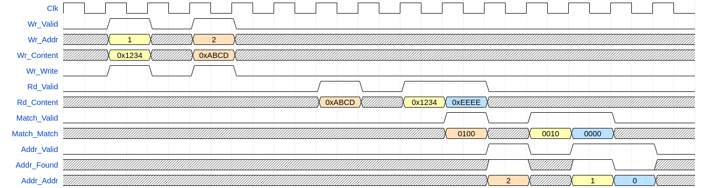
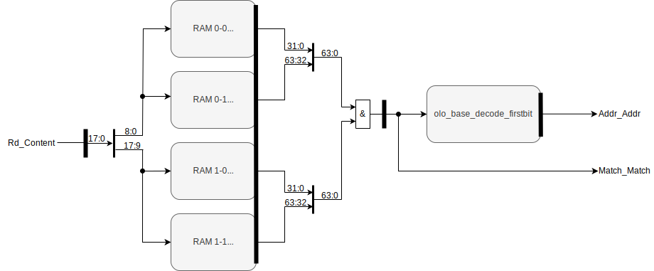
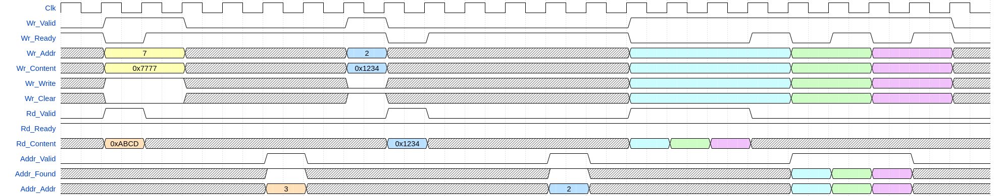
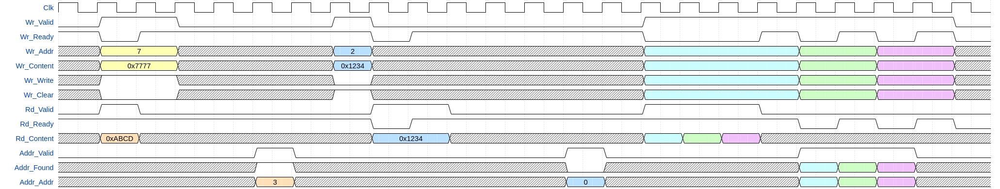
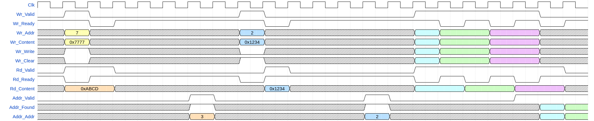
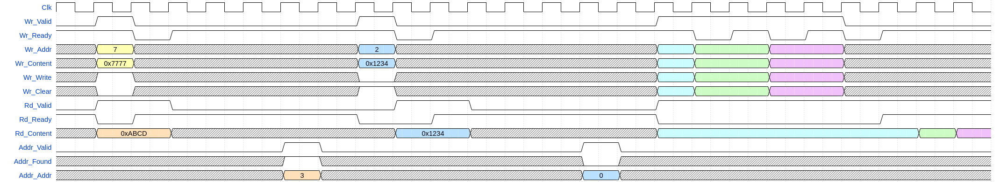
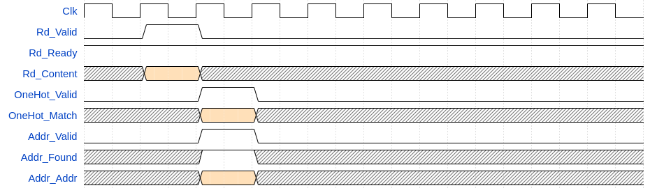
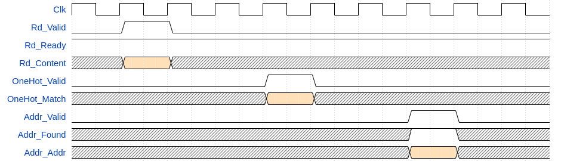

# olo_base_cam

[Back to **Entity List**](../EntityList.md)

## Status Information

VHDL Source: [olo_base_cam](../../src/base/vhdl/olo_base_cam.vhd)

## Description

This component implements a content addressable memory. Content addressable memories are usually used for fast-lookups
in caches, routing tables and other similar scenarios.

The concept of mapping a CAM into block and/or distributed RAM described in the
[AMD application not XAPP 1151](https://docs.amd.com/v/u/en-US/xapp1151_Param_CAM) is applied. However, _olo_base_cam_
has a very different and much easier to understand user interface than the component described in the application note.

The _olo_base_cam_ does allow to write address/content pairs and to find out in which address a queried content is
stored.

Reads take one clock cycle, writes take two clock cycles and the two things cannot happen at the same time.

Below example assumes a _olo_base_cam_ with 4 addresses and 16 bit content.

The CAM has logically separated read and write interfaces. They share some resources internally but from a users
perspective they are independent. Every read-request issues through _Rd_..._ is followed by one output on both
read-response streams:

- _OneHot_..._ provides a match response
  - A vector with one entry per address, indicating if the requested _Rd_Content_ was stored in this address or not
- _Addr_..._ provides the binary encoded address where _Rd_Content_ is stored
  - The first (lowest) matching address is returned
  - If _Rd_Content_ is not found, _Addr_Found='0'_ is returned.

**Note:** By default the content of the CAM is cleared after reset. During the _RamBlockDepth_g_ clock cycles this
takes, it is not ready to accept any requests and holds _Rd/Wr_Ready_ low. This behavior can be changed through generics
if needed.

**Warning:** The user must ensure that an address is NOT occupied when new content is written to this address. Failure
to adhere to this rule may lead to undefined behavior.

## Generics

Settings that normally must be adjusted by users are given in bold letters. All other settings are regarded as
optimization settings and normally are only touched to tweak the _olo_base_cam_ to match specific needs of an
application.

| Name                 | Type     | Default | Description                                                  |
| :------------------- | :------- | ------- | :----------------------------------------------------------- |
| **Addresses_g**      | positive | -       | Number of addresses in the CAM                               |
| **ContentWidth_g**   | positive | .       | Width of the content to be stored in the CAM                 |
| **RamStyle_g**       | string   | "auto"  | Through this generic, the exact resource to use for implementation can be controlled. This generic is applied to the attributes _ram_style_ and _ramstyle_ which vendors offer to control RAM implementation. For details refer to the description in [olo_base_ram_sdp](./olo_base_ram_sdp.md). |
| **RamBehavior_g**    | string   | "RBW"   | "RBW" = read-before-write, "WBR" = write-before-read For details refer to the description in [olo_base_ram_sdp](./olo_base_ram_sdp.md). |
| **RamBlockWidth_g**  | positive | 32      | For mapping the CAM efficiently into RAM elements of a given technology, the width and depth of the underlying RAM element must be known. **Use the RAM configuration with maximum width**. The CAM gets more resource efficient the wider BRAM ports are.  |
| **RamBlockDepth_g**  | positive | 512     | For mapping the CAM efficiently into RAM elements of a given technology, the width and depth of the underlying RAM element must be known. Use the RAM configuration with maximum width. The CAM gets more resource efficient the wider BRAM ports are. |
| ClearAfterReset_g    | boolean  | true    | **True**: After reset the CAM content is cleared. This process takes _RamBlockDepth_g_ clock cycles during which _Wr_Ready_ and _Rd_Ready_ stay low. **False**: The CAM is not cleared after reset. Contents from before the reset stay in the CAM but the CAM is operable immedieatly. _Note:_ It is strongly suggested to keep this setting enabled if the CAM is receiving resets after it was once operated. Clearing a CAM manually requires looping through all possible content values which can be time-consuming. |
| ReadPriority_g       | true     | true    | **True**: _Rd_Valid_ and _Wr_Valid_ are high at the same time, the read is executed first. This means that writes are delayed (_Wr_Ready_ held low) until reads are done.  **False**: _Rd_Valid_ and _Wr_Valid_ are high at the same time, the write is executed first. This means that reads are delayed (_Rd_Ready_ held low)until reads are done.  Default value is _true_ to ensure constant read-latency because read-latency is one of the main drivers for using CAMs. |
| StrictOrdering_g     | boolean  | false   | **True:** After a write to the CAM, the next read is delayed by one clock-cycle by holding _Rd_Ready_ low to ensure the read already sees the updated CAM content. **False:** A read following a write immediately (in the next clock cycle) may read the old CAM content. In return compared to the _StrictOrdering_g=true_ setting reads can follow writes immediately and are not delayed in this case. Default value is _false_ to ensure constant read-latency because read-latency is one of the main drivers for using CAMs. |
| UseAddrOut_g         | boolean  | true    | **True**: The binary-encoded address output (_Addr_..._) is implemented. This often is more logical to the user but requires additional logic for first-bit decoding.  **False**: Only the match output (_Match_..._) is implemented. The binary-encoded output is omitted to save logic. Normally the same can be achieved by just not connecting the output and relying on the tools optimizing away the related logic. |
| RegisterInput_g      | boolean  | true    | **True:** All inputs are registered. This is optimal for throughput/clock-speed but adds one cycle of latency. **False:** The address lines of the RAM blocks are driven by user inputs combinatorially. This reduces the latency but may negatively affect the possible clock-speed. |
| RegisterMatch_g      | boolean  | true    | **True:** The match output (_Match_..._) is registered. This is optimal for throughput/clock-speed but adds one cycle of latency.  **False:** The match output is driven by RAM blocks combinatorially. This reduces the latency but may negatively affect the possible clock-speed. |
| FirstBitDecLatency_g | natural  | 1       | Number of FF stages for calculating the binary address output _Addr\_..._ after the one-hot output _Match_..._ is known. Range: 0 ... ceil(log2(_InWidth_g_))/2-1 |

## Interfaces

### Control

| Name | In/Out | Length | Default | Description                                     |
| :--- | :----- | :----- | ------- | :---------------------------------------------- |
| Clk  | in     | 1      | -       | Clock                                           |
| Rst  | in     | 1      | -       | Reset input (high-active, synchronous to _Clk_) |

### Read Request

| Name       | In/Out | Length           | Default | Description                                     |
| :--------- | :----- | :--------------- | ------- | :---------------------------------------------- |
| Rd_Content | in     | _ContentWidth_g_ | -       | Content to find address for                     |
| Rd_Valid   | in     | 1-               |         | AXI4-Stream handshaking signal for _Rd_Content_ |
| Rd_Ready   | out    | 1                | N/A     | AXI4-Stream handshaking signal for _Rd_Content_ |

### Write Request

| Name        | In/Out | Length                    | Default | Description                                                  |
| :---------- | :----- | :------------------------ | ------- | :----------------------------------------------------------- |
| Wr_Content  | in     | _ContentWidth_g_          | -       | Content to find to modify entry for                          |
| Wr_Addr     | in     | ceil(log2(_Addresses_g_)) | -       | Address to modify entry for                                  |
| Wr_Write    | in     | 1                         | -       | Write _Wr_Content_ to _Wr_Addr_ in CAM.  Note that the **user must ensure that this address is NOT occupied at the time of writing** to it. |
| Wr_Clear    | in     | 1                         | '0'     | Clear _Wr_Content_ from _Wr_Addr_. Only this exact content is removed from this exact address. |
| Wr_ClearAll | in     | 1                         | '0'     | Clear _Wr_Content_ from all addresses it is stored in (_Wr_Addr_ is ignored). |
| Wr_Valid    | in     | 1                         | -       | AXI4-Stream handshaking signal for _Wr_..._                  |
| Wr_Ready    | out    | 1                         | N/A     | AXI4-Stream handshaking signal for _Wr_..._                  |

### One Hot Encoded Output

| Name        | In/Out | Length        | Default | Description                                                  |
| :---------- | :----- | :------------ | ------- | :----------------------------------------------------------- |
| Match_Match | out    | _Addresses_g_ | N/A     | Match vector, containing a '1' for every address in which the requested _Rd_Content_ is stored. |
| Match_Valid | out    | 1             | N/A     | AXI4-Stream handshaking signal for _Match_Match_. One _Match_Valid_ pulse is produced for every read transaction as signaled through _Rd_Valid_/_Rd_Ready_ |

### Binary Encoded Output

Note that this interface is only operated if _UseAddrOut_g=true_.

| Name       | In/Out | Length                    | Default | Description                                                  |
| :--------- | :----- | :------------------------ | ------- | :----------------------------------------------------------- |
| Addr_Found | out    | 1                         | N/A     | '1' if the requested _Rd_Content_ was found in the CAM, '0' otherwise. |
| Addr_Addr  | out    | ceil(log2(_Addresses_g_)) | N/A     | First (lowest) address _Rd_Content_ was found in.            |
| Addr_Valid | out    | 1                         | N/A     | AXI4-Stream handshaking signal for _Addr_..._. One _Addr_Valid_ pulse is produced for every read transaction as signaled through _Rd_Valid_/_Rd_Ready_ |

## Details

### Architecture

Below figure shows the architecture for the following properties:

- _Addresses_g_=64
- _ContentWidth_g_=18
- AMD 7-Series BRAM18
  - _RamBlockWidth_g_=32
  - _RamBlockDepth_g_=512

The match-entries are stored with one bit per address. Hence overall the RAM must be 64 bits wide, which leads to the
need of having two block RAM in parallel (each one 32 bits wide).

The content is used to address the RAMs. Naturally an 18-bit address would lead to 256k entries to address. However,
the content can be split and 9 bits can be fed to two different RAMs. Like this only 1k entries are required. In order
to receive the correct match entries, the outputs of the two sub-RAMs must be ANDed. This concept works because each
address is occupied only once.

Note that the figure only shows the read path. The write path is best understood from the code directly.

Let's assume the CAM contains the following entries:

- Address 2 = Content 0x10010
- Address 3 = Content 0x100FF
- Address 4 = Content 0xFF010

If the _Rd_Content_ 0x100010 is applied, this is split into two sub-addresses. The upper bits (0x080) go to _RAM 1-0_
and _RAM 1-1_ and the lower bits (0x010) go to _RAM 0-0_ and _RAM 0-1_.

The upper RAMs return 0x0000'0000'0000'000C. Two bits are set, because the same partial address (0x080) applies to both
entries in the CAM.

The lower RAMs return 0x0000'0000'0000'0014 (again two entries match the pattern). ANDing the two RAM responses results
in a _Match_Match_ of 0x0000'0000'0000'0004 (bit 2 is set) and a _Addr_Addr_ o 2 as expected.

For more details about this architecture, refer to
[AMD application not XAPP 1151](https://docs.amd.com/v/u/en-US/xapp1151_Param_CAM).

### Read/Write Access Ordering

The ordering and prioritization between read and write accesses is important for CAMs. First, because they often are
used in cases where traffic is very asymmetric with many fast lookups (read operations) and much less write operations.
Second, in some applications deterministic read-latency is a key driver for using CAMs - and this property often should
not be destroyed by write operations having priority over read operations. On the other hand, there are applications
that can read from CAMs continuously and in this case write operations must have priority (because they never happen
otherwise).

Bottomline: There are a few things to consider and the behavior of _olo_base_cam_ is configurable therefore.

Below four samples show different configurations. All examples assume the following things:

- Initial CAM content:
  - Content 0x1234 at address 2
  - Content 0xABCD at address 3
- RAM behavior is read before write

#### ReadPriority_g = True / StrictOrdering_g = False

In above figure the following things are noticeable:

- Between the yellow and the orange transaction, the read transaction is executed first due to _ReadPriority_g=true_.
- For the blue transaction, although the entry was cleared in the clock cycle just before, the read still returns a
  match. This is caused by _StrictOrdering_g=false_ which leads to reads in the clock cycle directly after the write
  still reading the old content.
  - Note that this only happens for _RamBehavior_g="RBW"_. Write before read RAMs always return the new value.
- In the last part it is visible that read transactions are prioritized and write transactions are delayed until the
  point where no read is happening.

#### ReadPriority_g = True / StrictOrdering_g = True

In above figure the following difference to the last section is noticeable:

- For the blue transaction, the read is delayed by one clock cycle to ensure the updated CAM content is seen after the
  write transaction. This is caused by _StrictOrdering_g=true_.
  - As a result, the new content is read. _AddrFound='0'_ is returned because the clearing took effect before the read.
- In the last part, it is visible that the low-pulse on _Rd_Ready_ after a write happens always (independently of the
  details about the read and the write).

#### ReadPriority_g = False / StrictOrdering_g = False

The following points are notable about the figure above:

- Writes are prioritized over reads (see yellow/orange transaction or the part at the end of the figure). This is due
  to _ReadPriority_g=False_.
- Due to _StrictOrdering_g=False_ a read can happen immediately after the write but reads the old content (see blue
  transaction). In the colorful part to the end of the figure, it becomes visible that this configuration allows to use
  the stall cycles of the writes (where _Wr_Ready_ is pulsed low) for reads. Hence this configuration allows for
  maximum overall throughput.

#### ReadPriority_g = False / StrictOrdering_g = True

The following points are notable about the figure above:

- Due to the strict ordering, the read for the blue transaction is delayed by one clock cycle and the new value is read.
- Because the strict ordering does not allow to use the _Wr_Ready_ low pulses for reading, the reads are delayed until
  all writes are done towards the end of the figure.

### Latency/Throughput Considerations

#### Low Latency

If you aim for lowest possible read latency (in terms of clock cycles), disable all optional registers. Note that this
may lead to reduced clock frequencies for larger CAM implementations:

- _RegisterInput_g=false_
- _RegisterMatch_g=false_
- _FirstBitDecLatency_g=0_

Additionally prioritize reads over writes to ensure the read-latency is not negatively impacted when the CAM is written.
Also disable strict ordering to ensure reads are not delayed _after_ writes.

- _ReadPriority_g=true_
- _StrictOrdering_g=false_

To avoid long combinatorial paths, the _Match_...__ outputs shall be preferred over _Addr_..._.

#### Maximum Clock Speed

For achieving maximum throughput and high clock speed, use enable all registering. The number of _FirstBitDecLatency_g_
registers for the first bit decoding depends on the size of the CAM. However, for maximum clock frequency the number
shall be chosen better a bit higher.

- _RegisterInput_g=true_
- _RegisterMatch_g=true_
- _FirstBitDecLatency_g=3_

If read-throughput is in focus, of course reads shall never be stalled due to writes:

- _ReadPriority_g=true_
- _StrictOrdering_g=false_

### Reset Behavior

The fact that RAM contents are not reset when reset signals are asserted is well known. For RAMs this is not too severe
because one can easily iterate through all addresses to clear the RAMs.

For CAMs the situation is more difficult because often the width of the contents are relatively high (this is a good
reason to use a CAM instead of a RAM) and hence iterating through e.g. all possible 64-bit values of a CAM content to
clear the memory is not practicable. However, in the internal structure it is possible to iterate through each RAM block
separately.

_olo_base_cam_ implements clearing of the RAM contents after reset if _ClearAfterReset_g=true_. It is strongly
recommended to leave this setting enabled unless the initial delay of _RamBlockDepth_g_ clock cycles (required for the
clearing) before _Rd_Ready_ and _Wr_Ready_ going high is really not tolerable.
