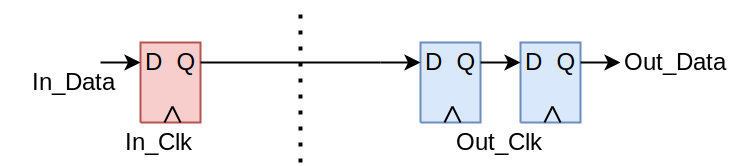

# olo_base_cc_bits

[Back to **Entity List**](../EntityList.md)

## Status Information

  

VHDL Source: [olo_base_cc_bits](../../src/base/vhdl/olo_base_cc_bits.vhd)

## Description

This component implements a clock crossing for multiple independent single-bit signals. It contains double-stage synchronizers and sets all the attributes required for proper synthesis.
Note that this clock crossing does not guarantee that all bits arrive in the same clock cycle at the destination clock domain, therefore it can only be used for independent single-bit signals. Do not use it to transfer multi-bit signals (e.g. numbers) where it is important that all the bits are updated in the same clock cycle.

This block follows the general [clock-crossing principles](clock_crossing_principles.md). Read through them for more information.

## Generics

| Name    | Type     | Default | Description                                             |
| :------ | :------- | ------- | :------------------------------------------------------ |
| Width_g | positive | 1       | Number of data bits to implement the clock crossing for |

## Interfaces

| Name     | In/Out | Length    | Default | Description                                                  |
| :------- | :----- | :-------- | ------- | :----------------------------------------------------------- |
| In_Clk   | in     | 1         | -       | Source clock                                                 |
| In_Rst   | in     | 1         | '0'     | Reset input (high-active, synchronous to *In_Clk*)           |
| In_Data  | in     | *Width_g* | -       | Vector of independent input bits (synchronous to *In_Clk*)   |
| Out_Clk  | in     | 1         | -       | Destination clock                                            |
| Out_Rst  | in     | 1         | '0'     | Reset input (high-active, synchronous to *Out_Clk*)          |
| Out_Data | out    | *Width_g* | N/A     | Vector of independent output bits (synchronous to *Out_Clk*) |

## Architecture

*In_Data* is first synchronized to *In_Clk*. The synchronization register is included to cover cases where users connect a combinatorial signal (from the *In_Clk* domain) to *In_Data*. Although this is in-line with synchronous design practices,  without the input FF this would lead to a clock crossing containing combinatorial logic which is problematic.

On the *Out_Clk* domain, the signal is then synchronized using an ordinary two-stage synchronizer. 

The VHDL code contains all synthesis attributes required to ensure correct behavior of tools (e.g. avoid mapping of the synchronizer FFs into shift registers) for the most common FPGA vendors *AMD* and *Intel*.

Regarding timing constraints, refer to [clock-crossing principles](clock_crossing_principles.md).

