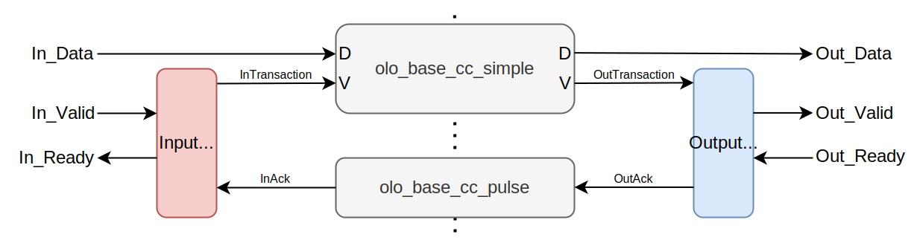

# olo_base_cc_handshake

[Back to **Entity List**](../EntityList.md)

## Status Information

VHDL Source: [olo_base_cc_handshake](../../src/base/vhdl/olo_base_cc_handshake.vhd)

## Description

This component implements a clock crossing with AXI-S handshaking for transferring data from one clock domain to another
one that runs at a potentially completely asynchronous clock It can for example be used to transfer data from a 100 MHz
clock domain to a 55.32 MHz clock domain.

This component implements full AXI-S handshaking but is not made for high performance. It can transfer one data-word
every _(2 + SyncStages_g) x InputClockPeriods + (2 + SyncStages_g) x OutputClockPeriods_ .

Whenever distributed RAM can be used (i.e. LUTs can be used as small RAMs),
[olo_base_fifo_async](./olo_base_fifo_async.md) is to be preferred over this entity. For small FIFO depths, it is more
resource efficient. Hence _olo_base_cc_handshake_ shall only be used in cases where distributed RAM is not an option
(e.g. because it is in not supported by the target technology or because the design is short the related LUT resources).

This block follows the general [clock-crossing principles](clock_crossing_principles.md). Read through them for more
information.

## Generics

| Name            | Type      | Default | Description                                                  |
| :-------------- | :-------- | ------- | :----------------------------------------------------------- |
| Width_g         | positive  | -       | Data width in bits.                                          |
| ReadyRstState_g | std_logic | '1'     | Controls the status of the _In_Ready_ signal in during reset. Choose '1' for minimal logic on the (often timing-critical) _In_Ready_ path. |
| SyncStages_g    | positive  | 2       | Number of synchronization stages.  Range: 2 ... 4       |

## Interfaces

### Input Data

| Name      | In/Out | Length    | Default | Description                                                  |
| :-------- | :----- | :-------- | ------- | :----------------------------------------------------------- |
| In_Clk    | in     | 1         | -       | Input clock (must run at an integer multiple of _Out_Clk_)   |
| In_RstIn  | in     | 1         | '0'     | Reset input (high-active, synchronous to _In_Clk_)           |
| In_RstOut | out    | 1         | N/A     | Reset output (see [clock-crossing principles](clock_crossing_principles.md), synchronous to _In_Clk_) |
| In_Data   | in     | _Width_g_ | -       | Input data                                                   |
| In_Valid  | in     | 1         | '1'     | AXI4-Stream handshaking signal for _In_Data_                 |
| In_Ready  | out    | 1         | N/A     | AXI4-Stream handshaking signal for _In_Data_                 |

### Output Data

| Name       | In/Out | Length    | Default | Description                                                  |
| :--------- | :----- | :-------- | ------- | :----------------------------------------------------------- |
| Out_Clk    | in     | 1         | -       | Output clock                                                 |
| Out_RstIn  | in     | 1         | '0'     | Reset input (high-active, synchronous to _Out_Clk_)          |
| Out_RstOut | out    | 1         | N/A     | Reset output (see [clock-crossing principles](clock_crossing_principles.md), synchronous to _Out_Clk_) |
| Out_Data   | out    | _Width_g_ | N/A     | Output data                                                  |
| Out_Valid  | out    | 1         | N/A     | AXI4-Stream handshaking signal for _Out_Data_                |
| Out_Ready  | in     | 1         | '1'     | AXI4-Stream handshaking signal for _Out_Data_                |

## Architecture

The architecture of of _olo_base_cc_handshake_ is based on the idea of passing a request (_XxxTransaction_) from the
source domain to the destination domain when data is applied and an acknowledge (_XxxAck_) back once it was accepted.
The input logic only accepts new data after the acknowledge was received.

This architecture is built based on _olo_base_cc_simple_ and _olo_base_cc_pulse_.

Note that this architecture is optimized for simplicity and not for throughput.

Regarding timing constraints, refer to [clock-crossing principles](clock_crossing_principles.md).
