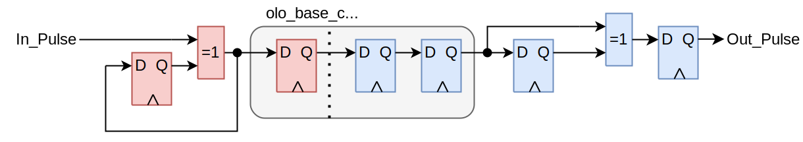
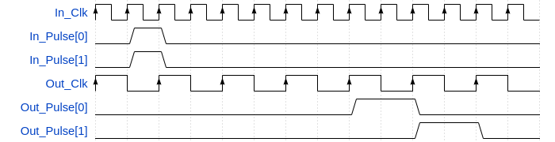

# olo_base_cc_pulse

[Back to **Entity List**](../EntityList.md)

## Status Information

  

VHDL Source: [olo_base_cc_pulse](../../src/base/vhdl/olo_base_cc_pulse.vhd)

## Description

This component implements a clock crossing for transferring single pulses from one clock domain to another (completely asynchronous clocks).

The entity shall only be used for single-cycle pulses and the pulse frequency must be lower than twice the frequency of the slower clock for it to work correctly.

The entity does only guarantee that all pulses arrive at the destination clock domain. It does not guarantee that pulses that occur in the same clock cycle on the source clock domain, occur on the target clock domain in the same clock cycle. As a result it should only be used to do clock-crossings for individual pulses.

This block follows the general [clock-crossing principles](clock_crossing_principles.md). Read through them for more information.

## Generics

| Name        | Type     | Default | Description                                                  |
| :---------- | :------- | ------- | :----------------------------------------------------------- |
| NumPulses_g | positive | 1       | Number of individual pulse signals to implement the clock crossing for |

## Interfaces

| Name       | In/Out | Length        | Default | Description                                                  |
| :--------- | :----- | :------------ | ------- | :----------------------------------------------------------- |
| In_Clk     | in     | 1             | -       | Source clock                                                 |
| In_RstIn   | in     | 1             | '0'     | Reset input (high-active, synchronous to *In_Clk*)           |
| In_RstOut  | out    | 1             | N/A     | Reset output (see [clock-crossing principles](clock_crossing_principles.md), synchronous to *In_Clk*) |
| In_Pulse   | in     | *NumPulses_g* | -       | Vector of independent input pulses (synchronous to *In_Clk*) |
| Out_Clk    | in     | 1             | -       | Destination clock                                            |
| Out_RstIn  | in     | 1             | '0'     | Reset input (high-active, synchronous to *Out_Clk*)          |
| Out_RstOut | out    | 1             | N/A     | Reset output (see [clock-crossing principles](clock_crossing_principles.md), synchronous to *Out_Clk*) |
| Out_Pulse  | out    | *NumPulses_g* | N/A     | Vector of independent output pulses (synchronous to *Out_Clk*) |

## Architecture

The figure below shows how the pulses are transferred from one clock domain to the other. Every pulse toggles a signal in the *In_Clk* comain. The toggle signal is clock-crossed using *olo_base_cc_bits* and in the *Out_Clk* domain the pulse is recovered.

Note that the clock-crossing of the reset is not shown for simplicity reasons. Refer to  [clock-crossing principles](clock_crossing_principles.md). Important is that all registers inside *olo_base_cc_pulse* are reset by the clock-crossed resets. Hence it is guaranteed that a reset does not produce any spurious pulses.

The VHDL code contains all synthesis attributes required to ensure correct behavior of tools (e.g. avoid mapping of the synchronizer FFs into shift registers) for the most common FPGA vendors *AMD* and *Intel*.

Since each pulse is handled separately, the pulse alignment may change because of the clock crossing. This is shown in the figure below.

Regarding timing constraints, refer to [clock-crossing principles](clock_crossing_principles.md).

