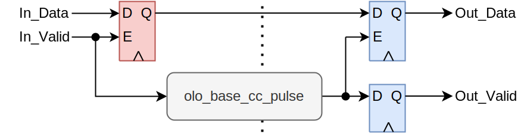

# olo_base_cc_simple

[Back to **Entity List**](../EntityList.md)

## Status Information

 

VHDL Source: [olo_base_cc_simple](../../src/base/vhdl/olo_base_cc_simple.vhd)

## Description

This component implements a clock crossing for transferring single values from one clock domain to another (completely asynchronous clocks). In both clock domains the valid samples are marked with a Valid signal according to the AXI-S specification but back-pressure (Ready) is not handled.

**For the entity to work correctly, the data-rate must be significantly lower (5x lower) than the slower clock frequency.**

This block follows the general [clock-crossing principles](clock_crossing_principles.md). Read through them for more information.

## Generics

| Name    | Type     | Default | Description                             |
| :------ | :------- | ------- | :-------------------------------------- |
| Width_g | positive | 1       | Width of the data-signal to clock-cross |

## Interfaces

| Name       | In/Out | Length    | Default | Description                                                  |
| :--------- | :----- | :-------- | ------- | :----------------------------------------------------------- |
| In_Clk     | in     | 1         | -       | Source clock                                                 |
| In_RstIn   | in     | 1         | '0'     | Reset input (high-active, synchronous to *In_Clk*)           |
| In_RstOut  | out    | 1         | N/A     | Reset output (see [clock-crossing principles](clock_crossing_principles.md), synchronous to *In_Clk*)) |
| In_Data    | in     | *Width_g* | -       | Input data (synchronous to *In_Clk*)                         |
| In_Valid   | in     | 1         | -       | AXI4-Stream handshaking signal for *In_Data*                 |
| Out_Clk    | in     | 1         | -       | Destination clock                                            |
| Out_RstIn  | in     | 1         | '0'     | Reset input (high-active, synchronous to *Out_Clk*)          |
| Out_RstOut | out    | 1         | N/A     | Reset output (see [clock-crossing principles](clock_crossing_principles.md), synchronous to *Out_Clk*)) |
| Out_Data   | out    | *Width_g* | N/A     | Output data (synchronous to *Out_Clk*)                       |
| Out_Valid  | out    | 1         | N/A     | AXI4-Stream handshaking signal for *Out_Data*                |

## Architecture

*In_Data* is latched when *In_Valid* is asserted. The valid signal is then clock-crossed using *olo_base_cc_pulse*. In the output clock domain, the latched data signal is latched when the valid pulse is detected.

A specific clock crossing for the data signal is not required since it is guaranteed to be stable (latched) when the valid pulse is detected in the output clock domain.

Regarding timing constraints, refer to [clock-crossing principles](clock_crossing_principles.md).

