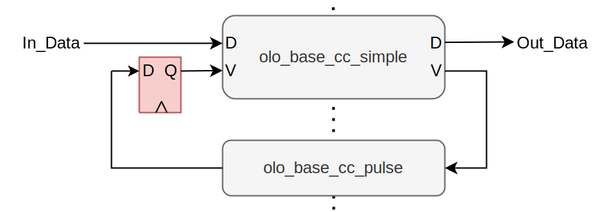

# olo_base_cc_status

[Back to **Entity List**](../EntityList.md)

## Status Information

  

VHDL Source: [olo_base_cc_status](../../src/base/vhdl/olo_base_cc_status.vhd)

## Description

This component implements a clock crossing for slowly changing status information that does not have exact sample rates. It can for example be used to  transfer a buffer fill level from one clock domain to another with minimal effort and without knowing anything about the frequencies of the two clocks (e.g. without knowing which one runs faster).

The entity ensures that data from the source clock domain is correctly transferred to the destination clock domain. The value at the destination clock domain is always correct in terms of "the exact same value was present on the input clock domain in one clock-cycle". The exact timing of the sampling points at which the data is transferred is generated by the entity itself, so it is unknown to the user. As a result, the entity does not guarantee to show transient states of the data signal in the source clock domain to the destination clock domain in cases of fast changing signals.

For the entity to work correctly, the data-rate must be significantly lower (10 x lower) than the slower clock frequency. Of course the signal can change more quickly but the clock crossing will skip some values in this case.

This block follows the general [clock-crossing principles](clock_crossing_principles.md). Read through them for more information.

## Generics

| Name    | Type     | Default | Description                             |
| :------ | :------- | ------- | :-------------------------------------- |
| Width_g | positive | 1       | Width of the data-signal to clock-cross |

## Interfaces

| Name       | In/Out | Length    | Default | Description                                                  |
| :--------- | :----- | :-------- | ------- | :----------------------------------------------------------- |
| In_Clk     | in     | 1         | -       | Source clock                                                 |
| In_RstIn   | in     | 1         | '0'     | Reset input (high-active, synchronous to *In_Clk*)           |
| In_RstOut  | out    | 1         | N/A     | Reset output (see [clock-crossing principles](clock_crossing_principles.md), synchronous to *In_Clk*) |
| In_Data    | in     | *Width_g* | -       | Input data (synchronous to *In_Clk*)                         |
| Out_Clk    | in     | 1         | -       | Destination clock                                            |
| Out_RstIn  | in     | 1         | '0'     | Reset input (high-active, synchronous to *Out_Clk*)          |
| Out_RstOut | out    | 1         | N/A     | Reset output (see [clock-crossing principles](clock_crossing_principles.md), synchronous to *Out_Clk*) |
| Out_Data   | out    | *Width_g* | N/A     | Output data (synchronous to *Out_Clk*)                       |

## Architecture

The architecture of of *olo_base_cc_status* is based on the idea of passing around a valid pulse between the two clock-domains continuously. Data is transferred from *In_Clk* to *Out_Clk* together with the pulse.

This architecture is built based on *olo_base_cc_simple* and *olo_base_cc_pulse*.

Regarding timing constraints, refer to [clock-crossing principles](clock_crossing_principles.md).

