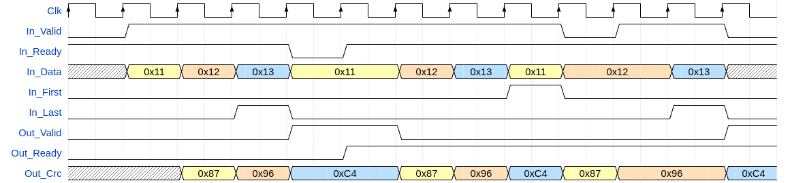

# olo_base_crc

[Back to **Entity List**](../EntityList.md)

## Status Information

VHDL Source: [olo_base_crc](../../src/base/vhdl/olo_base_crc.vhd)

## Description

This component is a CRC checksum generator. It can be used to generate CRC checksums to send together with data (TX
side) or to calculate the CRC checksum of received data and compare it to the CRC received (RX side).

_olo_base_crc_ can take one input data word per clock cycle. One CRC is produced per packet - the _Out_Valid_ signal is
presented to the output after _In_Last_ was received. Although _Out_Valid_ is asserted only upon the _In_Last_ being
received, the output _Out_Crc_ is updated exactly one clock cycle after an input word being received. This allows for
special applications where the CRC has to be checked after every data-word.

The component is highly configurable in order to allow calculating CRC checksums for all known standard protocols
without any external logic. Regarding the notation of parametrization, the website
[crccalc.com](https://crccalc.com) is taken as reference. On this website
many commonly used CRCs are listed.

## Generics

| Name            | Type     | Default     | Description                                                  |
| :-------------- | :------- | ----------- | :----------------------------------------------------------- |
| CrcWidth_g      | positive | -           | Width of the CRC in bits (must be >= 2)                      |
| DataWidth_g     | positive | -           | Input data width                                             |
| Polynomial_g    | natural  | -           | CRC Polynomial according to the notation in [crccalc.com](https://crccalc.com) - which matches the comon-sense. Passed as integer - for good readability use hex notation (e.g. _16#D5#_)  For details, see [Architecture](#architecture) |
| InitialValue_g  | natural  | 0           | Initial value to load into the LFSR before the first data word arrives. Passed as integer - for good readability use hex notation (e.g. _16#D5#_) |
| BitOrder_g      | string   | "MSB_FIRST" | The input can be processed "MSB_FIRST" or "LSB_FIRST". "MSB_FIRST" - Most significant bit is shifted into LFSR first "LSB_FIRST" - Least significant bit is shifted into LFSR first |
| ByteOrder_g     | string   | "NONE"      | This generic allows byte-wise processing of the input if required. "NONE" - No byte-wise processing, the whole input is interpreted as one word "MSB_FIRST" - Most significant byte of the input is shifted into the LFSR first.  "MSB_FIRST" -  Least significant byte of the input is shifted into the LFSR first.  For any other values than "NONE" the setting of _BitOrder_g_ is applied to the ordering of bits within each byte. **Note:** Other values than "NONE" are only allowed if _DataWidth_g_ is a multiple of 8 |
| BitflipOutput_g | boolean  | false       | If set to _true_ the LFSR content is bit-flipped (MSB to LSB and vice-versa) for output through _Out_Crc_. |
| XorOutput_g     | natural  | 0           | XOR mask to apply to the output. This is required for certain standards according to [crccalc.com](https://crccalc.com). <b> The XOR mask is applied after bitflip in case of _BitFlipOutput_g=true_. |

**Note:** For cases where no exact protocol specification must be followed (for user defined protocols) it is suggested
to leave the following generics on their default value. These generics are only used to match exact protocol
specifications.

- XorOutput_g
- BitflipOutput_g
- ByteOrder_g
- BitOrder_g
- InitialValue_g

## Interfaces

### Control

| Name | In/Out | Length | Default | Description                                     |
| :--- | :----- | :----- | ------- | :---------------------------------------------- |
| Clk  | in     | 1      | -       | Clock                                           |
| Rst  | in     | 1      | -       | Reset input (high-active, synchronous to _Clk_) |

### Input Data

| Name     | In/Out | Length        | Default | Description                                                  |
| :------- | :----- | :------------ | ------- | :----------------------------------------------------------- |
| In_Data  | in     | _DataWidth_g_ | -       | Input data                                                   |
| In_Valid | in     | 1             | '1'     | AXI4-Stream handshaking signal for _In_Data_                 |
| In_Ready | out    | 1             | -       | AXI4-Stream handshaking signal for _In_Data_                 |
| In_Last  | in     | 1             | '0'     | AXI4-Stream packet end signaling for _In_Data_               |
| In_First | in     | 1             | '0'     | In case a packet is aborted/finished without a _In_Last_ this bit can be pulled high on the first _In_Data_ word of the next packet to signal the start of a new packet. |

### Output Data

| Name      | In/Out | Length       | Default | Description                                   |
| :-------- | :----- | :----------- | ------- | :-------------------------------------------- |
| Out_Crc   | out    | _CrcWidth_g_ | -       | Output CRC checksum                           |
| Out_Valid | out    | 1            | -       | AXI4-Stream handshaking signal for _Out_Data_ |
| Out_Ready | in     | 1            | '1'     | AXI4-Stream handshaking signal for _Out_Data_ |

## Architecture

For the following documentation, the abbreviation LFSR stands for Linear Feedback Shift Register, a hardware optimized
CRC calculation algorithm.

The figure below shows the overall architecture of _olo_base_crc_. It also nicely shows the order of operations. Note
that flow-control is not depicted for simplicity reasons.

The handling of _BitOrder_g_ and _ByteOrder_g_ might be non-straightforward to understand. The table below lists all
combinations.

| In_Data               | BitOrder_g  | ByteOrder_g          | LFSR Input (first bit left) |
| --------------------- | ----------- | -------------------- | --------------------------- |
| "0001_0011_0111_1111" | "MSB_FIRST" | "NONE" / "MSB_FIRST" | 0000 0011 0111 1111         |
| "0001_0011_0111_1111" | "LSB_FIRST" | "NONE" / "LSB_FIRST" | 1111 1110 1100 1000         |
| "0001_0011_0111_1111" | "MSB_FIRST" | "LSB_FIRST"          | 0111 1111 0001 0011         |
| "0001_0011_0111_1111" | "LSB_FIRST" | "MSB_FIRST"          | 1100 1000 1111 1110         |

The handling of _BitflipOutput_g_ and _XorOutput_g_ might be non-straightforward to understand. The table below lists
all combinations.

| LFSR Content | BitflipOutput_g | XorOutput_g | Out_Crc     |
| ------------ | --------------- | ----------- | ----------- |
| "1010_0011"  | true            | 16#00#      | "1100_0101" |
| "1010_0011"  | false           | 16#00#      | "1010_0011" |
| "1010_0011"  | true            | 16#0F#      | "1100_1010" |
| "1010_0011"  | false           | 16#0F#      | "1010_1100" |

Below figure shows how CRC polynomials are represented in _Polynomial_g_ and how the LFSR itself exactly is implemented.
The figure is drawn as if only one bit per clock cycle is processed but in reality multiple bits are processed - hence
the figure does not depict the actual implementation but the functionality.

Below table lists the settings to be used for a set of standard CRCs according to different protocol specifications.
More standard CRCs can be found on [crccalc.com](https://crccalc.com).
All the CRCs listed in below table are also present in
[crccalc.com](https://crccalc.com) and hence the mapping of values from
[crccalc.com](https://crccalc.com) to _olo_base_crc_ generics is clarified
by the table.

| CRC Standard    | CrcWidth_g | Polynomial_g | InitialValue_g | BitOrder_g  | BitflipOutput_g | XorOutput_g |
| --------------- | ---------- | ------------ | -------------- | ----------- | --------------- | ----------- |
| CRC-8/DVB-S2    | 8          | 0xD5         | 0x00           | "MSB_FIRST" | false           | 0x00        |
| CRC-8/AUTOSAR   | 8          | 0x2F         | 0xFF           | "MSB_FIRST" | false           | 0xFF        |
| CRC-8/BLUETOOTH | 8          | 0xA7         | 0x00           | "LSB_FIRST" | true            | 0x00        |
| CRC-16/DECT-R   | 16         | 0x0589       | 0x0000         | "MSB_FIRST" | false           | 0x01        |
| CRC-16/DDS-110  | 16         | 0x8005       | 0x800D         | "MSB_FIRST" | false           | 0x00        |

Below figure depicts the handshaking, the usage of _In_Last_/_In_First_ as well as _Out_Crc_ being valid one clock cycle
after every data input.

The following points are worth mentioning:

- The CRC for the example is CRC-8/DVB-S2
- Three identical packets are processed (data 0x11, 0x12, 0x13)
- _Out_Crc_ is updated exactly one clock cycle after the input data being transferred
- The first packet shows backpressure (propagation of _Out_Ready_ to _In_Ready_)
- The second packet is not terminated by _In_Last_ and the start of the third packet is indicated by _In_First_
