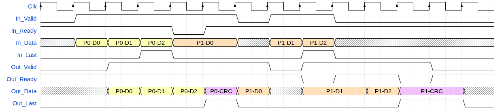
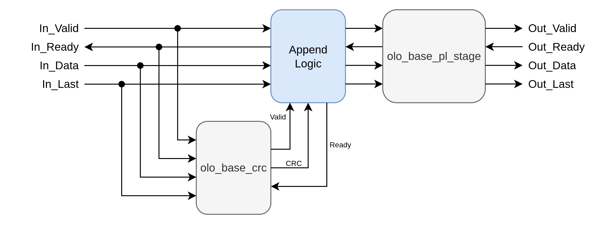

# olo_base_crc_append

[Back to **Entity List**](../EntityList.md)

## Status Information

VHDL Source: [olo_base_crc_append](../../src/base/vhdl/olo_base_crc_append.vhd)

## Description

This component does calculate and append a CRC checksum to AXI4-Stream packets. Together with
[olo_base_crc_check](./olo_base_crc_check.md) it can be used to CRC protect any data stream.

The CRC to append to the packet must be smaller or equal to the width of the data stream (_DataWidth_g_). If the CRC
is smaller, the CRC is placed in the LSBs of the data word and the remaining MSBs are filled with zeros.

CRC settings are identical to [olo_base_crc](./olo_base_crc.md), plese refer to the documentation of _olo_base_crc_
for details.

Below waveform shows an example use-case.

Note that the exact timing and latency might be different from the figure. The important point in the figure are:

- There are no bubble cycles in the output stream
- There is one stall cycle per packet in the input stream (when CRC is appended)
- Input and output support full AXI4-Stream handshaking (Ready/Valid)

## Generics

| Name               | Type             | Default     | Description                                                  |
| :----------------- | :--------------- | ----------- | :----------------------------------------------------------- |
| DataWidth_g        | positive         | -           | Data width of the data stream                                |
| CrcPolynomial_g    | std_logic_vector | -           | See [olo_base_crc](./olo_base_crc.md)                        |
| CrcInitialValue_g  | std_logic_vector | all '0'     | See [olo_base_crc](./olo_base_crc.md)                        |
| CrcBitOrder_g      | string           | "MSB_FIRST" | See [olo_base_crc](./olo_base_crc.md)                        |
| CrcByteOrder_g     | string           | "NONE"      | See [olo_base_crc](./olo_base_crc.md)                        |
| CrcBitflipOutput_g | boolean          | false       | See [olo_base_crc](./olo_base_crc.md)                        |
| CrcXorOutput_g     | std_logic_vector | all '0'     | See [olo_base_crc](./olo_base_crc.md)                        |

**Note:** For cases where no exact protocol specification must be followed (for user defined protocols) it is suggested
to leave the following generics on their default value. These generics are only used to match exact protocol
specifications.

- CrcXorOutput_g
- CrcBitflipOutput_g
- CrcByteOrder_g
- CrcBitOrder_g
- CrcInitialValue_g

## Interfaces

### Control

| Name | In/Out | Length | Default | Description                                     |
| :--- | :----- | :----- | ------- | :---------------------------------------------- |
| Clk  | in     | 1      | -       | Clock                                           |
| Rst  | in     | 1      | -       | Reset input (high-active, synchronous to _Clk_) |

### Input Data

| Name     | In/Out | Length        | Default | Description                                                  |
| :------- | :----- | :------------ | ------- | :----------------------------------------------------------- |
| In_Data  | in     | _DataWidth_g_ | -       | Input data                                                   |
| In_Valid | in     | 1             | '1'     | AXI4-Stream handshaking signal for _In_Data_                 |
| In_Ready | out    | 1             | N/A     | AXI4-Stream handshaking signal for _In_Data_                 |
| In_Last  | in     | 1             | -    | AXI4-Stream packet end signaling for _In_Data_               |

### Output Data

| Name      | In/Out | Length                | Default | Description                                     |
| :-------- | :----- | :-------------------- | ------- | :---------------------------------------------- |
| Out_Data  | out    | _DataWidth_g_         | N/A     | Output data                                     |
| Out_Valid | out    | 1                     | N/A     | AXI4-Stream handshaking signal for _Out_Data_   |
| Out_Ready | in     | 1                     | '1'     | AXI4-Stream handshaking signal for _Out_Data_   |
| Out_Last  | out    | 1                     | N/A     | AXI4-Stream packet end signaling for _Out_Data_ |

## Architecture

The architecture is relatively trivial thanks to the already existing [olo_base_crc](./olo_base_crc.md) component.

A pipeline stage [olo_base_pl_stage](./olo_base_pl_stage.md) is required at the output to avoid any direct combinatorial
paths from _Out_Ready_ to _In_Ready_.
