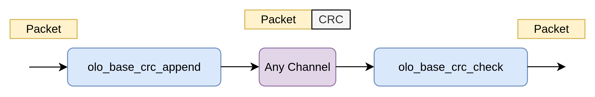
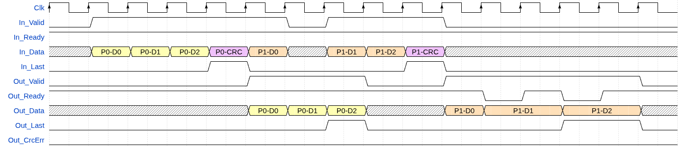
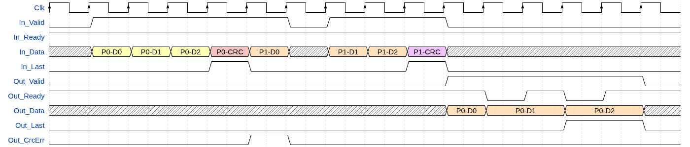
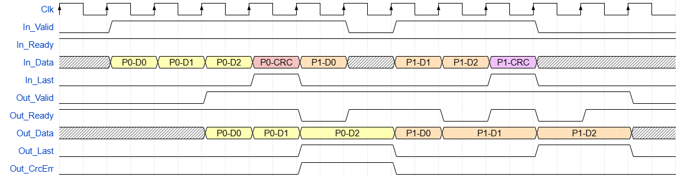
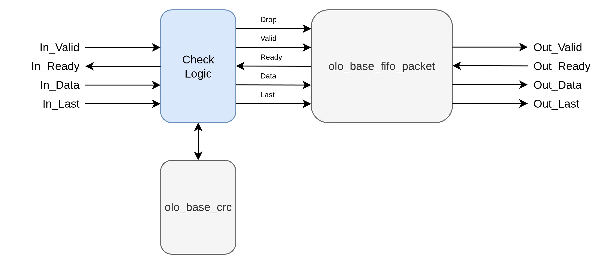

# olo_base_crc_check

[Back to **Entity List**](../EntityList.md)

## Status Information

VHDL Source: [olo_base_crc_check](../../src/base/vhdl/olo_base_crc_check.vhd)

## Description

This component does check the CRC contained in AXI4-Stream packets as last word. It is meant to be used together with
[olo_base_crc_append](./olo_base_crc_append.md) to CRC protect any data stream.

_olo_base_crc_check_ has two modes of operation (_Mode_g_). In `Mode_g="DROP"` any packets with CRC errors are dropped
(i.e. they do not appear on the output). In this mode the component contains a packet FIFO. In `Mode_g="FLAG"`, all
packets appear at the output but packets with CRC errors are flagged (with _Out_CrcErr_ in the last data beat).

The CRC appended to the packet must be smaller or equal to the width of the data stream (_DataWidth_g_).

CRC settings are identical to [olo_base_crc](./olo_base_crc.md), please refer to the documentation of _olo_base_crc_
for details. The CRC is calculated over all data words except the last one which contains the CRC itself.

**Important Note**: Packets without any data, only containing a CRC, are not handled and might lead to
undefined behavior.

Below waveform shows an example use-case in _DROP_ mode without any CRC errors.

Note that the exact latency might be different (this applies to all figures). The important point in the figure are:

- There is one bubble cycle per packet in the output stream (when CRC is checked)
- There are no bubble cycles in the input stream
- Input and output support full AXI4-Stream handshaking (Ready/Valid)
- The packet is only presented to the output after it wass fully received and the CRC check was successful

### Details about DROP mode

In _DROP_ mode a [olo_base_fifo_packet](./olo_base_fifo_packet.md) is used to drop packets with CRC errors. Because
the CRC can only be checked once it arrived, the first word of a packet is only presented on the output once the full
packet was received. Hence the latency is higher compared to the _FLAG_ mode.

The presence of the FIFO also implies that backpressure is forwarded to the input only once the FIFO is full.

Failed CRC checks (red CRC in below figure) lead to the whole packet being dropped and _Out_CrcErr_ being
pulsed high for exactly one clock cycle.

**Important:** _Out_CrcErr_ in this mode is _NOT_ handshaked with _Out_Ready_ and _Out_Valid_ but a single cycle pulse.

### Details about FLAG mode

Failed CRC checks (red CRC in below figure) lead to the last word of the packet being flagged with
_Out_CrcErr.

Note that in _FLAG_ mode, the packet is presented at the output while it still is received, because no packet FIFO
is present.

_Out_CrcErr_ in this mode _IS_ handshaked with _Out_Ready_ and _Out_Valid_ but a single cycle pulse.

## Generics

| Name               | Type             | Default     | Description                                                  |
| :----------------- | :--------------- | ----------- | :----------------------------------------------------------- |
| DataWidth_g        | positive         | -           | Data width of the data stream                                |
| Mode_g             | string           | "DROP"      | _DROP_ - drop packets with CRC errors   _FLAG_ keep, but flag packets with CRC errors |
| FifoDepth_g        | positive         | 1024        | Depth of the internal packet FIFO (in number of data words). Must be at least _2 x maximum packet size_ for optimal performance.   Not used for Mode_g=_FLAG_.         |
| FifoRamStyle_g     | string           | "auto"      | Resource to use for packet FIFO RAM implementation in _DROP_ mode. For details refer to the description in [olo_base_ram_sdp](./olo_base_ram_sdp.md).   Not used for Mode_g=_FLAG_. |
| FifoRamBehavior_g  | string           | "RBW"       | Behavior of the packet FIFO RAM in _DROP_ mode. For details refer to the description in [olo_base_ram_sdp](./olo_base_ram_sdp.md).   Not used for Mode_g=_FLAG_. |
| CrcPolynomial_g    | std_logic_vector | -           | See [olo_base_crc](./olo_base_crc.md)                        |
| CrcInitialValue_g  | std_logic_vector | all '0'     | See [olo_base_crc](./olo_base_crc.md)                        |
| CrcBitOrder_g      | string           | "MSB_FIRST" | See [olo_base_crc](./olo_base_crc.md)                        |
| CrcByteOrder_g     | string           | "NONE"      | See [olo_base_crc](./olo_base_crc.md)                        |
| CrcBitflipOutput_g | boolean          | false       | See [olo_base_crc](./olo_base_crc.md)                        |
| CrcXorOutput_g     | std_logic_vector | all '0'     | See [olo_base_crc](./olo_base_crc.md)                        |

**Note:** For cases where no exact CRC specification must be followed (for user defined protocols) it is suggested
to leave the following generics on their default value. These generics are only used to match exact CRC
specifications

- CrcXorOutput_g
- CrcBitflipOutput_g
- CrcByteOrder_g
- CrcBitOrder_g
- CrcInitialValue_g

## Interfaces

### Control

| Name | In/Out | Length | Default | Description                                     |
| :--- | :----- | :----- | ------- | :---------------------------------------------- |
| Clk  | in     | 1      | -       | Clock                                           |
| Rst  | in     | 1      | -       | Reset input (high-active, synchronous to _Clk_) |

### Input Data

| Name     | In/Out | Length        | Default | Description                                                  |
| :------- | :----- | :------------ | ------- | :----------------------------------------------------------- |
| In_Data  | in     | _DataWidth_g_ | -       | Input data                                                   |
| In_Valid | in     | 1             | '1'     | AXI4-Stream handshaking signal for _In_Data_                 |
| In_Ready | out    | 1             | N/A     | AXI4-Stream handshaking signal for _In_Data_                 |
| In_Last  | in     | 1             | -       | AXI4-Stream packet end signaling for _In_Data_               |

### Output Data

| Name       | In/Out | Length                | Default | Description                                     |
| :--------- | :----- | :-------------------- | ------- | :---------------------------------------------- |
| Out_Data   | out    | _DataWidth_g_         | N/A     | Output data                                     |
| Out_Valid  | out    | 1                     | N/A     | AXI4-Stream handshaking signal for _Out_Data_   |
| Out_Ready  | in     | 1                     | '1'     | AXI4-Stream handshaking signal for _Out_Data_   |
| Out_Last   | out    | 1                     | N/A     | AXI4-Stream packet end signaling for _Out_Data_ |
| Out_CrcErr | out    | 1                     | N/A     | Asserted on CRC errors. See [Description](#description). |

## Architecture

The architecture is relatively trivial thanks to the already existing [olo_base_crc](./olo_base_crc.md) and
[olo_base_fifo_packet](./olo_base_fifo_packet.md)
components. Note that the packet FIFO is operated in _DROP_ONLY_ mode for minimal resource usage and to avoid any
limitation of the maximum packet count supported.

The check logic simply asserts the _Drop_ signal to the packet FIFO when the CRC at the end of a packet does not
match the CRC calculated by _olo_base_crc_.

Above figure applies for the _DROP_ mode. In _FLAG_ mode, the _olo_base_fifo_packet_ is simply replaced by a
[olo_base_pl_stage](./olo_base_pl_stage.md) and the drop signal is not used to drop packets but as data-flag (_CrcErr_)
and forwarded to the output.
