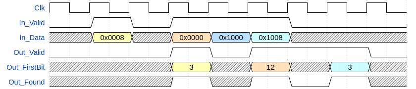
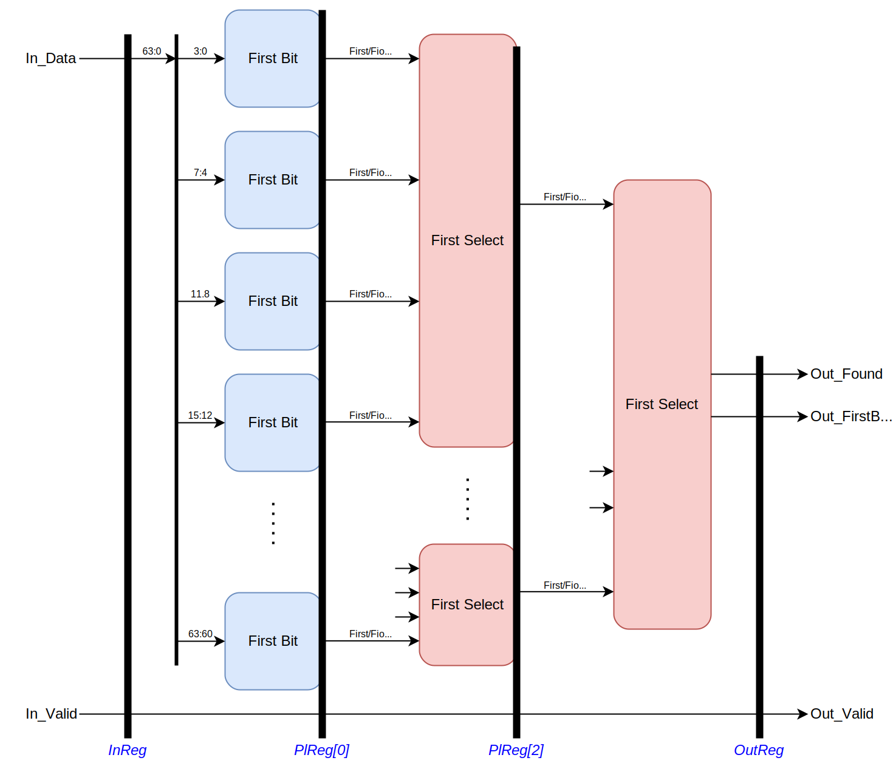

# olo_base_decode_firstbit

[Back to **Entity List**](../EntityList.md)

## Status Information

  

VHDL Source: [olo_base_arb_prio](../../src/base/vhdl/olo_base_arb_prio.vhd)

## Description

This entity implements a first-bit decoder. It does return the index of the lowest bit set in a vector. 

First bit decoding can be done in only a few lines of code if all the decoding is done in one clock cycles. However, for doing first-bit decoding on very wide vectors this leads to poor timing performance. In this case using *olo_base_decode_firstbit* makes sense - because it allows pipelining the operation.

The figure below assumes *InReg_g=false*, *OutReg_g=false* and *PlRegs_g=2*.

## Generics

| Name      | Type     | Default | Description                                                  |
| :-------- | :------- | ------- | :----------------------------------------------------------- |
| InWidth_g | positive | -       | Width of the input vector                                    |
| InReg_g   | boolean  | true    | If set to *true* all inputs are registered before any operations are done on it.  Can be set to *false* if the user knows that *In_Data* is driven by FFs directly without combinatorial logic after the FF. |
| OutReg_g  | boolean  | true    | If set to *true* all outputs are registered. Can be set to *false* if the user knows that *Out_FirstBit* and *Out_Found* are fed into FFs without any combinatorial logic. |
| PlRegs_g  | natural  | 1       | Number of pipeline registers in the first-bit decoding logic. 0 Means that the decoding is done in one clock-cycle, 1 means that one register stage is added and the logic is split into two clock cycles. Range: 0 ... ceil(log2(*InWidth_g*))/2-1 |

## Interfaces

### Control

| Name | In/Out | Length | Default | Description                                     |
| :--- | :----- | :----- | ------- | :---------------------------------------------- |
| Clk  | in     | 1      | -       | Clock                                           |
| Rst  | in     | 1      | -       | Reset input (high-active, synchronous to *Clk*) |

### Input Data

| Name     | In/Out | Length      | Default | Description                                  |
| :------- | :----- | :---------- | ------- | :------------------------------------------- |
| In_Data  | in     | *InWidth_g* | -       | Input data vector                            |
| In_Valid | in     | 1           | '1'     | AXI4-Stream handshaking signal for *In_Data* |

### Output Data

| Name         | In/Out | Length                  | Default | Description                                                  |
| :----------- | :----- | :---------------------- | ------- | :----------------------------------------------------------- |
| Out_FirstBit | out    | ceil(log2(*InWidth_g*)) | N/A     | Index of the lowest bit set in *In_Data*                     |
| Out_Found    | out    | 1                       | N/A     | Set to '1' if any bit in *In_Data* was set. If no bit is set in *In_Data* this output is '0'. |
| Out_Valid    | out    | 1                       | N/A     | AXI4-Stream handshaking signal for *Out_...*                 |

## Architecture

Below figure shows the overall architecture of the block. The figure assumes *InReg_g=true*, *OutReg_g=true* and *PlRegs_g=2*.

Note that these settings are chosen for illustrative reasons only. Two pipeline registers for only a 64 bit first-bit detector would not actually be required.

The first stage detects the index of the first bit on a small number of input bits. All subsequent stages detect the upstream stage with the lowest index that found a bit, forward this result to the output and extend a few more bits of the index information.

