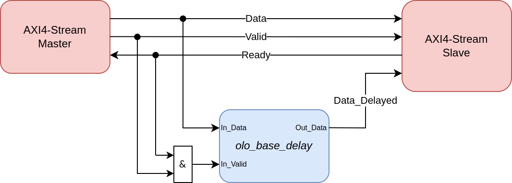
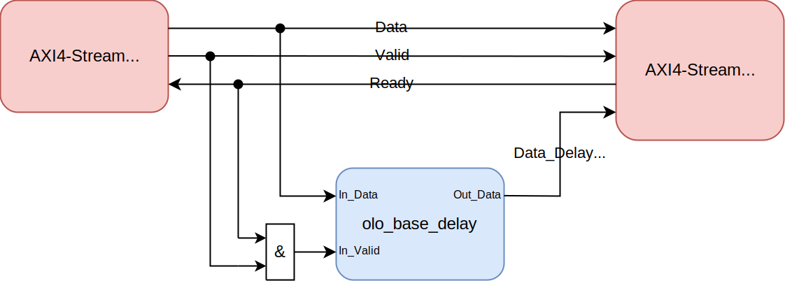
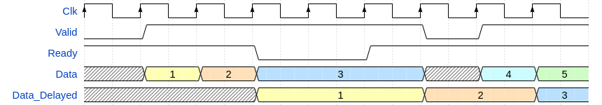

# olo_base_delay

[Back to **Entity List**](../EntityList.md)

## Status Information

  

VHDL Source: [olo_base_delay](../../src/base/vhdl/olo_base_delay.vhd)

## Description

This component is an efficient implementation for delay chains. It uses FPGA memory resources (Block-RAM and distributed RAM resp. SRLs) for implementing the delays (instead of many FFs). The last delay stage is always implemented in FFs to ensure good timing (RAM outputs are usually slow).

The delay is specified as a number of data-beats (samples). For a delay in clock-cycles, simply connect *In_Valid*='1' - or lave *In_Valid* unconnected to rely on its default value.

One Problem with using RAM resources to implement delays is that they don't have a reset, so the content of the RAM persists after resetting the logic. The *olo_base_delay* entity works around this issue by some logic that ensures that any persisting data is replaced by zeros after a reset. The replacement is done at the output of the *olo_base_delay*, so no time to overwrite memory cells after a reset is required and the entity is ready to operate on the first clock cycle after the reset.

If the delay is implemented using a RAM, the behavior of the RAM (read-before-write or write-before-read) can be selected to allow efficient implementation independently of the target technology.

Note that output data is valid together with Input data (when *In_Valid* is high). Below figure shows the behavior for *Delay_g*=3 with both possible settings for *RstState_g*:

In cases a delayed version of an AXI4-Stream with back-pressure (*Ready* signal) is required, the ANDed *Ready* and *Valid* signals shall be connected to the *In_Valid* input of *olo_base_delay*.

## Generics

| Name            | Type     | Default | Description                                                  |
| :-------------- | :------- | ------- | :----------------------------------------------------------- |
| Width_g         | positive | -       | Data width                                                   |
| Delay_g         | natural  | -       | Number of samples / data-beats of delay                      |
| Resource_g      | string   | "AUTO"  | The following values are possible: - "BRAM": Always use BlockRAM  (only allowed for *Delay_g* >= 3) - "SRL": Always use shift registers - "AUTO": Automatically select based on *Delay_g* and *BramThreshold_g* |
| BramThreshold_g | positive | 128     | In case of *Resource_g*="AUTO", BlockRAM is used when *Delay_g*>*BramThreshold_g* and shift registers are used otherwise. Must be greater or equal to 3. |
| RstState_g      | boolean  | true    | true: 0 is outputted for the first *Delay_g* data beats after reset false: No special handling for reset, the content of the delay-line is output after reset. |
| RamBehavior_g   | string   | "RBW"   | "RBW" = read-before-write, "WBR" = write-before-read For details refer to the description in [olo_base_ram_sdp](./olo_base_ram_sdp.md). |

Note that BlockRAM as resource are only a valid choice for *Delay_g* >= 3. For lower *Delay_g* values, "SRL" or "AUTO" must be chosen as resource.

## Interfaces

### Control

| Name | In/Out | Length | Default | Description                                     |
| :--- | :----- | :----- | ------- | :---------------------------------------------- |
| Clk  | in     | 1      | -       | Clock                                           |
| Rst  | in     | 1      | -       | Reset input (high-active, synchronous to *Clk*) |

### Input Data

| Name     | In/Out | Length    | Default | Description                                  |
| :------- | :----- | :-------- | ------- | :------------------------------------------- |
| In_Data  | in     | *Width_g* | -       | Input data                                   |
| In_Valid | in     | 1         | '1'     | AXI4-Stream handshaking signal for *In_Data* |

### Output Data

| Name     | In/Out | Length    | Default | Description                                    |
| :------- | :----- | :-------- | ------- | :--------------------------------------------- |
| Out_Data | out    | *Width_g* | N/A     | Output data (valid as indicated by *in_Valid*) |

## Architecture

The architecture of the entity is simple, not detailed description is required.
