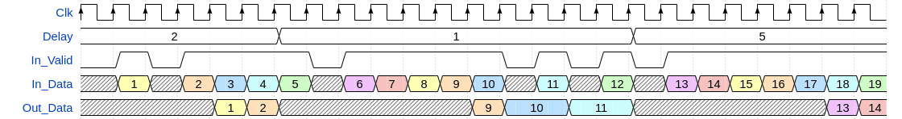

# olo_base_delay_cfg

[Back to **Entity List**](../EntityList.md)

## Status Information

  

VHDL Source: [olo_base_delay_cfg](../../src/base/vhdl/olo_base_delay_cfg.vhd)

## Description

This component is an efficient implementation for runtime configurable delay chains. It uses FPGA memory resources (Block-RAM) for implementing the delays (instead of many FFs). The last delay stage is always implemented in FFs to ensure good timing (RAM outputs are usually slow).

For general usage of the *olo_base_delay_cfg* entity, the same considerations as for [olo_base_delay](./olo_base_delay.md) apply. Refer to this documentation for details on the input and output signaling.

Note that any changes of the delay are reflected at the output (*Out_Data*) within less than 5 samples / data-beats. During those 5 samples, the content of (*Out_Data*) is undefined. This is illustrated in the figure below.

## Generics

| Name          | Type     | Default | Description                                                  |
| :------------ | :------- | ------- | :----------------------------------------------------------- |
| Width_g       | positive | -       | Data width                                                   |
| MaxDelay_g    | positive | 256     | Maximum delay in samples / data-beats                        |
| SupportZero_g | boolean  | false   | Selects if zero-delay pass-through (*Delay*=0) is supported or not. Supporting zero-delay pass-through adds a combinatorial path directly from the input to the output which is suboptimal for timing performance. Hence this generic should be set to *false* unless there is a real need for zero-delay pass-through. |
| RamBehavior_g | string   | "RBW"   | "RBW" = read-before-write, "WBR" = write-before-read For details refer to the description in [olo_base_ram_sdp](./olo_base_ram_sdp.md). |

## Interfaces

### Control

| Name  | In/Out | Length                   | Default | Description                                     |
| :---- | :----- | :----------------------- | ------- | :---------------------------------------------- |
| Clk   | in     | 1                        | -       | Clock                                           |
| Rst   | in     | 1                        | -       | Reset input (high-active, synchronous to *Clk*) |
| Delay | in     | *log2ceil(MaxDelay_g+1)* | -       | Delay in data-beats / samples.                  |

### Input Data

| Name     | In/Out | Length    | Default | Description                                  |
| :------- | :----- | :-------- | ------- | :------------------------------------------- |
| In_Data  | in     | *Width_g* | -       | Input data                                   |
| In_Valid | in     | 1         | '1'     | AXI4-Stream handshaking signal for *In_Data* |

### Output Data

| Name     | In/Out | Length    | Default | Description                                    |
| :------- | :----- | :-------- | ------- | :--------------------------------------------- |
| Out_Data | out    | *Width_g* | N/A     | Output data (valid as indicated by *in_Valid*) |

## Architecture

The architecture of the entity is simple, not detailed description is required.
