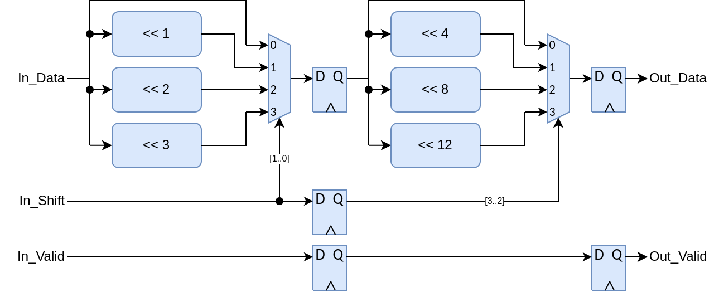

# olo_base_dyn_sft

[Back to **Entity List**](../EntityList.md)

## Status Information

VHDL Source: [olo_base_dyn_sft](../../src/base/vhdl/olo_base_dyn_sft.vhd)

## Description

This entity implements a dynamic shift (barrel shift) implemented in multiple stages in order to achieve good timing.
The number of bits to shift can be selected at runtime for each data-sample.

## Generics

| Name              | Type     | Default | Description                                                  |
| :---------------- | :------- | ------- | :----------------------------------------------------------- |
| Width_g           | positive | -       | Data width                                                   |
| Direction_g       | string   | -       | Direction to shift. Allowed values are "LEFT" (shift towards MSB) and "RIGHT" (shift towards LSB). |
| MaxShift_g        | positive | -       | Maximum number of bits to shift.  _MaxShift_g_ must be smaller or equal to _Width_g_. |
| SignExtend_g      | boolean  | false   | Controls whether the sign bit is replicated (true) or zeros are shifted in (false) for _Direction_g_ = "LEFT". _true_ is used to perform arithmetic left-shifts for signed numbers. |
| SelBitsPerStage_g | positive | 4       | Number of bits from _In_Shift_ to implement in each stage. This parameter controls how many pipeline stages are implenented: _Stages_ = _ceil(log2(MaxShift_g+1))/SelBitsPerStage_g_ Smaller values lead to better timing performance, bigger values to less stages (less latency). |

## Interfaces

### Control

| Name | In/Out | Length | Default | Description                                     |
| :--- | :----- | :----- | ------- | :---------------------------------------------- |
| Clk  | in     | 1      | -       | Clock                                           |
| Rst  | in     | 1      | -       | Reset input (high-active, synchronous to _Clk_) |

### Input Data

| Name     | In/Out | Length                     | Default | Description                                                 |
| :------- | :----- | :------------------------- | ------- | :---------------------------------------------------------- |
| In_Data  | in     | _Width_g_                  | -       | Input data                                                  |
| In_Shift | in     | ceil(log2(_MaxShift_g_+1)) | -       | Number of bits to shift the corresponding _In_Data_ sample. |
| In_Valid | in     | 1                          | '1'     | AXI4-Stream handshaking signal for _In_Data_                |

### Output Data

| Name     | In/Out | Length    | Default | Description                                   |
| :------- | :----- | :-------- | ------- | :-------------------------------------------- |
| Out_Data | out    | _Width_g_ | N/A     | Output data                                   |
| In_Valid | out    | 1         | '1'     | AXI4-Stream handshaking signal for _Out_Data_ |

## Architecture

Below figure shows the implementation for _MaxShift_g=15_ and _SelBitsPerStage_g=2_.

For example a shift by 7 bits is implemented as shift by 3 bits in the first stage plus shift by 4 bits in the second
stage.

