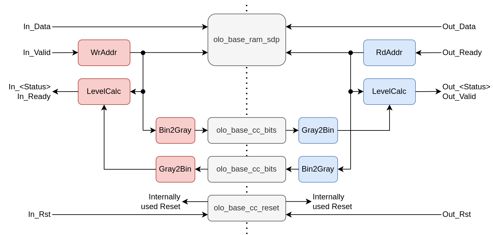

# olo_base_fifo_async

[Back to **Entity List**](../EntityList.md)

## Status Information

 

VHDL Source: [olo_base_fifo_async](../../src/base/vhdl/olo_base_fifo_async.vhd)

## Description

This component implements an asynchronous FIFO (different clocks for write and read port). 

The memory is described in a way that it utilizes RAM resources (Block-RAM or distributed RAM) available in FPGAs with commonly used tools. For this purpose [olo_base_ram_sdp](./olo_base_ram_sdp.md) is used.

The FIFO is a fall-through FIFO and has AXI-S interfaces on read and write side.

The RAM behavior (read-before-write or write-before-read) can be selected. This allows efficiently implementing FIFOs for different technologies (some technologies implement one, some the other behavior).

An asynchronous FIFO is a clock-crossing and hence this block follows the general [clock-crossing principles](clock_crossing_principles.md). Read through them for more information.

## Generics

| Name            | Type      | Default | Description                                                  |
| :-------------- | :-------- | ------- | :----------------------------------------------------------- |
| Widht_g         | positive  | -       | Number of bits per FIFO entry (word-width)                   |
| Depth_g         | positive  | -       | Number of FIFO entries.  This **must** be a power of two. See [Architecture](#Architecture) for more details. |
| AlmFullOn_g     | boolean   | false   | If set to true, the *AlmFull* (almost full) status flag is generated (otherwise it is omitted) |
| AlmFullLevel_g  | natural   | 0       | Level to generate *AlmFull* flag at.  Has no effect if *AlmFullOn_g* = false |
| AlmEmptyOn_g    | boolean   | false   | If set to true, the *AlmEmpty* (almost empty) status flag is generated (otherwise it is omitted) |
| AlmEmptyLevel_g | natural   | 0       | Level to generate *AlmEmpty* flag at.  Has no effect if *AlmEmptyOn_g* = false |
| RamStyle_g      | string    | "auto"  | Through this generic, the exact resource to use for implementation can be controlled. This generic is applied to the attributes *ram_style* and *ramstyle* which vendors offer to control RAM implementation. For details refer to the description in [olo_base_ram_sdp](./olo_base_ram_sdp.md). |
| RamBehavior_g   | string    | "RBW"   | "RBW" = read-before-write, "WBR" = write-before-read For details refer to the description in [olo_base_ram_sdp](./olo_base_ram_sdp.md). |
| ReadyRstState_g | std_logic | '1'     | Controls the status of the *In_Ready* signal in during reset.  Choose '1' for minimal logic on the (often timing-critical) *In_Ready* path.  = *AlmFullLevel_g* (synchronous to *In_Clk*) Output is undefined if *AlmFullOn_g*=false. |
| In_AlmEmpty | out    | 1                       | N/A     | Status flag. Asserted if the FIFO fill level is <= *AlmEmptyevel_g* (synchronous to *In_Clk*) Output is undefined if *AlmEmptyOn_g*=false. |
| In_Level    | out    | ceil(log2(*Depth_g*+1)) | N/A     | FIFO fill level calculated on the write side (synchronous to *In_Clk*) |

### Output Status

| Name         | In/Out | Length                  | Default | Description                                                  |
| :----------- | :----- | :---------------------- | ------- | :----------------------------------------------------------- |
| Out_Full     | out    | 1                       | N/A     | Status flag. Asserted if the FIFO is full (synchronous to *Out_Clk*) |
| Out_Empty    | out    | 1                       | N/A     | Status flag. Asserted if the FIFO is empty (synchronous to *Out_Clk*) |
| Out_AlmFull  | out    | 1                       | N/A     | Status flag. Asserted if the FIFO fill level is >= *AlmFullLevel_g* (synchronous to *Out_Clk*) Output is undefined if *AlmFullOn_g*=false. |
| Out_AlmEmpty | out    | 1                       | N/A     | Status flag. Asserted if the FIFO fill level is <= *AlmEmptyevel_g* (synchronous to *Out_Clk*) Output is undefined if *AlmEmptyOn_g*=false. |
| Out_Level    | out    | ceil(log2(*Depth_g*+1)) | N/A     | FIFO fill level calculated on the write side (synchronous to *Out_Clk*) |

## Architecture

The rough architecture of the FIFO is shown in the figure below. Note that the figure does only depict the general architecture and not each and every detail.

Read and write address counters are handled in their corresponding clock domain. The current address counter value is then transferred to the other clock-domain by converting it to gray code, synchronizing it using a double-stage synchronizer (using [olo_base_cc_bits](./olo_base_cc_bits.md)) and convert it back to a two's complement number. This approach ensures that a correct value is received, even if the clock edges are aligned in a way that causes metastability on the first flip-flop. Because the data is transferred in gray code, in this case either the correct value before an increment of the counter or the correct value after the increment is received, so the result is always correct.

The gray-encoding approach only works for power of two FIFO depths. For any other FIFO depths, the gray encoded counter value would toggle more than one bit during the overflow and hence the clock domain crossing would not work safely. 

All status information is calculated separately in both clock domains to make it available synchronously to both clocks.

This architecture is independent of the FPGA technology used and can also be used to combine more than just one Block-RAM into one big FIFO.

Regarding constraints, refer to  [clock-crossing principles](clock_crossing_principles.md). The FIFO is also auto-constraints capable.

