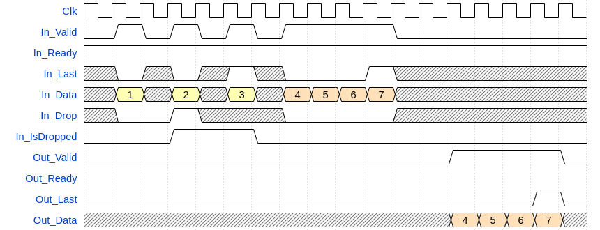

# olo_base_fifo_packet

[Back to **Entity List**](../EntityList.md)

## Status Information

VHDL Source: [olo_base_fifo_packet](../../src/base/vhdl/olo_base_fifo_packet.vhd)

## Description

This component implements a synchronous packet FIFO. The FIFO works in store and forward mode. This means a packet is
only presented to the output after it is written into the FIFO completely.

This component offers the following additional features compared to [olo_base_fifo_sync](./olo_base_fifo_sync.md):

- Due to the store and forward implementation, packets are compressed. Even if the data is written into the FIFO at low
  rate, it is guaranteed that the packet can be read in a single short burst once it is presented at the output.
- Writing of a packet into a FIFO can be aborted at any time during writing the packet (see
  [Dropping Packets on Write Side](#dropping-packets-on-write-side)). The write pointer is automatically rewinded in
  this case.
  - Example use-case: A CRC error can only be detected at the end of the packet. User logic can still write the packet
    into the FIFO directly and just asserts _In_Drop_ if a CRC error is detected at the end of the packet. The full
    packet (including already written data) is ignored.
- On the read side, it is possible to skip the remaining data of a packet at any time during reading a packet (see
  [Skipping Packets on Read Side](#skipping-packets-on-read-side)).
  - Example use-case: The user logic is interested only in some packet types. If a different packet type is found in the
    header, _Out_Next_ can be asserted to skip the rest of the packet and directly continue reading the next packet.
- On the read side, it is possible to repeat a packet (see
  [Repeating Packets on Read Side](#repeating-packets-on-read-side)).
  - Example use-case: A packet is read from the FIFO and transmitted wirelessly. During sending the packet a collision
    occurs and the transmission is aborted. In this situation the user logic can assert _Out_Repeat_ to read the same
    packet again and retry the transmission.

Below samples assumes _Depth_g_=32.

The memory is described in a way that it utilizes RAM resources (Block-RAM or distributed RAM) available in FPGAs with
commonly used tools. For this purpose [olo_base_ram_sdp](./olo_base_ram_sdp.md) is used.

The FIFO  has AXI-S interfaces on read and write side.

The RAM behavior (read-before-write or write-before-read) can be selected. This allows efficiently implementing FIFOs
for different technologies (some technologies implement one, some the other behavior).

The FIFO contains a large RAM for packet data and a small [olo_base_fifo_sync](./olo_base_fifo_sync.md) for storing the
sizes of individual packets.

**Note:** Due to implementation reasons the FIFO introduces one stall cycle per packet on the read-side. Hence the FIFO
throughput is suboptimal for very small packets.

Packets exceeding _Depth_g_ cannot be processed in store and forward mode and are therefore dropped automatically.

## Generics

| Name               | Type      | Default | Description                                                  |
| :----------------- | :-------- | ------- | :----------------------------------------------------------- |
| Width_g            | positive  | -       | Number of bits per FIFO entry (word-width)                   |
| Depth_g            | positive  | .       | Number of FIFO entries                                       |
| RamStyle_g         | string    | "auto"  | Through this generic, the exact resource to use for implementation can be controlled. This generic is applied to the attributes _ram_style_ and _ramstyle_ which vendors offer to control RAM implementation. For details refer to the description in [olo_base_ram_sdp](./olo_base_ram_sdp.md). |
| RamBehavior_g      | string    | "RBW"   | "RBW" = read-before-write, "WBR" = write-before-read For details refer to the description in [olo_base_ram_sdp](./olo_base_ram_sdp.md). |
| SmallRamStyle_g    | string    | "auto"  | Same as _RamStyle_g_ but applies to the small FIFO for packet sizes instead of the main RAM.  Offers the additional option "same" to use the same value as for _RamStyle_g_. |
| SmallRamBehavior_g | string    | "same"  | Same as _RamBehavior_g_ but applies to the small FIFO for packet sizes instead of the main RAM.  Offers the additional option "same" to use the same value as for _RamBehavior_g_. |
| MaxPackets_g       | positive  | 17      | Controls how many packets can be stored at maximum in the FIFO (i.e. controls the size of the packet-size FIFO). Range: 2 ... 2^31-1 |

## Interfaces

### Control

| Name | In/Out | Length | Default | Description                                     |
| :--- | :----- | :----- | ------- | :---------------------------------------------- |
| Clk  | in     | 1      | -       | Clock                                           |
| Rst  | in     | 1      | -       | Reset input (high-active, synchronous to _Clk_) |

### Input Data

| Name         | In/Out | Length    | Default | Description                                  |
| :----------- | :----- | :-------- | ------- | :------------------------------------------- |
| In_Data      | in     | _Width_g_ | -       | Input data                                   |
| In_Valid     | in     | 1         | '1'     | AXI4-Stream handshaking signal for _In_Data_ |
| In_Ready     | out    | 1         | N/A     | AXI4-Stream handshaking signal for _In_Data_ |
| In_Last      | in     | 1         | '1'     | AXI4-Stream end of packet signaling for _In_Data_ |
| In_Drop      | in     | 1         | '0'     | Assert this signal for dropping the current packet (not storing it in the FIFO). |
| In_IsDropped | out    | 1         | N/A     | Indicates that the current packet is dropped. Either because _In_Drop_ was asserted during the packet or because the packet exceeds the _Depth_g_ of the FIFO. |

### Output Data

| Name       | In/Out | Length                  | Default | Description                                   |
| :--------- | :----- | :---------------------- | ------- | :-------------------------------------------- |
| Out_Data   | out    | _Width_g_               | N/A     | Output data                                   |
| Out_Valid  | out    | 1                       | N/A     | AXI4-Stream handshaking signal for _Out_Data_ |
| Out_Ready  | in     | 1                       | '1'     | AXI4-Stream handshaking signal for _Out_Data_ |
| Out_Last   | out    | 1                       | N/A     | AXI4-Stream end of packet signaling for _Out_Data_ |
| Out_Size   | out    | ceil(log2(_Depth_g_+1)) | N/A     | Indicates the size of the current packet in words/data-beats. |
| Out_Next   | in     | 1                       | '0'     | Assert this signal for aborting readout of the current packet and jump to the next one. |
| Out_Repeat | in     | 1                       | '0'     | Assert this signal for repeating this packet one more time after it was read completely (or it was aborted due to _Out_Next_). |

For aborting the current packet and repeating it one more time, _Out_Next_ and _Out_Repeat_ can be asserted both at the
same time.

Note that it also is possible to repeat a packet several times by asserting _Out_Repeat_ again during the repeated
readout of the packet.

### Status

| Name         | In/Out | Length                       | Default | Description                                                  |
| :----------- | :----- | :--------------------------- | ------- | :----------------------------------------------------------- |
| PacketLevel  | out    | ceil(log2(_MaxPackets_g_+1)) | N/A     | Number of packets stored in the FIFO. The counter is incremented _after_ a packet was written completely and decremented _after_ the packet was read completely or skipped (due to _Out_Next_). |
| FreeWords    | out    | ceil(log2(_Depth_g_+1))      | N/A     | Available space in the FIFO. The counter is decremented _during_ writing of the packet as the individual words are written and increased _after_ the packet was read completely or skipped (due to _Out_Next_). The counter is also increased if a packet is dropped (due to _In_Drop_ or its size exceeding _Depth_g_)  |

## Details

### Architecture

The FIFO works like a normal FIFO, just that it contains a small FIFO storing the end address for each packet. This
allows to calculate the packet size on the read size for indication through _Out_Size_ and asserting _Out_Last_ on the
correct data-beat.

The end-address of the currently read packet is removed from the FIFO when readout starts. Therefore the depth of the
FIFO for the end-address is _MaxPackets_g-1_. This is also the reason for the default value of 17: 16 is a reasonable
default size of the FIFO (maps well to distributed RAM in all common FPGA architectures) and one more packet is
currently being read-out.

### Dropping Packets on Write Side

For dropping a packet during writing it into the FIFO, the _In_Drop_ signal is asserted anywhere between (including)
the transaction of the first data word and (including) the transaction of the last data word.

The signal _In_IsDropped_ is kept asserted from the clock cycle where _In_Drop_ is asserted until the end of the packet.
The signal is implemented to avoid that user logic has to remember whether _In_Drop_ was at any earlier point during
writing a packet.

Note that the user may still provide more data after _In_Drop_ being asserted. All this data until _In_Last_ is ignored.

Below is an example for asserting _In_Drop_ during a packet:

It is also allowed to assert _In_Drop_ together with the last data word of a packet:

_In_Drop_ can also be detected when _In_Valid_ or _In_Ready_ are low (i.e. in between transactions). However, it is
strongly suggested that the signal is kept asserted until a transaction (_In_Valid_ and _In_Ready_ both are high) for
easy understanding of the waveforms and to be in-line with the AXI4-Stream handshaking protocol.

### Skipping Packets on Read Side

For skipping the rest of a packet on the read side, the _Out_Next_ signal is aserted anywhere between (including) the
transaction of the first data word and the transaction of the last data word. Asserting the signal on the last data word
does not have any effect because there is no more data to skip at this point.

Skipped packets are ended by asserting _Out_Last_ earlier and omitting the remaining data words - hence the AXI4-Stream
protocol is fully respected (_Out_Last_ is **NOT** omitted).

If _Out_Next_ is asserted during a transaction of a data word (_Out_Valid_ and _Out_Ready_ both are high), _Out_Last_
is asserted immediately on this word.

Example for skipping a packet containing the data 0x1, 0x2, 0x3, 0x4:

_Out_Next_ can also be detected when _Out_Valid_ or _Out_Ready_ are low (i.e. in between transactions). However, it is
strongly suggested that the signal is kept asserted until a transaction (_Out_Valid_ and _Out_Ready_ both are high) for
easy understanding of the waveforms and to be in-line with the AXI4-Stream handshaking protocol. If _Out_Next_ is
asserted between transactions, one more word is read after the assertion - this is required because _Out_Last_ must be
asserted during a transaction according to the AXI4-Stream protocol.

### Repeating Packets on Read Side

For repeating a packet on the read side, the _Out_Repeat_ signal is asserted anywhere between (including) the
transaction of the first data word and (including) the transaction of the last data word. The remaining data of the
packet still is read but after the last word of the packet, the same packet is repeated.

Example for repeating a packet containing the data 0x1, 0x2, 0x3, 0x4:

For repeating a packet immediately in the middle of a packet and without reading the remaining words, _Out_Repeat_ and
_Out_Next_ can be asserted both at the same time.

Example for repeating a packet containing the data 0x1, 0x2, 0x3, 0x4 immediately:

_Out_Repeat_ can also be detected when _Out_Valid_ or _Out_Ready_ are low (i.e. in between transactions). However, it is
strongly suggested that the signal is kept asserted until a transaction (_Out_Valid_ and _Out_Ready_ both are high) for
easy understanding of the waveforms and to be in-line with the AXI4-Stream handshaking protocol.
