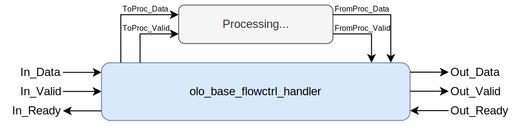
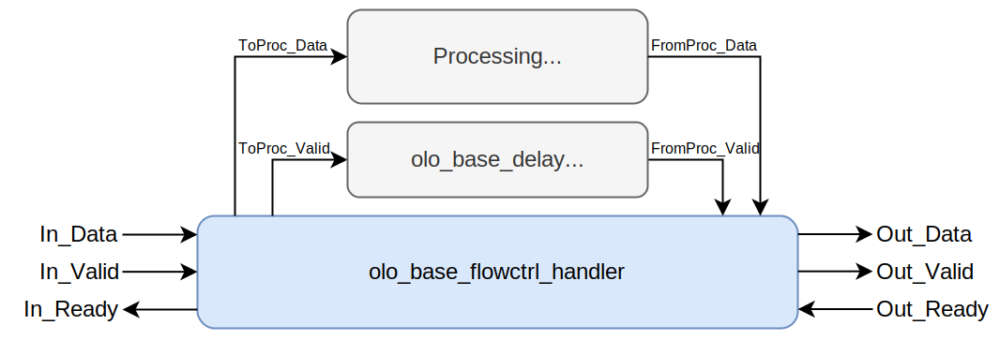
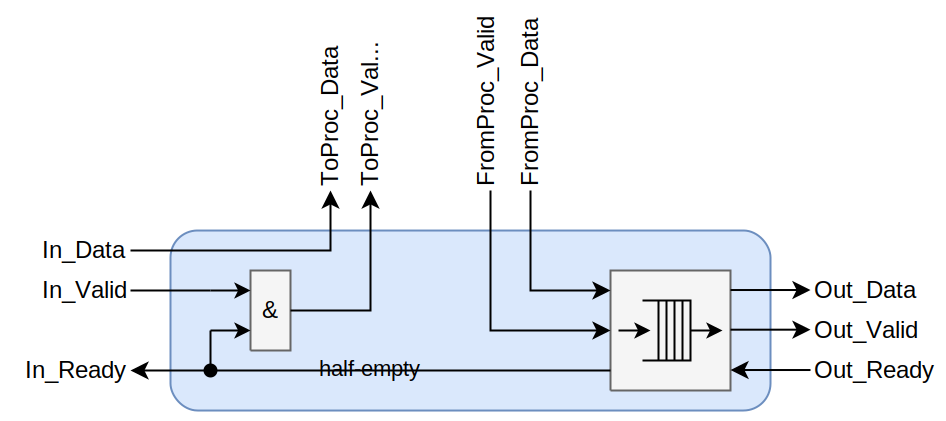

# olo_base_flowctrl_handler

[Back to **Entity List**](../EntityList.md)

## Status Information

VHDL Source: [olo_base_flowctrl_handler](../../src/base/vhdl/olo_base_flowctrl_handler.vhd)

## Description

This component implements full flow-control (including Ready/back-pressure) around processing entities that do not
support Ready/back-pressure natively.

The usage is depicted below:

The _olo_base_flowctrl_handler_ includes a small FIFO buffer and ensures to de-assert _In_Ready_ in a way that remaining
output samples from processing can be absorbed without data-loss when _Out_Ready_ is de-asserted. The FIFO buffer is
chosen large enough to provide full throughput (i.e. not add any needless stall-cycles).

For processing entities that do not even provide the handling of the _Valid_ flag, the _Valid_ flag handling can
easily be implemented by adding an [olo_base_delay](*./olo_base_delay.md) component with the same delay as the
processingitself:

## Generics

| Name              | Type     | Default | Description                                                  |
| :---------------- | :------- | ------- | :----------------------------------------------------------- |
| InWidth_g         | positive | -       | Data width on the input side (input to processing)           |
| OutWidth_g        | positive | -       | Data width on the output side (output from processing)       |
| SamplesToAbsorb_g | positive | -       | Maximum number of samples that the processing may produce after _ToProc_Valid_ was de-asserted. For processing without rate changes (simple processing pipelines) this is the number of pipeline stages in processing.  For processing with rate changes the value depends on the exact implementation and behavior of the processing. **Note:** A too high value is never a problem (except for resource usage). When in doubt, round the number up to a value that is for sure large enough. |
| RamStyle_g        | boolean  | true    | Through this generic, the exact resource to use for implementation can be controlled.  For details refer to the description in [olo_base_ram_sdp](./olo_base_ram_sdp.md). |
| RamBehavior_g     | string   | "RBW"   | "RBW" = read-before-write, "WBR" = write-before-read For details refer to the description in [olo_base_ram_sdp](./olo_base_ram_sdp.md). |

## Interfaces

### Control

| Name | In/Out | Length | Default | Description                                     |
| :--- | :----- | :----- | ------- | :---------------------------------------------- |
| Clk  | in     | 1      | -       | Clock                                           |
| Rst  | in     | 1      | -       | Reset input (high-active, synchronous to _Clk_) |

### Input Data

| Name     | In/Out | Length    | Default | Description                                  |
| :------- | :----- | :-------- | ------- | :------------------------------------------- |
| In_Data  | in     | _Width_g_ | -       | Input data                                   |
| In_Valid | in     | 1         | '1'     | AXI4-Stream handshaking signal for _In_Data_ |
| In_Ready | out    | 1         | N/A     | AXI4-Stream handshaking signal for _In_Data_ |

### Output Data

| Name      | In/Out | Length    | Default | Description                                   |
| :-------- | :----- | :-------- | ------- | :-------------------------------------------- |
| Out_Data  | out    | _Width_g_ | N/A     | Output data                                   |
| Out_Valid | out    | 1         | N/A     | AXI4-Stream handshaking signal for _Out_Data_ |
| Out_Ready | in     | 1         | '1'     | AXI4-Stream handshaking signal for _Out_Data_ |

### Processing Input

| Name         | In/Out | Length    | Default | Description                                      |
| :----------- | :----- | :-------- | ------- | :----------------------------------------------- |
| ToProc_Data  | out    | _Width_g_ | N/A     | Input data to processing                         |
| ToProc_Valid | out    | 1         | N/A     | AXI4-Stream handshaking signal for _ToProc_Data_ |

### Processing Output

| Name           | In/Out | Length    | Default | Description                                        |
| :------------- | :----- | :-------- | ------- | :------------------------------------------------- |
| FromProc_Data  | in     | _Width_g_ | -       | Output data from processing                        |
| FromProc_Valid | in     | 1         | -       | AXI4-Stream handshaking signal for _FromProc_Data_ |

## Architecture

The architecture of the entity is depicted below:

The depth of the FIFO is configured as (_SamplesToAbsorb_g_+2)*2.

The theoretical formula is (_SamplesToAbsorb_g_+LatencyFIFO+1)*2 where the _FIFO Latency_ of the _olo_base_sync_fifo_
is 1.
