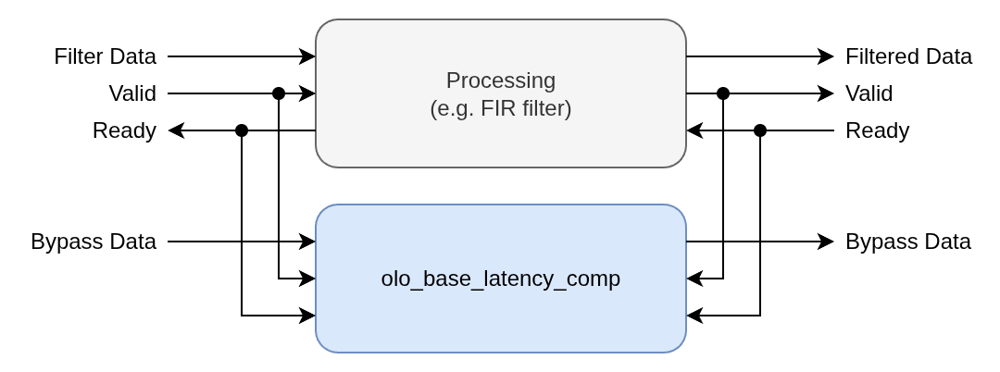
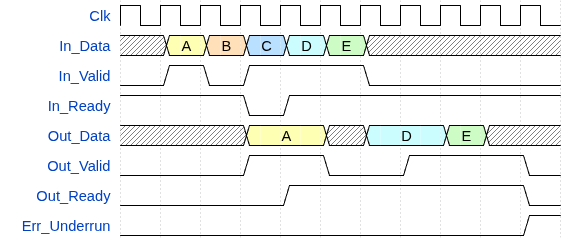
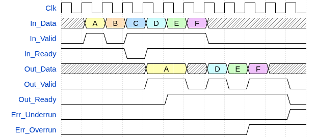
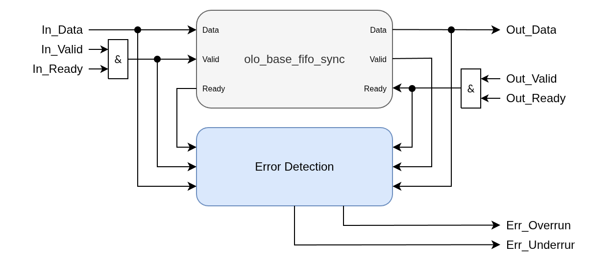
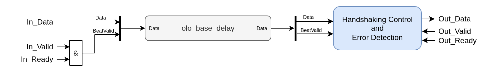

# olo_base_latency_comp

[Back to **Entity List**](../EntityList.md)

## Status Information

VHDL Source: [olo_base_latency_comp](../../src/base/vhdl/olo_base_latency_comp.vhd)

## Description

This component does compensate the latency of a processing element by delaying data that bypasses the processing
element by delaying the bypass data-path. This is visualized by the figure below. In the setup depicted in the figure,
_Filter Data_ and _Bypass Data_ arriving on the input in the same cycle reaches the output in the same cycle.

Note that the block only works for processing elements that do not change the sample rate (i.e one output sample is
produced for each input sample).

Input samples are shifted into the delay when both _In_Valid_ and _In_Ready_ are high. Output samples are considered
as read when both _Out_Valid_ and _Out_Ready_ are high.

The data going through the _olo_base_latency_comp_ entity may be the same data that goes through the processing element
or it may be different data (e.g. metadata associated with the data going through the processing element).

The _olo_base_latency_comp_ entity is non-intrusive in the sense that it does not modify the handshaking signals.
It does simply delay the data and executes extensive checking and error reporting in case of failure to compensate
the latency.

The entity has two modes of operation:

- _DYNAMIC_
  - The latency is adjusted dynamically to match the latency of the processing element.
  - This mode allows to write code that works even if the latency of the processing element changes (e.g. when
    generics are changed or additional pipeline stages are added).
  - This mode is most versatile and even works if the latency is non-constant
- _FIXED_CYCLES_
  - The latency is fixed to a constant number of clock cycles specified by the generic _Latency_g_.
  - This mode requires the latency of the processing element to be known and fixed.
  - This mode does allow to process one sample per clock-cycle

Main aim of this entity is to simplify the creation of maintainable code that works independently of smaller
changes in the main processing element. The entity also increases maintainability by reporting errors in cases
where the latency cannot be compensated successfully.

### DYNAMIC Mode

_DYNAMIC_ mode has the advantage that the exact delay does not have to be known at the cost of increased LUT usage
for implementing the underlying FIFO. This mode also can be used with processing elements that have non-constant
latency.

Notes to the figure:

- Samples B and C are ignored because either _In_Valid_ is low or _In_Ready_ is low.
- Non-constant latency is handled by only providing the next sample after the last one has been read (both _Out_Valid_
  and _Out_Ready_ high).
- After sample E an underrun is detected because a sample is read but none was written.

### FIXED_CYCLES Mode

_FIXED_CYCLES_ mode has the advantage that the exact delay is known and fixed, which can reduce LUT usage compared to
the _DYNAMIC_ mode. This mode requires the latency of the processing element to be known and constant.

An overrun error is reported only when the last sample was not read before the next sample arrives at the output.
Limited backpressure (_In_Ready_ low) is supported as long as the output is accepted before the next sample arrives.

An underrun is detected if an output sample is read when no sample is present from the delay line.

Below figure depicts _Latency_g=3_.

Notes to the figure:

- Samples B and C are ignored because either _In_Valid_ is low or _In_Ready_ is low.
- As long as no new sample arrives, handshaking is tolerated without error (see sample A)
- After sample F an underrun is detected because a sample is read but none was written.
- After sample E an overrun is detected because E was not read before F arrived.

## Generics

| Name             | Type     | Default   | Description                                                                                                                                                                                                                                                                |
| :--------------- | :------- | --------- | :------------------------------------------------------------------------------------------------------------------------------------------------------------------------------------------------------------------------------------------------------------------------- |
| Width_g          | positive | -         | Data width                                                                                                                                                                                                                                                                 |
| Mode_g           | string   | "DYNAMIC" | Operation mode. Possible values are: "DYNAMIC": Dynamically adjust latency to match the processing element "FIXED_CYCLES": Fixed latency in clock cycles as specified by _Latency_g_                                                                             |
| Latency_g        | positive | 32        | The meaning of this generic is as follows, depending on the value of _Mode_g_: "DYNAMIC": **Maximum** latency in beats/samples "FIXED_CYCLES": Exact latency in clock cycles Range 2 ... 2^31-1                                                              |
| AssertsDisable_g | boolean  | false     | Disable assertion reports (errors/warnings) for under- and overflow (can be used if this is expected)                                                                                                                                                                      |
| AssertsName_g    | string   | "No Name" | Name used in assertion reports to identify the instance of the entity                                                                                                                                                                                                      |
| RamBehavior_g    | string   | "RBW"     | "RBW" = read-before-write, "WBR" = write-before-read For details refer to the description in [olo_base_ram_sdp](./olo_base_ram_sdp.md).  This generic only plays a role for very large _Latency_g_ values that map into BRAMs                                       |
| Resource_g       | string   | "AUTO"    | Through this generic, the delay implementation for _Mode_g="FIXED_CYCLES" can be controlled.: see [olo_base_delay](./olo_base_delay.md) for details                                                                                                                   |
| RamStyle_g       | string   | "auto"    | Through this generic, the exact resource to use for implementation can be controlled for _Mode_g="FIXED_CYCLES" and _Resource_g="BLOCK"_ and for _Mode_g="DYNAMIC"_.  For details refer to the description in [olo_base_ram_sdp](./olo_base_ram_sdp.md).                 |

For technologies that do not support shift-register implementation in LUTs and _Mode_g="FIXED_CYCLES"_,
_Resource_g="BLOCK" often is more resource efficient even for moderate delay values to avoid a large number of FFs
(given that blockram utilization is not critical).

## Interfaces

### Control

| Name | In/Out | Length | Default | Description                                     |
| :--- | :----- | :----- | ------- | :---------------------------------------------- |
| Clk  | in     | 1      | -       | Clock                                           |
| Rst  | in     | 1      | -       | Reset input (high-active, synchronous to _Clk_) |

### Input Data

| Name     | In/Out | Length    | Default | Description                                                |
| :------- | :----- | :-------- | ------- | :--------------------------------------------------------- |
| In_Data  | in     | _Width_g_ | -       | Input data                                                 |
| In_Valid | in     | 1         | '1'     | AXI4-Stream handshaking signal from the processing element |
| In_Ready | in     | 1         | '1'     | AXI4-Stream handshaking signal from the processing element |

**Note**: The direction of _In_Ready_ is input in this case because the entity is non-intrusive and does not modify
the handshaking signals.

### Output Data

| Name     | In/Out | Length    | Default | Description                                                |
| :------- | :----- | :-------- | ------- | :--------------------------------------------------------- |
| Out_Data | out    | _Width_g_ | N/A     | Output data                                                |
| Out_Valid| in     | 1         | '1'     | AXI4-Stream handshaking signal from the processing element |
| Out_Ready| in     | 1         | '1'     | AXI4-Stream handshaking signal from the processing element |

**Note**: The direction of _Out_Valid_ is input in this case because the entity is non-intrusive and does not modify
the handshaking signals.

### Error Outputs

| Name         | In/Out | Length    | Default | Description                                                                |
| :----------- | :----- | :-------- | ------- | :------------------------------------------------------------------------- |
| Err_Overrun  | out    | 1         | N/A     | Overrun error signal indicating input data was lost due to backpressure    |
| Err_Underrun | out    | 1         | N/A     | Underrun error signal indicating output data was not present when expected |

Error outputs stay asserted once they are set (sticky) until the next reset.

## Architecture

### DYNAMIC Mode

In _DYNAMIC_ mode the latency is adjusted dynamically using an internal FIFO. Note that for implementation reasons,
the FIFO depth is _Latency_g_ + 2. This may be considered to most efficiently parametrize the entity.

### FIXED_CYCLES Mode

In _FIXED_CYCLES_ mode the latency is compensated through a fixed delay line and handshaking tolerance
is added through a single storage state at the output.

To detect overruns, the validity of samples (_In_Valid_ and _In_Ready_ both high) is shifted through the
delay line together with the data.

