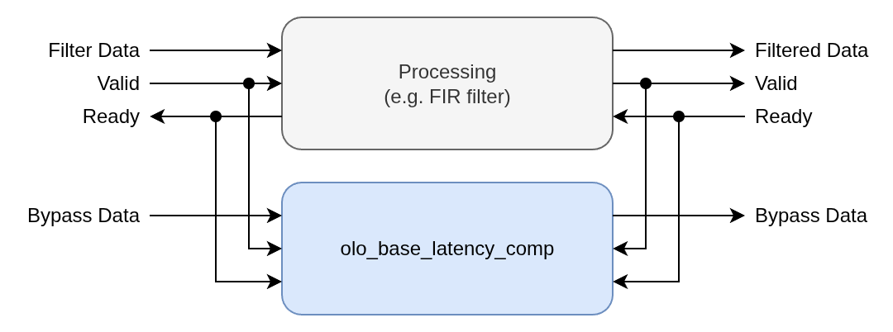

# olo_base_latency_comp

[Back to **Entity List**](../EntityList.md)

## Status Information

VHDL Source: [olo_base_latency_comp](../../src/base/vhdl/olo_base_latency_comp.vhd)

## Description

This component does compensate the latency of a processing elelement by delaying data that bypasses the processing
element by delaying the bypass data-path. This is visualized by the figure below. In the setup depicted in the figure,
data arriving on the input in the same cycle reaches the output in the same cycle.

The data going through the _olo_base_latency_comp_entity may be the same data that goes through the processing element
or it may be different data (e.g. metadata associated with the data going through the processing element).

The _olo_base_latency_comp_ entity is non-intrusive in the sense that it does not modify the hanshaking signals.
It does simply delay the data and executes extensive checking and error reporting in case of failure to compensate
the latency.

The entity has two modes of operation:

- _DYNAMIC_
  - The latency is adjusted dynamically to match the latency of the processing element.
  - This mode allows to write code that works even if the latency of the processing element changes (e.g. when
    generics are changed or additional pipeline stages are added).
  - This mode is most versatile and even works if the latency is non-constant
- _FIXED_CYCLES_
  - The latency is fixed to a constant number of clock cycles specified by the generic _Latency_g_.
  - This mode requires the latency of the processing element to be known and fixed.
  - This mode does allow to process one sample per clock-cycle

Main aim of thiis entity is to simplify the creation of maintainable code that works independently of smaller
changes in the main processing element. The entity also increases maintainability by reporting errors in cases
where the latency cannot be compensated successfully.

### DYNAMIC Mode

**TBD**

### FIXED_CYCLES Mode

**TBD**

## Generics

| Name             | Type     | Default   | Description                                                                                                                                                                                                                                                                |
| :--------------- | :------- | --------- | :------------------------------------------------------------------------------------------------------------------------------------------------------------------------------------------------------------------------------------------------------------------------- |
| Width_g          | positive | -         | Data width                                                                                                                                                                                                                                                                 |
| Mode_g           | string   | "DYNAMIC" | Operation mode. Possible values are: "DYNAMIC": Dynamically adjust latency to match the processing element "FIXED_CYCLES": Fixed latency in clock cycles as specified by _Latency_g_                                                                             |
| Latency_g        | positive | 32        | The meanin of this generic is as follows, depending on the value of _Mode_g_: "DYNAMIC": **Maximum** latency in beats/samples "FIXED_CYCLES": Exact latency in clock cycles Range 2 ... 2^31-1                                                              |
| AssertsDisable_g | boolean  | false     | Disable assertion reports (errors/warnings) for under- and overflow                                                                                                                                                                                                        |
| AssertsName_g    | string   | "No Name" | Name used in assertion reports to identify the instance of the entity                                                                                                                                                                                                      |
| RamBehavior_g    | string   | "RBW"     | "RBW" = read-before-write, "WBR" = write-before-read For details refer to the description in [olo_base_ram_sdp](./olo_base_ram_sdp.md).  This generic only plays a role for very large _Latency_g_ values that map into BRAMs                                       |

## Interfaces

### Control

| Name | In/Out | Length | Default | Description                                     |
| :--- | :----- | :----- | ------- | :---------------------------------------------- |
| Clk  | in     | 1      | -       | Clock                                           |
| Rst  | in     | 1      | -       | Reset input (high-active, synchronous to _Clk_) |

### Input Data

| Name     | In/Out | Length    | Default | Description                                                |
| :------- | :----- | :-------- | ------- | :--------------------------------------------------------- |
| In_Data  | in     | _Width_g_ | -       | Input data                                                 |
| In_Valid | in     | 1         | '1'     | AXI4-Stream handshaking signal from the processing element |
| In_Ready | in     | 1         | '1'     | AXI4-Stream handshaking signal from the processing element |

**Note**: The direction of _In_Ready_ is input in this case because the entity is non-intrusive and does not modify
the handshaking signals.

### Output Data

| Name     | In/Out | Length    | Default | Description                                                |
| :------- | :----- | :-------- | ------- | :--------------------------------------------------------- |
| Out_Data | out    | _Width_g_ | N/A     | Output data                                                |
| Out_Valid| in     | 1         | '1'     | AXI4-Stream handshaking signal from the processing element |
| Out_Ready| in     | 1         | '1'     | AXI4-Stream handshaking signal from the processing element |

**Note**: The direction of _Out_Valid_ is input in this case because the entity is non-intrusive and does not modify
the handshaking signals.

### Error Outputs

| Name         | In/Out | Length    | Default | Description                                                                |
| :----------- | :----- | :-------- | ------- | :------------------------------------------------------------------------- |
| Err_Overrun  | out    | 1         | N/A     | Overrun error signal indicating input data was lost due to backpressure    |
| Err_Underrun | out    | 1         | N/A     | Underrun error signal indicating output data was not present when expected |

Error outputs stay asserted once they are set until the next reset.

## Architecture

**TBD** show different architectures and mention that DYNAMIC works best for technologies with distributed RAMs

**TBD** Document FIFO depth for dynamic mode

Document efficiency (Vivado: Fixed30 = 42, Dynamic30=150 or 40+BRAM, Cologne)

Document WBR for LUTRAM (some technologies like AMD, try to be sure)

add reference to latency_comp to cordic

TODO Add altera/libero SRL extraction to delay_srl.
TODO Add RAMStyle to delay/latency_comp
ShiftReg component (for shift reg with correct ram style attributes)
