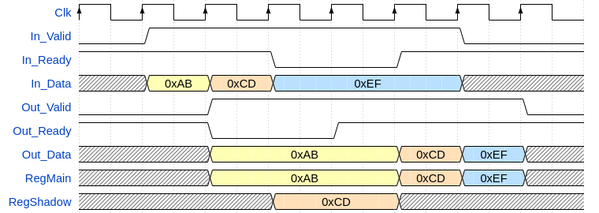

# olo_base_pl_stage

[Back to **Entity List**](../EntityList.md)

## Status Information

  

VHDL Source: [olo_base_pl_stage](../../src/base/vhdl/olo_base_pl_stage.vhd)

## Description

This entity implements multiple pipeline stages with handshaking (AXI-S Ready/Valid). The pipeline stage ensures all signals are registered in both directions (including Ready). This is important to break long logic chains that can occur in the Ready  paths because Ready is often forwarded asynchronously.

*olo_base_pl_stage* is used for two main cases:

* Breaking long logic paths into several sections, each one having a propagation time shorter than the clock period. In this case *olo_base_pl_stage* usually is configured for *Stages_g*=1.
* Adding multiple register stages for long routing paths. In this case *olo_base_pl_stage* usually is configured for *Stages_g*>1.

## Generics

| Name       | Type     | Default | Description                                                  |
| :--------- | :------- | ------- | :----------------------------------------------------------- |
| Width_g    | positive | -       | Number of bits per FIFO entry (word-width)                   |
| Stages_g   | natural  | 1       | Number of register stages to implement                       |
| UseReady_g | boolean  | true    | Support for backpressure only is implemented if this generic is set to *true* |

## Interfaces

### Control

| Name | In/Out | Length | Default | Description                                     |
| :--- | :----- | :----- | ------- | :---------------------------------------------- |
| Clk  | in     | 1      | -       | Clock                                           |
| Rst  | in     | 1      | -       | Reset input (high-active, synchronous to *Clk*) |

### Input Data

| Name     | In/Out | Length    | Default | Description                                  |
| :------- | :----- | :-------- | ------- | :------------------------------------------- |
| In_Data  | in     | *Width_g* | -       | Input data                                   |
| In_Valid | in     | 1         | '1'     | AXI4-Stream handshaking signal for *In_Data* |
| In_Ready | out    | 1         | N/A     | AXI4-Stream handshaking signal for *In_Data* |

### Output Data

| Name      | In/Out | Length    | Default | Description                                   |
| :-------- | :----- | :-------- | ------- | :-------------------------------------------- |
| Out_Data  | out    | *Width_g* | N/A     | Output data                                   |
| Out_Valid | out    | 1         | N/A     | AXI4-Stream handshaking signal for *Out_Data* |
| Out_Ready | in     | 1         | '1'     | AXI4-Stream handshaking signal for *Out_Data* |

## Architecture

The architecture for *UseReady_g*=false is straightforward. The figure below shows an example for 3 stages. 

Note that synthesis attributes are set to avoid registers being merged into shift-registers. Implementation as FFs is guaranteed.

For *UseReady_g*=true, the architecture is less straightforward. In this case, the registering of the *Ready* path makes a shadow register (red) required for each stage. This shadow register is used for absorbing one more word of data during the additional clock-cycle of delay on the *Ready* path being added by the register in case the main register (blue) already contains data. Once the main register becomes free, data is transferred back from the shadow register to the main register.

The presence of a shadow register makes the pipeline stage not only a *register stage* but actually a *two entries FIFO*. The architecture chosen ensures that every output is directly driven by a FF to ensure optimal timing performance.

The figure below shows an example for 1 stage. The logic is then replicated per stage.

The requirement for a shadow register is depicted by below waveform.

