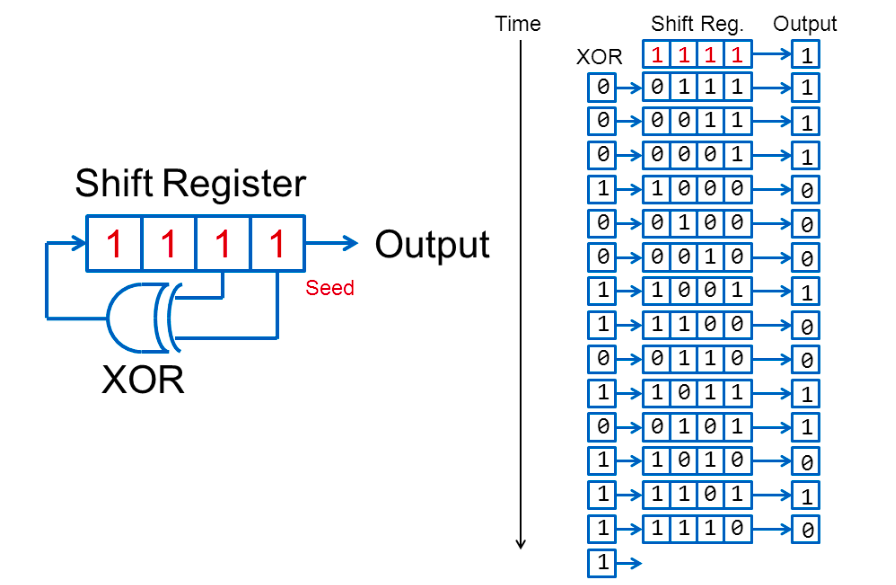

# olo_base_prbs

[Back to **Entity List**](../EntityList.md)

## Status Information

  

VHDL Source: [olo_base_prbs](../../src/base/vhdl/olo_base_prbs.vhd)

## Description

This component generates a pseudorandom binary sequence based (PRBS) on a logic feed-back shift register (LFSR) method. A set of common polynomials (aiming the maximum cycle possible) is available in [olo_base_pkg_logic](./olo_base_pkg_logic.md) and can be passed to *olo_base_prbs* through the generic *Polynomical_g*.

The number of bits per symbol which is presented at the output is configurable (up to the width of the LFSR).

Polynomials are passed as *std_logic_vector* where a one denotes every position where x^n is used: "100010000" means "x⁹ +x⁵ + 1".

The initial state of the LFSR can be configured throuh *Seed_g* at compile time or through *State_New* at the moment where *State_Set='1'* is asserted at runtime. Note that the state of an LFSR never should be zero - otherwise the LFSR will stay zero forever.

## Generics

| Name            | Type             | Default | Description                                                  |
| :-------------- | :--------------- | ------- | :----------------------------------------------------------- |
| LfsrWidth_g     | positive         | -       | Width of the LFSR in bits (must be >= 2)                     |
| Polynomial_g    | std_logic_vector | -       | Polynomial to use. Width according to *LfsrWidth_g*. "100010000" means "x⁴+x⁸". |
| Seed_g          | std_logic_vector | -       | Initial state of the LFSR. Width according to *LfsrWidth_g*. Must be non-zero. |
| BitsPerSymbol_g | positive         | 1       | Number of bits of the PRBS sequence to present at the output for every symbol (width of *Out_Data*).  Must be smaller or equal to *LfsrWidth_g*. |

## Interfaces

### Control

| Name | In/Out | Length | Default | Description                                     |
| :--- | :----- | :----- | ------- | :---------------------------------------------- |
| Clk  | in     | 1      | -       | Clock                                           |
| Rst  | in     | 1      | -       | Reset input (high-active, synchronous to *Clk*) |

### Output Data

| Name      | In/Out | Length            | Default | Description                                                  |
| :-------- | :----- | :---------------- | ------- | :----------------------------------------------------------- |
| Out_Data  | out    | *BitsPerSymbol_g* | -       | Output data                                                  |
| Out_Valid | out    | 1                 | -       | AXI4-Stream handshaking signal for *Out_Data* Always one. The output is always valid. |
| Out_Ready | in     | 1                 | '1'     | AXI4-Stream handshaking signal for *Out_Data*           |

### State

| Name          | In/Out | Length        | Default | Description                                                  |
| :------------ | :----- | :------------ | ------- | :----------------------------------------------------------- |
| State_Current | out    | *LfsrWidth_g* | -       | Current state of the LFSR register                           |
| State_Set     | in     | 1             | '0'     | The LFSR content is set to *State_New* when *State_Set='1'* is asserted. |
| State_New     | in     | *LfsrWidth_g* | 0       | LFSR state to set upon *State_Set='1'*.                      |

Note: If the state functionality is not needed, the corresponding signals can be left unconnected.

## Architecture

The PRBS generation is implemented using an LFSR register.

Below figures shows the implementation for a 4-bit LFSR with the polynomial *x⁴ + x³ + 1* ("1100").

