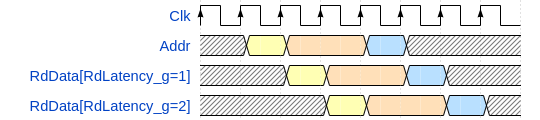

# olo_base_ram_sp

[Back to **Entity List**](../EntityList.md)

## Status Information

  

VHDL Source: [olo_base_ram_sp](../../src/base/vhdl/olo_base_ram_sp.vhd)

## Description

This component implements a **single-port** RAM. 

The RAM is implemented in pure VHDL but in a way that allows tools to implement it in block-RAMs.

## Generics

| Name            | Type     | Default | Description                                                  |
| :-------------- | :------- | ------- | :----------------------------------------------------------- |
| Depth_g         | positive | -       | Number of addresses the RAM has                              |
| Width_g         | positive | -       | Number of bits stored per address (word-width)               |
| UseByteEnable_g | boolean  | false   | By default, all bits of a memory cell are written. Enabling byte-enables allows to control which bytes are written individually.  The setting is only allows for if *Width_g* is a multiple of eight (otherwise the word *byte-enable* does not make sense). |
| RdLatency_g     | positive | 1       | Read latency.  1 is the behavior of a normal synchronous RAM Higher values can be desirable for timing-optimization in high-speed logic. |
| RamStyle_g      | string   | "auto"  | Through this generic, the exact resource to use for implementation can be controlled. This generic is applied to the attributes *ram_style* and *ramstyle* which vendors offer to control RAM implementation. Commonly used values are given below. AMD: "auto", block", "distributed", "ultra" - see [ug901](https://docs.amd.com/r/en-US/ug901-vivado-synthesis/RAM_STYLE?tocId=EWhb59DDWEWsMr4arnAICw) for details Intel: "M4K", "M9K", "M20K", "M144K", "MLAB" - see [quartus-help](https://www.intel.com/content/www/us/en/programmable/quartushelp/17.0/hdl/vhdl/vhdl_file_dir_ram.htm) for details |
| RamBehavior     | string   | "RBW"   | Controls the RAM behavior. Must match the behavior of RAM resources of the target technology for efficient implementation. "RBW": Read-before-write - more common common, hence the default  "WBR": Write-before-read If you are unsure what behavior your target device offers, try both settings and check which one is correctly mapped to RAM resources using the synthesis report. |

## Interfaces

| Name   | In/Out | Length                | Default | Description                                                  |
| :----- | :----- | :-------------------- | ------- | :----------------------------------------------------------- |
| Clk    | in     | 1                     | -       | Clock                                                        |
| Addr   | in     | ceil(log2(*Depth_g*)) | -       | Address                                                      |
| Be     | in     | *Width_g*/8           | All '1' | Byte-enables Ignored if *UseByteEnable_g* = false         |
| WrEna  | in     | 1                     | '1'     | Write enable. The memory cell at *Addr* is written only if *WrEna*='1'. |
| WrData | in     | *Width_g*             | -       | Write data                                                   |
| RdData | out    | *Width_g*             | N/A     | Read data                                                    |

## Architecture

Below figure explains the *RdLatency_g* generic in detail:

