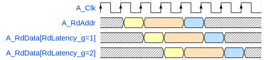

# olo_base_ram_tdp

[Back to **Entity List**](../EntityList.md)

## Status Information

VHDL Source: [olo_base_ram_sdp](../../src/base/vhdl/olo_base_ram_sdp.vhd)

## Description

This component implements a **true dual-port** RAM. It offers two ports, which both allow reading and writing. The two
ports run on separate clocks - although connecting the same clock to both ports is allowed.

The RAM is implemented in pure VHDL but in a way that allows tools to implement it in block-RAMs.

## Generics

| Name            | Type     | Default | Description                                                  |
| :-------------- | :------- | ------- | :----------------------------------------------------------- |
| Depth_g         | positive | -       | Number of addresses the RAM has                              |
| Width_g         | positive | -       | Number of bits stored per address (word-width)               |
| UseByteEnable_g | boolean  | false   | By default, all bits of a memory cell are written. Enabling byte-enables allows to control which bytes are written individually.  The setting is only allows for if _Width_g_ is a multiple of eight (otherwise the word _byte-enable_ does not make sense). |
| RdLatency_g     | positive | 1       | Read latency.  1 is the behavior of a normal synchronous RAM Higher values can be desirable for timing-optimization in high-speed logic. |
| RamStyle_g      | string   | "auto"  | Through this generic, the exact resource to use for implementation can be controlled. This generic is applied to the attributes _ram_style_ and _ramstyle_ which vendors offer to control RAM implementation. Commonly used values are given below. AMD: "auto", block", "distributed", "ultra" - see [ug901](https://docs.amd.com/r/en-US/ug901-vivado-synthesis/RAM_STYLE?tocId=EWhb59DDWEWsMr4arnAICw) for details Intel: "M4K", "M9K", "M20K", "M144K", "MLAB" - see [quartus-help](https://www.intel.com/content/www/us/en/programmable/quartushelp/17.0/hdl/vhdl/vhdl_file_dir_ram.htm) for details Efinix: "block_ram", "registers" - see [efinity-synthesis](https://www.efinixinc.com/docs/efinity-synthesis-v3.9.pdf) for details Synplify(Lattice/Microchip): "block_ram", "registers", "distributed" - see [microchip-attributes-guide](https://ww1.microchip.com/downloads/aemdocuments/documents/fpga/ProductDocuments/ReleaseNotes/microsemi_p201903asp1_attribute_reference.pdf) for details Gowin: "block_ram", "distributed_ram", "registers", "rw_check", "no_rw_check" - see [GowinSynthesis User Guide](https://cdn.gowinsemi.com.cn/SUG550E.pdf) for details. |
| RamBehavior     | string   | "RBW"   | Controls the RAM behavior. Must match the behavior of RAM resources of the target technology for efficient implementation. "RBW": Read-before-write - more common common, hence the default  "WBR": Write-before-read If you are unsure what behavior your target device offers, try both settings and check which one is correctly mapped to RAM resources using the synthesis report. |

## Interfaces

### Port A

| Name     | In/Out | Length                | Default | Description                                                  |
| :------- | :----- | :-------------------- | ------- | :----------------------------------------------------------- |
| A_Clk    | in     | 1                     | -       | Port A clock                                                 |
| A_Addr   | in     | _ceil(log2(Depth_g))_ | -       | Port A address                                               |
| A_Be     | in     | _Width_g/8_           | All '1' | Port A byte-enables Ignored if _UseByteEnable_g_ = false  |
| A_WrEna  | in     | 1                     | '0'     | Port A write enable. The memory cell at _A_Addr_ is written only if _A_WrEna_='1'. |
| A_WrData | in     | _Width_g_             | 0       | Port A write data                                            |
| A_RdData | out    | _Width_g_             | N/A     | Port A read data                                             |

### Port B

| Name     | In/Out | Length                | Default | Description                                                  |
| :------- | :----- | :-------------------- | ------- | :----------------------------------------------------------- |
| B_Clk    | in     | 1                     | -       | Port B clock                                                 |
| B_Addr   | in     | _ceil(log2(Depth_g))_ | -       | Port B address                                               |
| B_Be     | in     | _Width_g*/8_           | All '1' | Port B byte-enables Ignored if _UseByteEnable_g_ = false  |
| B_WrEna  | in     | 1                     | '0'     | Port B write enable. The memory cell at _B_Addr_ is written only if _B_WrEna_='1'. |
| B_WrData | in     | _Width_g_             | 0       | Port B write data                                            |
| B_RdData | out    | _Width_g_             | N/A     | Port B read data                                             |

## Architecture

Below figure explains the _RdLatency_g_ generic in detail:

