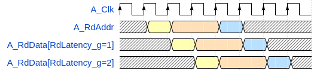
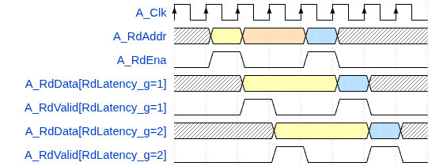

# olo_base_ram_tdp

[Back to **Entity List**](../EntityList.md)

## Status Information

VHDL Source: [olo_base_ram_tdp](../../src/base/vhdl/olo_base_ram_tdp.vhd)

## Description

This component implements a **true dual-port** RAM. It offers two ports, which both allow reading and writing. The two
ports run on separate clocks - although connecting the same clock to both ports is allowed.

The RAM is implemented in pure VHDL but in a way that allows tools to implement it in block-RAMs.

> [!WARNING]
> True dual port RAM is _NOT_ supported when compiling with Yosys for Gologne Chip FPGAs.
> Please use _olo_base_ram_sdp_ instead.

## Generics

| Name            | Type     | Default | Description                                                  |
| :-------------- | :------- | ------- | :----------------------------------------------------------- |
| Depth_g         | positive | -       | Number of addresses the RAM has                              |
| Width_g         | positive | -       | Number of bits stored per address (word-width)               |
| UseByteEnable_g | boolean  | false   | By default, all bits of a memory cell are written. Enabling byte-enables allows to control which bytes are written individually.  The setting is only allows for if _Width_g_ is a multiple of eight (otherwise the word _byte-enable_ does not make sense).  Note that setting this setting to _true_ can lead to _increased resource usage_. See [Detailed Description](#detailed-description) |
| RdLatency_g     | positive | 1       | Read latency.  1 is the behavior of a normal synchronous RAM Higher values can be desirable for timing-optimization in high-speed logic. |
| RamStyle_g      | string   | "auto"  | Through this generic, the exact resource to use for implementation can be controlled. This generic is applied to the attributes _ram_style_ and _ramstyle_ which vendors offer to control RAM implementation. Commonly used values are given below. AMD: "auto", block", "distributed", "ultra" - see [ug901](https://docs.amd.com/r/en-US/ug901-vivado-synthesis/RAM_STYLE?tocId=EWhb59DDWEWsMr4arnAICw) for details Intel: "M4K", "M9K", "M20K", "M144K", "MLAB" - see [quartus-help](https://www.intel.com/content/www/us/en/programmable/quartushelp/17.0/hdl/vhdl/vhdl_file_dir_ram.htm) for details Efinix: "block_ram", "registers" - see [efinity-synthesis](https://www.efinixinc.com/docs/efinity-synthesis-v3.9.pdf) for details Synplify(Lattice/Microchip): "block_ram", "registers", "distributed" - see [microchip-attributes-guide](https://ww1.microchip.com/downloads/aemdocuments/documents/fpga/ProductDocuments/ReleaseNotes/microsemi_p201903asp1_attribute_reference.pdf) for details Gowin: "block_ram", "distributed_ram", "registers", "rw_check", "no_rw_check" - see [GowinSynthesis User Guide](https://cdn.gowinsemi.com.cn/SUG550E.pdf) for details. |
| RamBehavior_g   | string   | "RBW"   | Controls the RAM behavior. Must match the behavior of RAM resources of the target technology for efficient implementation. "RBW": Read-before-write - more common common, hence the default  "WBR": Write-before-read If you are unsure what behavior your target device offers, try both settings and check which one is correctly mapped to RAM resources using the synthesis report. |
| InitString_g    | string   | ""      | Initialization data for the memory formatted as comma separated list of hex calues (e.g. "0x1234, 0x0ABC"). Each value _MUST_ have the 0x prefix. The first value goes to address 0, the second one to address 1 and so on. |
| InitFormat_g    | string   | "NONE"  | "NONE": RAM is not initialized "HEX": RAM is initialized with InitString_g interpreted as list of hex values. **Note:** Not all technologies support RAM initialization. Check the documentation of your technology/tools for details. |

## Interfaces

### Port A

| Name     | In/Out | Length                | Default | Description                                                  |
| :------- | :----- | :-------------------- | ------- | :----------------------------------------------------------- |
| A_Clk    | in     | 1                     | -       | Port A clock                                                 |
| A_Rst    | in     | 1                     | '0'     | Port A synchronous reset Optional, only resets internal state of _A_RdValid_ Does **NOT** reset the content of memory cells! |
| A_Addr   | in     | _ceil(log2(Depth_g))_ | -       | Port A address                                               |
| A_Be     | in     | _Width_g/8_           | All '1' | Port A byte-enables Ignored if _UseByteEnable_g_ = false  |
| A_WrEna  | in     | 1                     | '0'     | Port A write enable. The memory cell at _A_Addr_ is written only if _A_WrEna_='1'. |
| A_WrData | in     | _Width_g_             | 0       | Port A write data                                            |
| A_RdEna  | in     | 1                     | '1'     | Port A read enable. When asserted, _A_RdData_ is updated and _A_RdValid_ is asserted after _RdLatency_g_ cycles. |
| A_RdData | out    | _Width_g_             | N/A     | Port A read data                                             |
| A_RdValid | out   | 1                     | N/A     | Port A read valid. Asserted _RdLatency_g_ cycles after _A_RdEna_ was asserted. |

### Port B

| Name     | In/Out | Length                | Default | Description                                                  |
| :------- | :----- | :-------------------- | ------- | :----------------------------------------------------------- |
| B_Clk    | in     | 1                     | -       | Port B clock                                                 |
| B_Rst    | in     | 1                     | '0'     | Port B synchronous reset Optional, only resets internal state of _B_RdValid_ Does **NOT** reset the content of memory cells! |
| B_Addr   | in     | _ceil(log2(Depth_g))_ | -       | Port B address                                               |
| B_Be     | in     | _Width_g*/8_           | All '1' | Port B byte-enables Ignored if _UseByteEnable_g_ = false  |
| B_WrEna  | in     | 1                     | '0'     | Port B write enable. The memory cell at _B_Addr_ is written only if _B_WrEna_='1'. |
| B_WrData | in     | _Width_g_             | 0       | Port B write data                                            |
| B_RdEna  | in     | 1                     | '1'     | Port B read enable. When asserted, _B_RdData_ is updated and _B_RdValid_ is asserted after _RdLatency_g_ cycles. |
| B_RdData | out    | _Width_g_             | N/A     | Port B read data                                             |
| B_RdValid | out   | 1                     | N/A     | Port B read valid. Asserted _RdLatency_g_ cycles after _B_RdEna_ was asserted. |

## Detailed Description

### Read Latency

Below figure explains the _RdLatency_g_ generic in detail:

### Byte Enables

Due to tool limitations regarding inference, the usage of byte enables (_UseByteEnable_g=true_) can lead to increased
RAM usage.nTherefore, **do not use byte enable signals unless this is strictly required**.

Open Logic internally does not use byte enables, hence only users using the _olo_base_ram_tdp_ component directly with
byte-enables enabled are affected.

For applications where vendor/tool independence is important, this is to be regarded as a required trade-off. For
applications that target only one specific technology, it is suggested to use vendor macros if RAM with byte enables if
required.

## RdEna and RdValid

For TDP RAM inference, not all tools do support read enable signals. Therefore in _olo_base_ram_tdp, in contrast
to other RAM components, does read the RAM in every clock cycles, independently of the _A_RdEna_ / _B_RdEna_ signals.

The _A_RdEna_ / _B_RdEna_ signals are only used to control the _A_RdValid_ / _B_RdValid_ signals.

The _A_RdEna_ / _B_RdEna_ signals only control the _A_RdValid_ / _B_RdValid_ signals. This means that if _A_RdEna_ is
asserted, _A_RdValid_ is asserted after _RdLatency_g_ cycles, indicating that the data on _A_RdData_ is valid and can
be used. This is very useful in pipelined design, especially with configurable _RdLatency_g_ values because it allows
to design logic around independently of the RAM read latency.

Note that the read data is updated even if A_RdEna_ is de-asserted.
