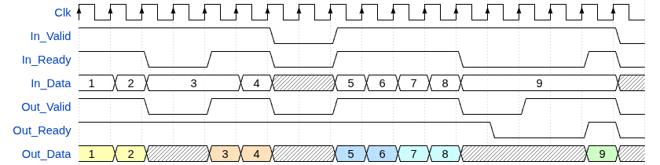
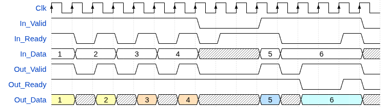

# olo_base_rate_limit

[Back to **Entity List**](../EntityList.md)

## Status Information

VHDL Source: [olo_base_rate_limit](../../src/base/vhdl/olo_base_rate_limit.vhd)

## Description

This component limits the rate of AXI4-Stream style handshaked interfaces to a specified maximum data rate. It can
be used to avoid overloading downstream components. This is especially useful when interfacing to components that have
limited processing capabilities and do not support back-pressure (i.e. do not de-assert _Ready_ signals).
Another common use-case is limiting the bandwidth of data-streams - thanks to runtime configurable
parameters the rate limit can be adjusted on-the-fly.

The component has two modes of operation:

- _BLOCK_: In this mode the component does not forward more than a limited number of samples over a given period but
  still does forward short bursts at full speed as long as the average rate is not exceeded.
- _SMOOTH_: In this mode the component spaces samples evenly over time to achieve a constant output data rate.

### _BLOCK_ Mode

The sample figure is drawn for _Period_g_=4 clock cycles and _MaxSamples_g_=2 samples per period. Periods on the output
side are marked in colors.

Note how the rate can exceed the limit if short bursts occur at the end of one block (blue, block 2) and the beginning
of the next block (turquoise, block 3). Although each block only forwards two samples, in this situation fours samples
are forwarded consecutively in the two consecutive blocks.

### _SMOOTH_ Mode

The sample figure is drawn for _Period_g_=4 clock cycles and _MaxSamples_g_=2 samples per period. Periods on the output
side are marked in colors.

Note how the samples are equally spaced (one sample every two clock cycles). In contrast to _BLOCK_ mode bursts are
forwarded.

### Runtime Configuration

When _RuntimeCfg_g_=false (default), the component operates with fixed parameters defined by the _Period_g_ and
_MaxSamples_g_ generics.

When _RuntimeCfg_g_=true, the component accepts runtime configuration through the _Cfg_Period_ and _Cfg_MaxSamples_
ports. In this mode:

- The generics _Period_g_ and _MaxSamples_g_ define the maximum supported values
- The actual period and max samples are determined by the configuration ports
- Configuration port values represent the actual value minus 1 (e.g., Cfg_Period=1 means a period of 2 clock cycles)
- Configuration changes take effect within less than five clock cycles
- The configuration ports must **always** satisfy: Cfg_MaxSamples ≤ Cfg_Period

## Generics

| Name            | Type      | Default  | Description                                                  |
| :-------------- | :-------- | -------- | :----------------------------------------------------------- |
| Width_g         | positive  | -        | Width of _In_Data_ and _Out_Data_                            |
| RegisterReady_g | boolean   | true     | If true, _In_Ready_ is registered to improve timing          |
| Mode_g          | string    | "SMOOTH" | Rate limiting mode, either "BLOCK" or "SMOOTH"               |
| Period_g        | positive  | -        | Time period for rate limiting in clock cycles. When _RuntimeCfg_g_=true, this defines the maximum supported period. |
| MaxSamples_g    | positive  | 1        | Maximum number of samples allowed per _Period_g_. When _RuntimeCfg_g_=true, this defines the maximum supported samples per period. |
| RuntimeCfg_g    | boolean   | false    | If true, period and max samples are taken from configuration ports instead of generics |

## Interfaces

### Control

| Name | In/Out | Length | Default | Description                                     |
| :--- | :----- | :----- | ------- | :---------------------------------------------- |
| Clk  | in     | 1      | -       | Clock                                           |
| Rst  | in     | 1      | -       | Reset input (high-active, synchronous to _Clk_) |

### Configuration

Configuration ports are only used when _RuntimeCfg_g_=true.

| Name           | In/Out | Length                   | Default        | Description                                              |
| :------------- | :----- | :----------------------- | -------------- | :------------------------------------------------------- |
| Cfg_Period     | in     | ceil(log2(Period_g))     | Period_g-1     | Period for runtime-configuration minus 1 (_Cfg_Period_=1 means a period of two clock cycles)     |
| Cfg_MaxSamples | in     | ceil(log2(MaxSamples_g)) | MaxSamples_g-1 | MaxSamples for runtime-configuration minus 1 (_Cfg_MaxSamples_=1 means two samples per block) |

### Input Data

| Name      | In/Out | Length    | Default | Description                                                  |
| :-------- | :----- | :-------- | ------- | :----------------------------------------------------------- |
| In_Data   | in     | _Width_g_ | -       | Input data                                                   |
| In_Valid  | in     | 1         | '1'     | AXI4-Stream handshaking signal for _In_Data_                 |
| In_Ready  | out    | 1         | N/A     | AXI4-Stream handshaking signal for _In_Data_                 |

### Output Data

| Name       | In/Out | Length    | Default | Description                                                  |
| :--------- | :----- | :-------- | ------- | :----------------------------------------------------------- |
| Out_Data   | out    | _Width_g_ | N/A     | Output data                                                  |
| Out_Valid  | out    | 1         | N/A     | AXI4-Stream handshaking signal for _Out_Data_                |
| Out_Ready  | in     | 1         | '1'     | AXI4-Stream handshaking signal for _Out_Data_                |

## Architecture

The architecture is trivial and therefore not documented in detail.

For _RegisterReady_g_=true, a _olo_base_pl_stage_ is used to register the data-stream on the input side (before
the rate limiting logic).
