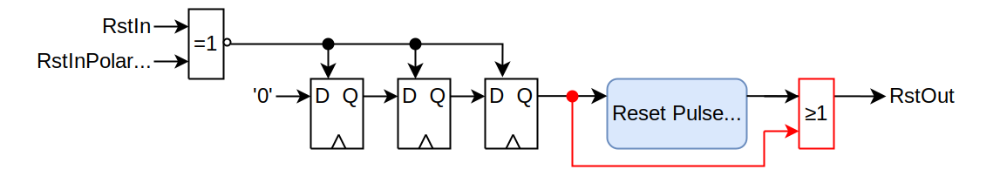

# olo_base_reset_gen

[Back to **Entity List**](../EntityList.md)

## Status Information

  

VHDL Source: [olo_base_reset_gen](../../src/base/vhdl/olo_base_reset_gen.vhd)

## Description

This component generates reset pulses of a specified minimum duration after FPGA configuration and optionally upon request (reset input).

The component dues guarantee synchronous de-assertion of the reset. It might assert the reset asynchronously.

**Note:** Because the reset input is detected asynchronously, it is important that this input is glitch-free.

The block comes with automatic constraints. For manual constraining, a `set_max_delay -datapath_only` or a `set_false_path` constraint is required for the *RstIn* input (if it is used).

**Note:** Automatic constraining currently only works for *AMD* tools (*Vivado*) and the usage in VHDL. Manual constraints are required for Verilog or other tools.

## Generics

| Name               | Type      | Default | Description                                                  |
| :----------------- | :-------- | ------- | :----------------------------------------------------------- |
| RstPulseCycles_g   | positive  | 3       | Minimum duration of the reset pulse in clock cycles Range: 3 ... 2^31-1 |
| RstInPolarity_g    | std_logic | '1'     | Polarity of *RstIn*. '1' - Active High '0' - Active Low |
| AsyncResetOutput_g | boolean   | false   | True = *RstOut* is asserted asynchronously (*RstIn* is forwarded even in absence of *Clk* activity) False = *RstOut* may be asserted synchronously (upon *Clk* rising edge). Note that for short reset pulses (*RstPulseCycles_g*=3) the output is always asserted synchronously. The generic is meant to enforce asynchronous assertion even for longer pulses. |

## Interfaces

| Name   | In/Out | Length | Default               | Description                                                  |
| :----- | :----- | :----- | :-------------------- | :----------------------------------------------------------- |
| Clk    | in     | 1      | -                     | Clock                                                        |
| RstOut | out    | 1      | -                     | Reset output (high-active, synchronous to Clk) **Note**: The output is always high-active according to *Open Logic* guidelines. |
| RstIn  | in     | 1      | not *RstInPolarity_g* | Reset input. The reset is detected asynchronously - any glitches on this signal lead to a reset pulse being generated. The input is optional. If reset shall only be asserted after FPGA configuration, it can be left floating. |

## Architecture

The architecture of the block is shown in the figure below:

The reset is detected asynchronously. If the *RstIn* input matches *RstInPolarity_g*, the reset synchronizer FFs are asynchronously set. A synchronous counter is then used to prolong the reset pulse to the required duraton.

Because the synchronous counter asserts its reset output only upon *Clk* edges, an additional OR (red) is added at the output when *AsyncResetOutput_g* is enabled.

