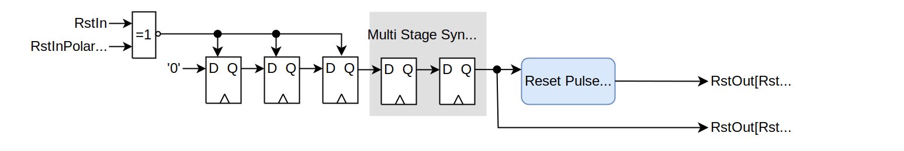

# olo_base_reset_gen

[Back to **Entity List**](../EntityList.md)

## Status Information

VHDL Source: [olo_base_reset_gen](../../src/base/vhdl/olo_base_reset_gen.vhd)

## Description

This component generates reset pulses of a specified minimum duration after FPGA configuration and optionally upon
request (reset input).

The component does guarantee synchronous de-assertion of the reset. Assertion is asynchronous or synchronous, depending
on the users choice.

**Note:** Because the reset input is detected asynchronously, it is important that this input is glitch-free.

The block comes with automatic constraints. For manual constraining, a `set_max_delay -datapath_only` or a
`set_false_path` constraint is required for the _RstIn_ input (if it is used).

**Note:** Automatic constraining currently only works for _AMD_ tools (_Vivado_) and the usage in VHDL. Manual
constraints are required for Verilog or other tools.

**WARNING:** Reset assertion upon FPGA configuration relies on the **target technology supporting specific FF
initialization state**. For the most common target technologies (namely AMD and altera) this is given. However, for
technologies which do not support specifying FF initialization state (e.g. Microchip devices) an external reset signal
must be connected to _RstIn_ - _RstOut_ will not be asserted upon FPGA configuration. If in doubt, refer to the the
documentation of your target technology or play it safe and connect _RstIn_.

## Generics

| Name               | Type      | Default | Description                                                  |
| :----------------- | :-------- | ------- | :----------------------------------------------------------- |
| RstPulseCycles_g   | positive  | 3       | Minimum duration of the reset pulse in clock cycles Range: 3 ... 2^31-1 |
| RstInPolarity_g    | std_logic | '1'     | Polarity of _RstIn_. '1' - Active High '0' - Active Low |
| AsyncResetOutput_g | boolean   | false   | True = _RstOut_ is asserted asynchronously (_RstIn_ is forwarded even in absence of _Clk_ activity) False = _RstOut_ may is asserted synchronously (upon _Clk_ rising edge). |
| SyncStages_g       | positive  | 2       | Number of synchronization stages for the multi-stage synchronizer in case of _AsyncResetOutput_g_=false.  This generic is not having any effect for _AsyncResetOutput_g_=true. Range: 2 ... 4 |

## Interfaces

| Name   | In/Out | Length | Default               | Description                                                  |
| :----- | :----- | :----- | :-------------------- | :----------------------------------------------------------- |
| Clk    | in     | 1      | -                     | Clock                                                        |
| RstOut | out    | 1      | -                     | Reset output (high-active, synchronous to Clk) **Note**: The output is always high-active according to _Open Logic_ guidelines. |
| RstIn  | in     | 1      | not _RstInPolarity_g_ | Reset input. The reset is detected asynchronously - any glitches on this signal lead to a reset pulse being generated. The input is optional. If reset shall only be asserted after FPGA configuration, it can be left floating (limited to target technologies supporting specifying the FF initialization state). |

## Architecture

The architecture of the block for _AsyncResetOutput_g_=false is shown in the figure below:

The reset is detected asynchronously. If the _RstIn_ input matches _RstInPolarity_g_, the reset synchronizer FFs are
asynchronously set. The reset assertion is then synchronized using a multi-stage synchronizer. A synchronous counter is
then used to prolong the reset pulse to the required duraton.

The architecture for _AsyncResetOutput_g_=true is relatively similar,
just with the last (metastability remover) FF in the synchronizer chain being omitted. Additionally, because the
synchronous counter asserts its reset output only upon _Clk_ edges, an additional OR (red) is added at the
output.

