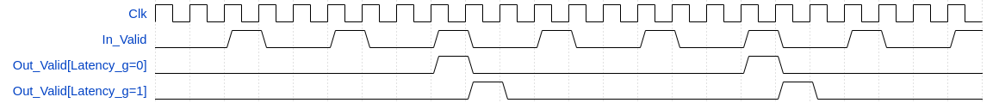
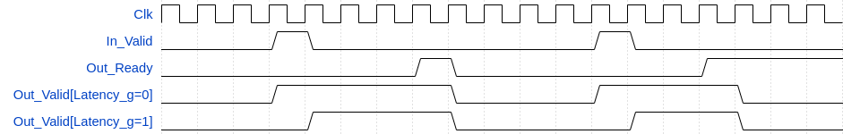

# olo_base_strobe_div

[Back to **Entity List**](../EntityList.md)

## Status Information

  

VHDL Source: [olo_base_strobe_div](../../src/base/vhdl/olo_base_strobe_div.vhd)

## Description

This component takes single-cycle pulses as inputs and divides the pulse frequency. 

The ratio can be configured at runtime or at compile-time. To use the compile-time variant, just leave the *In_Ratio* port unconnected and assign the ratio to *MaxRatio_g*.

The latency can be selected to be 0 (combinatorial output) or 1 (registered output) clock cycle through the generic *Latency_g*. Registered output (*Latency_g*=1) is preferred for timing optimization reasons.

Below figure shows an example for a ratio of 3.

The entity can also be used to convert single cycle pulses into pulses that stay active until acknowledged by *Out_Ready*='1'. For this usage, simply use *MaxRatio_g=1* and leave *In_Ratio* unconnected.

Note that for runtime configurable ratio, *In_Ratio* must be set to the **desired ratio minus one**. E.g. to forward every third pulse to the output, *In_Ratio* must be set to 2.

## Generics

| Name       | Type     | Default | Description                                                  |
| :--------- | :------- | ------- | :----------------------------------------------------------- |
| MaxRatio_g | positive | -       | Maximum ratio supported. If *In_Ratio* is left unconnected, exactly the ratio assigned to *MaxRatio_g* is implemented. |
| Latency_g  | natural  | 1       | 0 = Combinatorial output, 1 = Registered output              |

## Interfaces

### Control

| Name | In/Out | Length | Default | Description                                     |
| :--- | :----- | :----- | ------- | :---------------------------------------------- |
| Clk  | in     | 1      | -       | Clock                                           |
| Rst  | in     | 1      | -       | Reset input (high-active, synchronous to *Clk*) |

### Timing

| Name      | In/Out | Length                   | Default        | Description                                                  |
| :-------- | :----- | :----------------------- | -------------- | :----------------------------------------------------------- |
| In_Valid  | in     | 1                        | -              | Input pulse/strobe signal                                    |
| In_Ratio  | in     | *ceil(log2(MaxRatio_g))* | *MaxRatio_g-1* | Ratio selection. Apply the desired ratio **minus one**. E.g. to forward every third pulse to the output, use *In_Ratio=2*. |
| Out_Valid | out    | 1                        | -              | Output pulse/strobe signal                                   |
| Out_Ready | in     | 1                        | '1'            | Optional handshaking signal                                  |

## Architecture

The architecture of the entity is simple, not detailed description is required.

