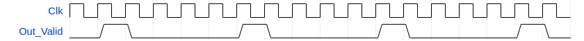
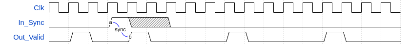
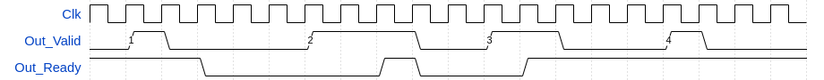

# olo_base_strobe_gen

[Back to **Entity List**](../EntityList.md)

## Status Information

  

VHDL Source: [olo_base_strobe_gen](../../src/base/vhdl/olo_base_strobe_gen.vhd)

## Description

This component generates pulse at a fixed frequency. It optionally allows synchronization of those events to an input.

In the most simple use-case, single cycle pulses are generated free-running at a fixed frequency. To achieve this, *Out_Ready* and *In_Sync* can be left unconnected. Bellow figure depicts this situation for *FreqClkHz_g=5e6* and *FreqStrobeHz_g=1e6*.

Alternatively the strobe phase can be synchronized to *In_Sync*. In this case, the event is synchronized to the rising edge of the *In_Sync* input.

If the *Out_Ready* signal is connected, *Out_Valid* stays asserted until *Out_Ready* and *Out_Valid* are asserted at the same time (AXI4-Stream hanshaking). Note that in this case, the rising edges of *Out_Valid* occur at *FreqStrobeHz_g* independently of how long the signal stays asserted.

However, *Out_Ready* and *In_Sync* are optional signals and can be left unconnected in the standard-case where just a pulse with a known frequency is required.

## Generics

| Name           | Type | Default | Description                       |
| :------------- | :--- | ------- | :-------------------------------- |
| FreqClkHz_g    | real | -       | Clock frequency in Hz             |
| FreqStrobeHz_g | real | -       | Pulse frequency to generate in Hz |

## Interfaces

### Control

| Name | In/Out | Length | Default | Description                                     |
| :--- | :----- | :----- | ------- | :---------------------------------------------- |
| Clk  | in     | 1      | -       | Clock                                           |
| Rst  | in     | 1      | -       | Reset input (high-active, synchronous to *Clk*) |

### Timing

| Name      | In/Out | Length | Default | Description                 |
| :-------- | :----- | :----- | ------- | :-------------------------- |
| In_Sync   | in     | 1      | '0'     | Synchronization signal      |
| Out_Valid | out    | 1      | -       | Output pulse/strobe signal  |
| Out_Ready | in     | 1      | '1'     | Optional handshaking signal |

## Architecture

The architecture of the entity is simple, not detailed description is required.

