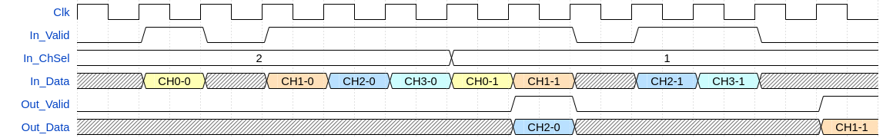
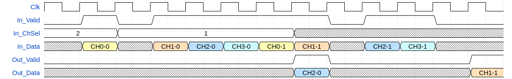
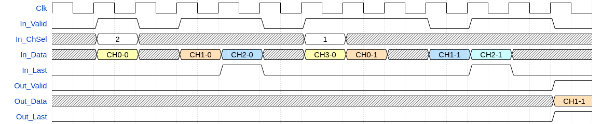

# olo_base_tdm_mux

[Back to **Entity List**](../EntityList.md)

## Status Information

VHDL Source: [olo_base_tdm_mux](../../src/base/vhdl/olo_base_tdm_mux.vhd)

## Description

This component allows selecting one unique channel over a bunch of "N" time division multiplexed (tdm, see
[Conventions](../Conventions.md)) data. Note that the number of channels must be compile-time defined (i.e. the entity
does not support variable number of channels at run-time).

The select signal _In_ChSel_ is sampled when the data of the first channel of a TDM burst arrives. The output
_Out_Data_/_Out_Valid_ is asserted after the last channel of a TDM burst was received.

The state of the _In_ChSel_ signal in between the _CH0_ inputs (where it is sampled) does not have any effect as
depicted by the figure below.

The entity does automatically synchronize the channel counter to _In_Last_. However, it can also be used in absence of
_In_Last_. In this case the first sample after reset is interpreted as channel 0 and the channel-counter is freerunning.

If _In_Last_ is asserted on the last channel in a TDM burst, the corresponding output hast _Out_Last_ asserted
(independently of which channel was selected). This behavior allows to signal packet-boundaries throughout the
_olo_base_tdm_mux_.

## Generics

| Name       | Type     | Default | Description                              |
| :--------- | :------- | ------- | :--------------------------------------- |
| Width_g    | positive | -       | Data-width                               |
| Channels_g | positive | -       | Number of TDM channels on the input side |

## Interfaces

### Control

| Name | In/Out | Length | Default | Description                                     |
| :--- | :----- | :----- | ------- | :---------------------------------------------- |
| Clk  | in     | 1      | -       | Clock                                           |
| Rst  | in     | 1      | -       | Reset input (high-active, synchronous to _Clk_) |

### Input Data

| Name     | In/Out | Length    | Default                  | Description                                                  |
| :------- | :----- | :-------- | ------------------------ | :----------------------------------------------------------- |
| In_Data  | in     | _Width_g_ | -                        | Input data                                                   |
| In_Valid | in     | 1         | '1'                      | AXI4-Stream handshaking signal for _In_Data_                 |
| In_Last  | in     | 1         | '0'                      | AXI4-Stream Last signal. Can be used to signal the last channel in TDM bursts or packet boundaries (but must be asserted on the last input channel in this case). |
| In_ChSel | in     | in        | _ceil(log2(Channels_g))_ | Channel select. Samples together with channel 0 data on _In_Data_ |

### Output Data

| Name      | In/Out | Length    | Default | Description                                                  |
| :-------- | :----- | :-------- | ------- | :----------------------------------------------------------- |
| Out_Data  | out    | _Width_g_ | N/A     | Output data                                                  |
| Out_Valid | out    | 1         | N/A     | AXI4-Stream handshaking signal for _Out_Data_                |
| Out_Last  | out    | 1         | N/A     | AXI4-Stream Last signal (used for signaling packet boundaries) |

## Architecture

The architecture of the entity is simple, not detailed description is required.
