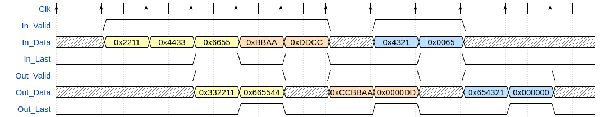
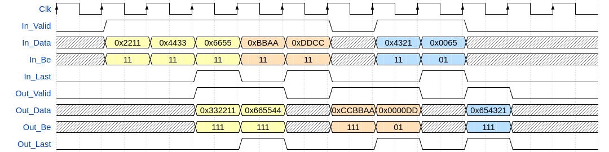
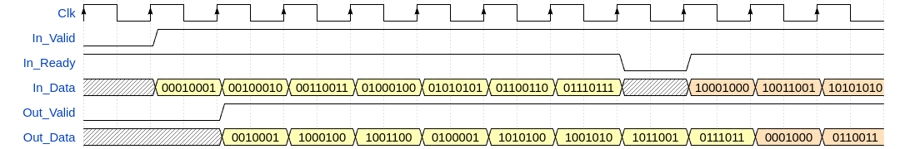
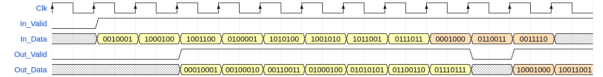

# olo_base_wconv_n2m

[Back to **Entity List**](../EntityList.md)

## Status Information

VHDL Source: [olo_base_wconv_n2m](../../src/base/vhdl/olo_base_wconv_n2m.vhd)

## Description

This component implements a width conversion between arbitrary word widths. It can handle continuous or packetized
data-streams and optionally supports the usage of byte-enable signals (for input and output widths being a multiple of
8-bits only).

 The width conversion implements AXI-S handshaking signals to handle back-pressure.

The with conversion supports back-to-back conversions (_In_Valid_ can stay high all the time). It also handles the
last-flag correctly according to AXI-S specification. If _In_Last_ is asserted, all data is flushed out and _Out_Last_
is asserted accordingly.

Usage examples:

- Conversion from 8-bit (byte oriented) data to 7-bit for the usage with 7-bit LVDS serializers
- Conversion from 24-bit to 32-bit in order to write 24-bit video pixel-data efficiently to a 32-bit wide memory

Note that for integer ratio width conversions, [olo_base_wconv_n2xn](./olo_base_wconv_n2xn.md) and
[olo_base_wconv_xn2n](./olo_base_wconv_xn2n.md) shall be used because they are more resource efficient and timing
optimal.

The entity does little-endian data alignment as shown in the figures below (the first word received on the input is
packet into the output bits with the lowest index).

### Byte Oriented Traffic and Byte-Enables

Below example shows a conversion from 16 to 24 bit. Backpressure (_Out_Ready_ going low) is not depicted for simplicity
reasons (but fully supported by the implementation).

Interesting is the last packet (blue) which contains an all zero word at the end, because without byte enable from the
input data 0x**00**66 it cannot be known if the zeros represent a data byte being zero or if it is a padding byte.
Similarly in the last output word of the orange packet, two padding bytes are inserted (0x**0000**DD) but to a receiver
this might not be clear due to the missing byte enables.

Below example is similar but uses byte enables to indicate padding bytes on the input as well as on the output. The blue
packet is now also shorter by one cycle because padding bytes at the end of the packet are removed.

Byte enables (_UseBe_g=true_) are only supported when both, _InWidth_g_ and _OutWidth_g_, are multiples of 8. For inputs
or outputs not being mutiples of bytes, the behavior of _In_Be_ and _Out_Be_ byte-enable signals is undefined.

**The usage of byte-enables is limited to indicating that not all bytes are used in the last beat of a packet**. Any
_In_Be_ being low in any other word of a packet than the last one (_In_Last='1'_) are not allowed and will lead to error
messages in simulations as well as undefined behavior in synthesis.

### Non-Byte Oriented Traffic

_olo_Base_wconv_n2m_ can be used for non-byte-aligned data as well. In this case byte enables are not supported,
otherwise the block behaves the same as for byte-oriented data.

Backpressure (_Out_Ready_ going low) is not depicted for simplicity reasons (but fully supported by the implementation).

Below example shows a 8-bit to 7-bit conversion, as required for 7-bit LVDS serializers.

And of course the conversion into the other direction (7-bit to 8-bit) is possible as well:$

## Generics

| Name       | Type     | Default | Description                                                  |
| :--------- | :------- | ------- | :----------------------------------------------------------- |
| InWidth_g  | positive | -       | Input width in bits.                                         |
| OutWidth_g | positive | -       | Output width in bits.                                        |
| UseBe_g    | boolean  | false   | true: Use _In_Be_ and _Out_Be_, only allowed for _InWidth_g_/_OutWidth_g_ being multiples of 8 false: _In_Be_ and _Out_Be_ are un |

## Interfaces

### Control

| Name | In/Out | Length | Default | Description                                     |
| :--- | :----- | :----- | ------- | :---------------------------------------------- |
| Clk  | in     | 1      | -       | Clock                                           |
| Rst  | in     | 1      | -       | Reset input (high-active, synchronous to _Clk_) |

### Input Data

| Name     | In/Out | Length        | Default | Description                                           |
| :------- | :----- | :------------ | ------- | :---------------------------------------------------- |
| In_Data  | in     | _InWidth_g_   | -       | Input data                                            |
| In_Be    | in     | _InWidth_g_/8 | all '1' | Input byte enables  Only used for _UseBe_g_=true |
| In_Valid | in     | 1             | '1'     | AXI4-Stream handshaking signal for _In_Data_          |
| In_Ready | out    | 1             | N/A     | AXI4-Stream handshaking signal for _In_Data_          |
| In_Last  | in     | 1             | '0'     | AXI4-Stream end of packet signaling for _In_Data_     |

### Output Data

| Name      | In/Out | Length         | Default | Description                                            |
| :-------- | :----- | :------------- | ------- | :----------------------------------------------------- |
| Out_Data  | out    | _OutWidth_g_   | N/A     | Output data                                            |
| Out_Be    | out    | _OutWidth_g_/8 | all '1' | Output byte enables  Only used for _UseBe_g_=true |
| Out_Valid | out    | 1              | N/A     | AXI4-Stream handshaking signal for _Out_Data_          |
| Out_Ready | in     | 1              | '1'     | AXI4-Stream handshaking signal for _Out_Data_          |
| Out_Last  | out    | 1              | N/A     | AXI4-Stream end of packet signaling for _Out_Data_     |

## Architecture

The architecture is based on a shift register. The position to insert new input data into the shift register is
determined by a counter that wraps around after as many input words being required to inject _least common multiple_
(LCM) bits of the input and the output word width.

The insertion position is selected in a multiple of _chunks_, a chunks being the _greatest common factor_ (GCF) of the
input an output width in bits.

The position of the last chunk is determined by a separate shift register containing one bit per chunk (_LastChunk_).
A one in this shift register masks the last chunk of a packet.

This architecture is versatile and supports any width to any width conversions.
