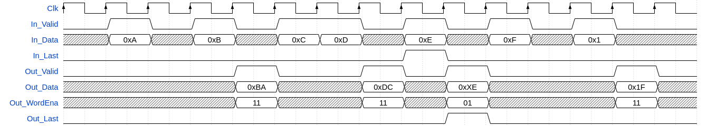

# olo_base_wconv_n2xn

[Back to **Entity List**](../EntityList.md)

## Status Information

VHDL Source: [olo_base_wconv_n2xn](../../src/base/vhdl/olo_base_wconv_n2xn.vhd)

## Description

This component implements a data width conversion from N-bits to a multiple of N-bits. The sample rate (_Valid_ pulse
rate) is reduced accordingly. The width conversion implements AXI-S handshaking signals to handle back-pressure.

This block can also be used for _TDM to Parallel_ conversion (see [Conventions](../Conventions.md))

The with conversion supports back-to-back conversions (_In_Valid_ can stay high all the time). It also handles the
last-flag correctly according to AXI specification. If _In_Last_ is asserted, all data is flushed out and the word
enabled (_Out_WordEna_) at the output are set only for words that contain data. _Out_Last_ is asserted accordingly.

Note that insteady of byte-enables, a word enable (_Out_WordEna_)  is implemented. It signals the validity of data on
the granularity of _In_Data_ words. This concept allows to correctly handle any data-widths, not only multiple of bytes.

The entity does little-endian data alignment as shown in the figure below. The figure depicts operation of the block
without backpressure (_Out_Ready_ continuously high) and for a width-conversion from 4 to 8 bits.

This entity does only do a width conversion but not clock crossing. If a half-clock-double-width conversion is used,
 [olo_base_cc_xn2n](./olo_base_cc_xn2n.md) component can be used after the width conversion.

## Generics

| Name       | Type     | Default | Description                                                  |
| :--------- | :------- | ------- | :----------------------------------------------------------- |
| InWidth_g  | positive | -       | Input width in bits.                                         |
| OutWidth_g | positive | -       | Output width in bits. Must be an integer multiple of _InWidth_g_ |

## Interfaces

### Control

| Name | In/Out | Length | Default | Description                                     |
| :--- | :----- | :----- | ------- | :---------------------------------------------- |
| Clk  | in     | 1      | -       | Clock                                           |
| Rst  | in     | 1      | -       | Reset input (high-active, synchronous to _Clk_) |

### Input Data

| Name     | In/Out | Length      | Default | Description                                       |
| :------- | :----- | :---------- | ------- | :------------------------------------------------ |
| In_Data  | in     | _InWidth_g_ | -       | Input data                                        |
| In_Valid | in     | 1           | '1'     | AXI4-Stream handshaking signal for _In_Data_      |
| In_Ready | out    | 1           | N/A     | AXI4-Stream handshaking signal for _In_Data_      |
| In_Last  | in     | 1           | '0'     | AXI4-Stream end of packet signaling for _In_Data_ |

### Output Data

| Name        | In/Out | Length                   | Default | Description                                                  |
| :---------- | :----- | :----------------------- | ------- | :----------------------------------------------------------- |
| Out_Data    | out    | _OutWidth_g_             | N/A     | Output data                                                  |
| Out_WordEna | out    | _OutWidth_g_/_InWidth_g_ | N/A     | Output word-enable. Works like byte-enable but with one bit per input-word. All bits in this signal are set, exept for with conversion results flushed  out by _Out_Last='1'_. In this case, the _Out_WordEna_ bits indicate which _Out_Data_ bits contain valid data (one _Out_WordEna_ bit per _InWidth_g_ bits in _Out_Data_.  See figure in the [Description](#description) section. |
| Out_Valid   | out    | 1                        | N/A     | AXI4-Stream handshaking signal for _Out_Data_                |
| Out_Ready   | in     | 1                        | '1'     | AXI4-Stream handshaking signal for _Out_Data_                |
| Out_Last    | out    | 1                        | N/A     | AXI4-Stream end of packet signaling for _Out_Data_           |

## Architecture

The architecture of the entity is simple, not detailed description is required.
