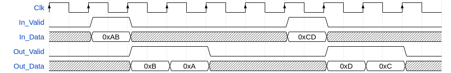
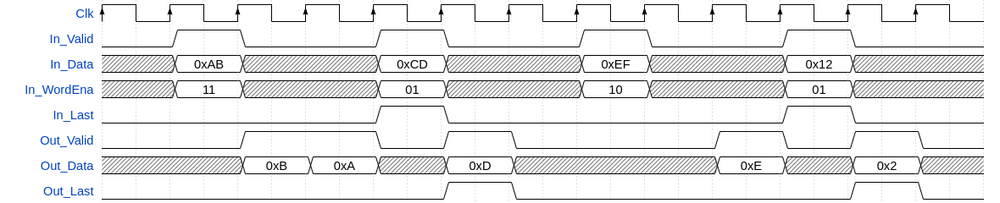

# olo_base_wconv_xn2n

[Back to **Entity List**](../EntityList.md)

## Status Information

  

VHDL Source: [olo_base_wconv_xn2n](../../src/base/vhdl/olo_base_wconv_xn2n.vhd)

## Description

This component implements a data width conversion from a multiple N-bits to a N-bits. The sample rate (*Valid* pulse rate) is increased accordingly. The width conversion implements AXI-S handshaking signals to handle back-pressure.

The width conversion does support back-to-back conversions (*Out_Valid/In_ready* can stay high all the time).

This block can also be used for *Parallel to TDM* conversion (see [Conventions](../Conventions.md))

The entity does little-endian data alignment as shown in the figure below.

The with conversion does also handle the last-flag according to AXI specification and it can do alignment. To do so, an input word-enable signal *In_WordEna* exists (one bit per *OutWidth_g* bits). Words that are not enabled are not sent to the output. If the input is marked with the *In_Last* flag, the last enabled word is marked with *Out_Last* at the output.

Note that with the assertion of *In_Last* at least one byte of the data must be valid (*In_WordEna* high). Otherwise it would be unclear when *Out_Last* shall be assigned.

This entity does only do a width conversion but not clock crossing. If a double-clock-half-width conversion is required, [olo_base_cc_n2xn](./olo_base_cc_n2xn)  component can be used in front of the width conversion.

## Generics

| Name       | Type     | Default | Description                                                  |
| :--------- | :------- | ------- | :----------------------------------------------------------- |
| InWidth_g  | positive | -       | Input width in bits. Must be an integer multiple of *OutWidth_g* |
| OutWidth_g | positive | -       | Output width in bits.                                        |

## Interfaces

### Control

| Name | In/Out | Length | Default | Description                                     |
| :--- | :----- | :----- | ------- | :---------------------------------------------- |
| Clk  | in     | 1      | -       | Clock                                           |
| Rst  | in     | 1      | -       | Reset input (high-active, synchronous to *Clk*) |

### Input Data

| Name       | In/Out | Length                   | Default | Description                                                  |
| :--------- | :----- | :----------------------- | ------- | :----------------------------------------------------------- |
| In_Data    | in     | *InWidth_g*              | -       | Input data                                                   |
| In_WordEna | in     | *InWidth_g*/*OutWidth_g* |         | Input word-enable. Works like byte-enable but with one bit per output-word. At least one word must be enabled together with the assertion of *In_Last*. |
| In_Valid   | in     | 1                        | all '1' | AXI4-Stream handshaking signal for *In_Data*                 |
| In_Ready   | out    | 1                        | N/A     | AXI4-Stream handshaking signal for *In_Data*                 |
| In_Last    | in     | 1                        | '0'     | AXI4-Stream end of packet signaling for *In_Data*            |

### Output Data

| Name      | In/Out | Length       | Default | Description                                        |
| :-------- | :----- | :----------- | ------- | :------------------------------------------------- |
| Out_Data  | out    | *OutWidth_g* | N/A     | Output data                                        |
| Out_Valid | out    | 1            | N/A     | AXI4-Stream handshaking signal for *Out_Data*      |
| Out_Ready | in     | 1            | '1'     | AXI4-Stream handshaking signal for *Out_Data*      |
| Out_Last  | out    | 1            | N/A     | AXI4-Stream end of packet signaling for *Out_Data* |

## Architecture

The architecture of the entity is simple, not detailed description is required.

