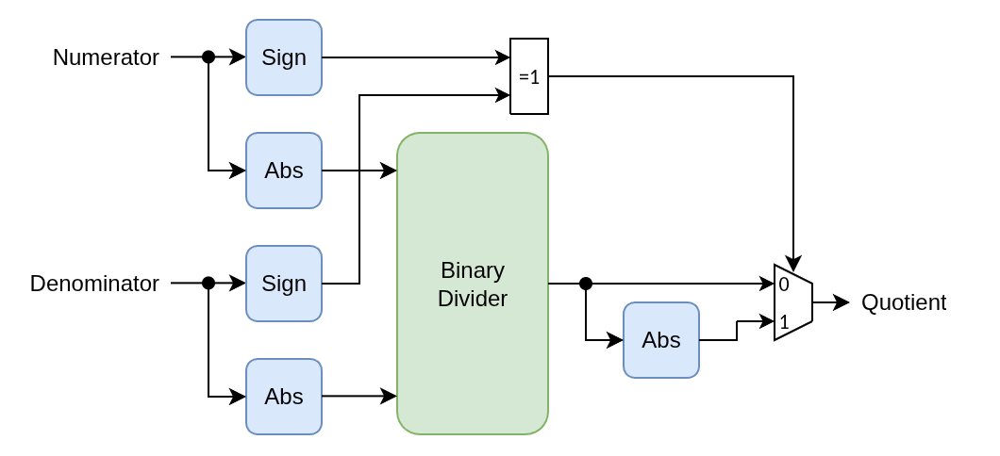

# olo_fix_bin_div

[Back to **Entity List**](../EntityList.md)

## Status Information

VHDL Source: [olo_fix_bin_div](../../src/fix/vhdl/olo_fix_bin_div.vhd) 
Bit-true Model: [olo_fix_bin_div](../../src/fix/python/olo_fix/olo_fix_bin_div.py)

## Description

### Overview

This entity implements a binary division of two fixed-point numbers.

The algorithm can be implemented in two different modes:

- **SERIAL**
  - Iterations are executed one after the other
  - A new sample can be accepted every _width(OutFmt_g) + 6_ clock cycles
  - Lowest possible resource usage
- **PIPELINED**
  - Iterations are implemented in individual pipeline stages
  - Every clock cycle a new sample can be accepted
  - Highest possible throughput

Division by zero returns the highest possible value when _Saturate_g = "Sat_s"_ and an undefined value otherwise.

### Latency

The latency of the entity depends on several factors and can best be determined in the simulation.

Note: Latency is not guaranteed to be constant across different versions. It's therefore best to design user logic
to be independent of the latency of this block (e.g. through [olo_base_latency_comp](../base/olo_base_latency_comp.md)).

In the current version the latency can be calculated as follows:

- _Mode_g_ = "SERIAL": _Latency_ = _OutFmt_g.I_ + _OutFmt_g.F_ + 6
- _Mode_g_ = "PIPELINED": _Latency_ = _OutFmt_g.I_ + _OutFmt_g.F_ + 6

## Generics

| Name              | Type     | Default     | Description                                                                                                                                                                                                                                                          |
| :---------------- | :------- | ----------- | :------------------------------------------------------------------------------------------------------------------------------------------------------------------------------------------------------------------------------------------------------------------- |
| NumFmt_g          | string   | -           | Numerator format  String representation of an _en_cl_fix Format_t_ (e.g. "(1,1,15)")                                                                                                                                                                            |
| DenomFmt_g        | string   | -           | Denominator format  String representation of an _en_cl_fix Format_t_ (e.g. "(1,1,15)")                                                                                                                                                                          |
| OutFmt_g          | string   | -           | Output data format  String representation of an _en_cl_fix Format_t_ (e.g. "(1,1,15)")                                                                                                                                                                          |
| Mode_g            | string   | "PIPELINED" | Mode of Operation "SERIAL": one iteration per clock cycle "PIPELINED": Pipelined mode (one sample per clock cycle)                                                                                                                                         |
| Round_g           | string   | "Trunc_s"   | Rounding mode  String representation of an _en_cl_fix FixRound_t_.                                                                                                                                                                                              |
| Saturate_g        | string   | "Sat_s"     | Saturation mode  String representation of an _en_cl_fix FixSaturate_t_.                                                                                                                                                                                         |

## Interfaces

### Control

| Name | In/Out | Length | Default | Description                                                  |
| :--- | :----- | :----- | ------- | :----------------------------------------------------------- |
| Clk  | in     | 1      | -       | Clock                                                        |
| Rst  | in     | 1      | -       | Reset input (high-active, synchronous to _Clk_)              |

### Input Data

| Name     | In/Out | Length              | Default | Description                                                                                                                |
| :------- | :----- | :------------------ | ------- | :------------------------------------------------------------------------------------------------------------------------- |
| In_Num   | in     | _width(NumFmt_g)_   | N/A     | Input numerator Format _NumFmt_g_                                                                                     |
| In_Denom | in     | _width(DenomFmt_g)_ | N/A     | Input denominator Format _DenomFmt_g_                                                                                 |
| In_Valid | in     | 1                   | '1'     | AXI4-Stream handshaking signal for _In_xxx_                                                                                |
| In_Ready | out    | 1                   | N/A     | AXI4-Stream handshaking signal for _In_xxx_                                                                                |

### Output Data

| Name       | In/Out | Length               | Default | Description                                                      |
| :--------- | :----- | :------------------- | ------- | :--------------------------------------------------------------- |
| Out_Quot   | out    | _width(OutFmt_g)_    | -       | Quotient output data Format: _OutFmt_g_                     |
| Out_Valid  | out    | 1                    | N/A     | AXI4-Stream handshaking signal for _Out_Quot_                    |

**Note** The output interface does not implement backpressure (_Ready_). If backpressure is required, the user ideally
implements it over the whole processing chain using [olo_base_flowctrl_handler](../base/olo_base_flowctrl_handler.md).

## Detail

The entity converts numerator and denominator to unsigned numbers, so the division can be implemented
using a simple non-restoring division algorithm. At the output the sign is then restored correctly.

