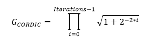
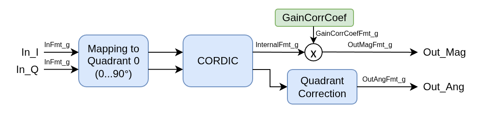

# olo_fix_cordic_vect

[Back to **Entity List**](../EntityList.md)

## Status Information

VHDL Source: [olo_fix_cordic_vect](../../src/fix/vhdl/olo_fix_cordic_vect.vhd) 
Bit-true Model: [olo_fix_cordic_vect](../../src/fix/python/olo_fix/olo_fix_cordic_vect.py)

## Description

### Overview

This entity implements the vectoring CORDIC algorithm. This algorithm is usually used to convert from the cartesian
to the polar coordinate system, i.e. to calculate the magnitude and angle of a vector given by its X and Y (or I and Q)
components.

The algorithm can be implemented in two different modes:

- **ITERATIVE**
  - Iterations are executed one after the other
  - A new sample can be accepted every _Iterations_g_ clock cycles
  - Lowest possible resource usage
- **PIPELINED**
  - Iterations are implemented in individual pipeline stages
  - Every clock cycle a new sample can be accepted
  - Highest possible throughput

For details about the fixed-point number format used in _Open Logic_, refer to the
[fixed point principles](./olo_fix_principles.md).

### Gain Compensation

The CORDIC algorithm has an inherent gain that depends on the number of iterations. This gain can optionally be
compensated directly within the _olo_fix_cordic_vect_ entity. The internal gain compensation works most efficiently
if the internal format _IntXyFmt_g_  fits into one multiplier of the target device.

Alternatively, the user may choose to do the gain compensation outside of the entity, e.g. by using an
_olo_fix_mult_ entity after the CORDIC. For this the gain factor must be known, hence the formula is given below:

Note that depending on the application the gain compensation may be omitted completely. Therefore it is optional and can
be controlled through the generic GainCorrCoefFmt_g.

### Latency

The latency of the entity depends on several factors and can best be determined in the simulation.

Note: Latency is not guaranteed to be constant accross different version. It's therefore best to design user logic
to be independent of the latency of this block.

## Generics

| Name              | Type     | Default     | Description                                                                                                                                                                                                                                                          |
| :---------------- | :------- | ----------- | :------------------------------------------------------------------------------------------------------------------------------------------------------------------------------------------------------------------------------------------------------------------- |
| InFmt_g           | string   | -           | Input data format  Must be (1,x,y)  String representation of an _en_cl_fix Format_t_ (e.g. "(1,1,15)")                                                                                                                                                       |
| OutMagFmt_g       | string   | -           | Output magnitude format  Must be (0,x,y)  String representation of an _en_cl_fix Format_t_ (e.g. "(0,1,15)")                                                                                                                                                 |
| OutAngFmt_g       | string   | -           | Output angle format  Must be (0,0,x)  String representation of an _en_cl_fix Format_t_ (e.g. "(0,0,15)")                                                                                                                                                     |
| IntXyFmt_g        | string   | "AUTO"      | Internal format for X/Y values.  With "AUTO" the format is chosen automatically.  For manual control, specify a string representation of a signed _en_cl_fix Format_t_ (e.g. "(1,1,15)"). Refer to [Format Considerations](#format-considerations) for details |
| IntAngFmt_g       | string   | "AUTO"      | Internal format for angles  With "AUTO" the format is chosen automatically.  For manual control, specify a string representation of a (1,-1,x) _en_cl_fix Format_t_ (e.g. "(1,-1,15)"). Refer to [Format Considerations](#format-considerations) for details   |
| Iterations_g      | positive | 16          | Number of CORDIC iterations.  Range: 1 .. 32  Refer to [Format Considerations](#format-considerations) for details                                                                                                                                             |
| Mode_g            | string   | "PIPELINED" | CORDIC operation mode "ITERATIVE": Iterative mode "PIPELINED": Pipelined mode                                                                                                                                                                              |
| GainCorrCoefFmt_g | string   | "(0,0,17)"  | Format of the gain correction coefficient, specify a string representation of a signed _en_cl_fix Format_t_ (e.g. "(1,1,15)"). Refer to [Format Considerations](#format-considerations).   To disable the internal gain compensation, choose "NONE"               |
| Round_g           | string   | "Trunc_s"   | Rounding mode  String representation of an _en_cl_fix FixRound_t_.                                                                                                                                                                                              |
| Saturate_g        | string   | "Warn_s     | Saturation mode  String representation of an _en_cl_fix FixSaturate_t_.                                                                                                                                                                                         |

## Interfaces

### Control

| Name | In/Out | Length | Default | Description                                                  |
| :--- | :----- | :----- | ------- | :----------------------------------------------------------- |
| Clk  | in     | 1      | -       | Clock                                                        |
| Rst  | in     | 1      | -       | Reset input (high-active, synchronous to _Clk_)              |

### Input Data

| Name     | In/Out | Length              | Default | Description                                                                                                            |
| :------- | :----- | :------------------ | ------- | :--------------------------------------------------------------------------------------------------------------------- |
| In_I     | in     | _width(InFmt_g)_    | -       | In-phase/real part of input data Format: _InFmt_g_                                                                |
| In_Q     | in     | _width(InFmt_g)_    | -       | Quadrature/imaginary part of input data Format: _InFmt_g_                                                         |
| In_Valid | in     | 1                   | '1'     | AXI4-Stream handshaking signal for _In_I_ and _In_Q_                                                                   |
| In_Ready | out    | 1                   | N/A     | AXI4-Stream ready signal for _In_I_ and _In_Q_ Used in "ITERATIVE" mode to signal when a new input sample is taken  |

### Output Data

| Name       | In/Out | Length               | Default | Description                                                                      |
| :--------- | :----- | :------------------- | ------- | :------------------------------------------------------------------------------- |
| Out_Mag    | out    | _width(OutMagFmt_g)_ | N/A     | Output magnitude Format _OutMagFmt_g_                                       |
| Out_Ang    | out    | _width(OutAngFmt_g)_ | N/A     | Output angle, Normalized units (1.0 = 360° = 2*PI) Format _OutAngFmt_g_     |
| Out_Valid  | out    | 1                    | N/A     | AXI4-Stream handshaking signal for _Out_Mag_ and _Out_Ang_                       |

**Note** The output interface does not implement backpressure (_Ready_). If backpressure is required, the user ideally
implements it over the whole processing chain using [olo_base_flowctrl_handler](../base/olo_base_flowctrl_handler.md).

## Detail

### Format Considerations

#### IntXyFmt_g

The format for internal calculation of X and Y components must be **signed**.

The more fractional bits are used, the more precise the calculation gets. Usually a few more fractional bits than in
_OutMagFmt_g_ and _OutAngFmt_g_ are required.

The number of integer bits must be chosen to ensure that no overflows happen during calculation. For inputs in the form
_(1,0,x)_ that are always within the unit circle, _(1,1,y)_ can be used. For inputs in the form _(1,0,x)_ that can
contain arbitrary values for X and Y, _(1,2,y)_ can be used.

Optimization is best performed based on the bit-true python model.

For "AUTO" mode, the internal format is chosen as follows:

- Sign bit: yes
- Integer bits: _InFmt_g.I_ + 2
- Fractional bits: max(_OutMagFmt_g.F_, _OutAngFmt_g.F_-_InFmt_g.I_) + 4

#### GainCorrCoefFmt_g

For optimal absolute precision, the gain correction coefficient shall have at least the same number of fractional
bits as _OutMagFmt_g_.

In many cases the absolute precision is secondary and only the relative precision matters. In such cases the number
of bits can be reduced to save resources. Because all samples receive the same gain correction, any errors in the
correction factor will not impact the relative precision between samples.

#### IntAngFmt_g

Internal calculation format for angles (must be signed) and have -1 integer bits (because only one quadrant is used,
angles 0...0.25 but the full range (incl. the 0.25 exactly) must be representable).

The more fractional bits, the more precise the calculation gets. Usually a few more bits than in _OutAngFmt_g_ are
required.

Optimization is best performed based on the bit-true python model.

For "AUTO" mode, the internal format is chosen as follows:

- Sign bit: yes
- Integer bits: -1
- Fractional bits: _OutAngFmt_g.F_ + 3

#### Iterations_g

More iterations lead to more precise results. A good starting point is one iteration per bit in the output format.

Optimization is best performed based on the bit-true python model.

### Architecture

The figure below shows the implementation of the vectoring CORDIC. The algorithm only works correctly in quadrant zero
(where I and Q are positive). Therefore the input is mapped into this quadrant by sign swapping and the effect of this
mapping is compensated at the output.

