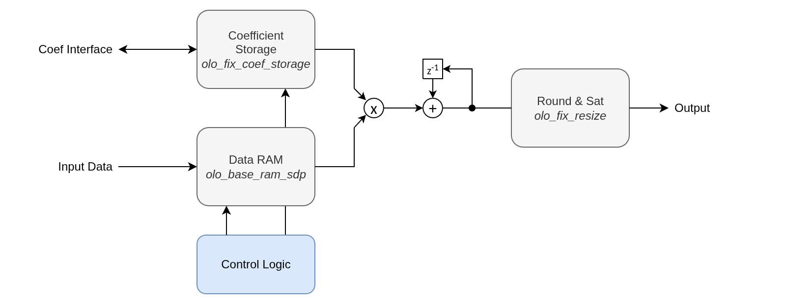

# olo_fix_fir_dec_ser_chtdm

[Back to **Entity List**](../EntityList.md)

## Status Information


VHDL Source: [olo_fix_fir_dec_ser_chtdm.vhd](../../src/fix/vhdl/olo_fix_fir_dec_ser_chtdm.vhd)<br />
Bit-true Model: [olo_fix_fir_dec.py](../../src/fix/python/olo_fix/olo_fix_fir_dec.py)

## Description

This entity implements a decimating FIR filter for multiple TDM (time-division-multiplexed) channels.
All channels share the same coefficient set and are processed one after the other. A single shared
multiplier computes filter taps serially. One tap after the other, then one tap after the other for the next channel,
and so on.

Example: A 4 channel, 16 taps FIR filter requires 64 clock cylces to produce one output sample set (one sample for each
channel).

Note that the filter can also be used non-decimation (ratio=1).

For details about the fixed-point number format used in _Open Logic_, refer to the
[fixed point principles](./olo_fix_principles.md).

### Coefficient Handling

Coefficients can be fixed (ROM) or runtime configurable (RAM) with optional readback. When coefficients are written
Coefficient updates (in RAM mode) must only occur when the filter is in reset (_Rst = '1'_).

### Accumulator Guard Bits

The accumulator carries _GuardBits_g_ integer guard bits above _OutFmt_g_
(_AccuFmt.I = OutFmt.I + GuardBits_g_). These bits allow the sum of products to grow beyond the output
range during the accumulation without overflowing. With the default of one guard bit, intermediate
results of up to twice the _OutFmt_g_ maximum are supported. The user is responsible for choosing
_GuardBits_g_, the coefficients and the formats such that the accumulator does not overflow; otherwise
the number of guard bits or the output format must be increased.

### Last Handling

On the input, _In_Last_ is not required for operation. It is only used in simulation to detect
incorrect TDM framing: an error is reported if _In_Last_ is asserted on a sample that does not belong
to the last channel (_Channels_g-1_). It has no functional effect on the computation.

On the output, _Out_Last_ is generated by the entity itself and is always asserted together with
_Out_Valid_ on the last channel (_Channels_g-1_) of every output sample set.

### Runtime Configuration

The _Cfg_Ratio_ and _Cfg_Taps_ ports are only evaluated when _RuntimeCfg_g = true_. In that case they
must only be changed while _Rst = '1'_; changing them during operation produces undefined behavior. When
_RuntimeCfg_g = false_ (default) the ports are ignored and the filter uses fixed _MaxRatio_g_ /
_MaxTaps_g_ values.

A single-tap filter (_Cfg_Taps = 0_) is **not supported**. The minimum tap count is 2.

### Input Bandwidth Limitation

**This entity does not generate backpressure.** The serial MAC requires _Taps x Channels_ clock cycles
to compute one output sample set (for all channels). This calculation is repeated ever _Ratio_ iput sample sets.

```text
f_in <= (f_clk x Ratio) / (Taps x Channels_g)
```

where _f_in_ is the rate of complete TDM frames (one frame = _Channels_g_ samples). If the input
arrives faster than this limit, the computation will fall behind and results will be incorrect.

Use [olo_base_rate_limit](../base/olo_base_rate_limit.md) externally to enforce the rate limit.

### Latency

This block changes the sample rate. Because not every input sample produces an output sample, the
latency is not fixed and is therefore not documented in detail.

## Generics

### General Generics

| Name              | Type     | Default         | Description                                                   |
| :---------------- | :------- | :-------------- | :------------------------------------------------------------ |
| InFmt_g           | string   | -               | Input format<br>String representation of an _en\_cl\_fix FixFormat\_t_ |
| OutFmt_g          | string   | -               | Output format<br>String representation of an _en\_cl\_fix FixFormat\_t_ |
| CoefFmt_g         | string   | -               | Coefficient format<br>String representation of an _en\_cl\_fix FixFormat\_t_ |
| Channels_g        | positive | -               | Number of TDM channels (must be >= 2)                         |
| MaxRatio_g        | positive | -               | Maximum decimation ratio |
| MaxTaps_g         | positive | -               | Maximum number of filter taps (must be >= 2)                  |
| RuntimeCfg_g      | boolean  | false           | _true_ - the active ratio and tap count are taken from the _Cfg_Ratio_ / _Cfg_Taps_ ports.<br> _false_ - they are fixed to _MaxRatio_g_ / _MaxTaps_g_ and the _Cfg\_..._ ports are ignored. |
| GuardBits_g       | natural  | 1               | Number of integer guard bits in the accumulator above _OutFmt_g_ |
| Round_g           | string   | "Trunc\_s"      | Rounding mode<br>String representation of an _en\_cl\_fix FixRound\_t_ |
| Saturate_g        | string   | "Warn\_s"       | Saturation mode<br>String representation of an _en\_cl\_fix FixSaturate\_t_ |
| MultRegs_g        | positive | 1               | Number of pipeline registers in the multiplier                |

### Coefficient and Data Storate

| Name              | Type     | Default         | Description                                                   |
| :---------------- | :------- | :-------------- | :------------------------------------------------------------ |
| CoefInit_g        | string   | "0.0"           | Comma-separated initial coefficient values (real numbers, quantized to _CoefFmt_g_)<br> Example: "0.3, 0.55, 0.2"<br> see [olo_fix_coef_storage](./olo_fix_coef_storage.md) |
| CoefStorageType_g | string   | "ROM"           | Coefficient storage type: "ROM" (fixed) or "RAM" (runtime-updateable)<br> see [olo_fix_coef_storage](./olo_fix_coef_storage.md) |
| CoefRamReadback_g | boolean  | false           | Enable coefficient readback via _Coef\_Rd\_..._ ports (RAM mode only)<br> see [olo_fix_coef_storage](./olo_fix_coef_storage.md) |
| CoefRamBehavior_g | string   | "RBW"           | Coefficient RAM behavior: "RBW" = read-before-write, "WBR" = write-before-read<br> see [olo_fix_coef_storage](./olo_fix_coef_storage.md) |
| CoefMemStyle_g    | string   | "auto"          | Synthesis attribute for coefficient memory style (e.g. "block", "distributed")<br> see [olo_fix_coef_storage](./olo_fix_coef_storage.md) |
| DataRamBehavior_g | string   | "RBW"           | Data RAM behavior: "RBW" = read-before-write, "WBR" = write-before-read<br> see [olo_base_ram_sdp](../base/olo_base_ram_sdp.md) |
| DataMemStyle_g    | string   | "auto"          | Synthesis attribute for data RAM style (e.g. "block", "distributed")<br> see [olo_base_ram_sdp](../base/olo_base_ram_sdp.md) |

## Interfaces

### Control

| Name | In/Out | Length | Default | Description                      |
| :--- | :----- | :----- | :------ | :------------------------------- |
| Clk  | in     | 1      | -       | Clock                            |
| Rst  | in     | 1      | -       | Reset (synchronous, active high) |

### Runtime Configuration

| Name      | In/Out | Length                   | Default         | Description                                          |
| :-------- | :----- | :----------------------- | :-------------- | :--------------------------------------------------- |
| Cfg_Ratio | in     | _log2ceil(MaxRatio_g)_   | _MaxRatio_g-1_  | Decimation ratio minus 1 (1 = ratio 2, 7 = ratio 8). |
| Cfg_Taps  | in     | _log2ceil(MaxTaps_g)_    | _MaxTaps_g-1_   | Active tap count minus 1 (1 = 2 taps). A single tap (value 0) is not supported. |

Both ports have safe defaults (maximum ratio and tap count) and are only used when _RuntimeCfg_g =
true_. They can be left unconnected to use the fixed maximum values. Change only when _Rst = '1'_.

### Coefficient Configuration

| Name          | In/Out | Length                    | Default      | Description                                                |
| :------------ | :----- | :------------------------ | :----------- | :--------------------------------------------------------- |
| Coef\_Addr    | in     | _log2ceil(MaxTaps_g)_     | 0            | Coefficient address for read/write                        |
| Coef\_WrEna   | in     | 1                         | '0'          | Coefficient write enable (RAM mode only)                  |
| Coef\_WrData  | in     | _width(CoefFmt_g)_        | 0            | Coefficient write data (RAM mode only)                    |
| Coef\_RdEna   | in     | 1                         | '0'          | Coefficient read enable (RAM readback mode only)          |
| Coef\_RdData  | out    | _width(CoefFmt_g)_        | N/A          | Coefficient read data (0 in ROM mode)                     |
| Coef\_RdValid | out    | 1                         | N/A          | Coefficient read valid (0 in ROM mode)                    |

All _Coef\_*_ ports have safe defaults and can be left unconnected in ROM mode or when
coefficient updates are not needed.

### Input Data

| Name     | In/Out | Length           | Default | Description                                                                        |
| :------- | :----- | :--------------- | :------ | :--------------------------------------------------------------------------------- |
| In_Valid | in     | 1                | -       | Input valid                                                                        |
| In_Data  | in     | _width(InFmt_g)_ | -       | Input data (TDM: channels interleaved, ch0 first)                                 |
| In_Last  | in     | 1                | '0'     | TDM frame boundary (optional)<br>see [TDM Conventions](../Conventions.md#tdm-time-division-multiplexing) |

The _In_Last_ signal is optional and has no functional effect. In simulation it is only used to check
that it is asserted at the correct TDM position (last channel); an error is reported if _In_Last_ is
asserted on a sample of any other channel. See [Last Handling](#last-handling).

### Output Data

| Name      | In/Out | Length            | Default | Description                                                                        |
| :-------- | :----- | :---------------- | :------ | :--------------------------------------------------------------------------------- |
| Out_Valid | out    | 1                 | N/A     | Output valid                                                                       |
| Out_Data  | out    | _width(OutFmt_g)_ | N/A     | Output data (TDM: channels interleaved, ch0 first)                                |
| Out_Last  | out    | 1                 | N/A     | TDM frame boundary, asserted on the last channel<br>see [TDM Conventions](../Conventions.md#tdm-time-division-multiplexing) |

## Details

### Example Instantiation

The example below shows the simplest possible instantiation: fixed coefficients stored in ROM, a
fixed tap count and a fixed decimation ratio. The ratio and tap count are fixed by setting
_MaxRatio_g_ / _MaxTaps_g_ to the desired values and leaving _Cfg_Ratio_ / _Cfg_Taps_ unconnected
(they then default to those maxima). All coefficient configuration ports and _In_Last_ are omitted
as well.

```vhdl
i_fir : entity olo.olo_fix_fir_dec_ser_chtdm
    generic map (
        -- Formats
        InFmt_g    => "(1,0,15)",
        OutFmt_g   => "(1,0,15)",
        CoefFmt_g  => "(1,0,17)",
        -- Filter parameters (ratio and taps are fixed to these maximum values)
        Channels_g => 4,
        MaxRatio_g => 4,
        MaxTaps_g  => 3,
        -- Fixed coefficients stored in ROM
        CoefInit_g => "0.25, 0.5, 0.25"
    )
    port map (
        Clk       => Clk,
        Rst       => Rst,
        In_Valid  => In_Valid,
        In_Data   => In_Data,
        Out_Valid => Out_Valid,
        Out_Data  => Out_Data
    );
```

### Architecture

All channel data is stored in a single simple dual-port RAM ([olo_base_ram_sdp](../base/olo_base_ram_sdp.md)). The
higher address bits select the channel region; the lower bits address the tap (delay line) within that channel. The
write port stores new input samples; the read port reads historical samples during computation.

Coefficients are stored in a dedicated [olo_fix_coef_storage](../olo_fix_coef_storage.md) instance (ROM or RAM
depending on _CoefStorageType_g_).

Below figure depics the conceptual architecture.



Because the data is written into the RAM as it arrives and is read out only when processed, the input may be bursty
or have an constant rate. Both work fine.

### Startup Behavior

At startup the data RAM may contain leftover data from before the reset. The filter replaces RAM reads of locations not
yet written with zeros. This matches the Python model, which initializes its delay
line to zero, ensuring bit-true agreement from the first output sample.

### Coefficient Format

The accumulator operates at full multiply precision:

- _MultFmt = (max(In.S, Coef.S), In.I + Coef.I, In.F + Coef.F)_
- _AccuFmt = (1, Out.I + GuardBits_g, In.F + Coef.F)_ (_GuardBits_g_ guard bits above output)

Choosing _OutFmt.I_ or _GuardBits_g_ too small risks accumulator overflow. Ensure
_max\_sum\_of\_products <= 2^(OutFmt.I + GuardBits_g) - 1 LSB_.
