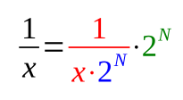
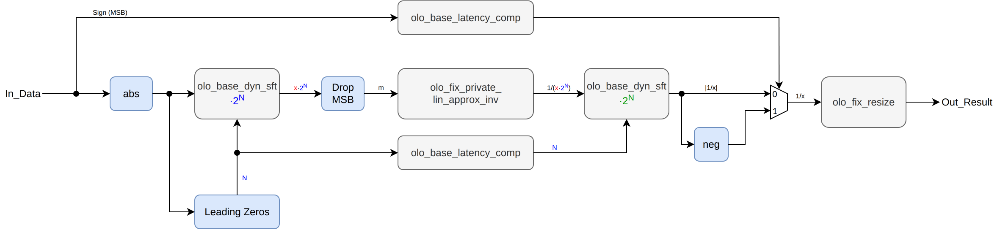
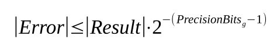

# olo_fix_inv

[Back to **Entity List**](../EntityList.md)

## Status Information


VHDL Source: [olo_fix_inv](../../src/fix/vhdl/olo_fix_inv.vhd)<br />
Bit-true Model: [olo_fix_inv](../../src/fix/python/olo_fix/olo_fix_inv.py)

## Description

This entity calculates the inverse of the input:

```text
Out_Result = 1/In_Data
```

The absolute value of the input is normalized (blue) into the range `[1, 2)`, inverted through a table based
piecewise linear approximation (red) and the normalization is reverted on the result (green):



Compared to [olo_fix_bin_div](./olo_fix_bin_div.md) it requires less LUT logic and its latency does not grow with the
output width, but it requires a ROM and a multiplier.

Because the normalization covers the full input range, the approximation only has to cover one octave. Hence a
relatively small table delivers accurate results over the full range of any input format. The precision of the
approximation is selected through _PrecisionBits_g_, see [Precision](#precision).

**Latency** of this entity depends on the input format, see [Latency](#latency). The entity is fully pipelined,
hence it accepts one input sample per clock cycle. As a result, back-pressure is not supported.

For details about the fixed-point number format used in _Open Logic_, refer to the
[fixed point principles](./olo_fix_principles.md).

### Corner Cases

Inputs that are **powers of two** are inverted **exactly** (as far as the result is representable in _OutFmt_g_).
Their normalized value is exactly 1.0, for which the approximation returns exactly 1.0.

An input of **zero** delivers the same result as the smallest non-zero input, which is the largest result the
entity can produce. No error is flagged. With the default _Saturate_g_ = "Sat_s" and an output format that cannot
represent `2^InFmt_g.F`, this result saturates to the maximum value of _OutFmt_g_.

### Latency

Latency is not guaranteed to be constant across different versions. It's therefore best to design user logic to be
independent of the latency of this block (e.g. through [olo_base_latency_comp](../base/olo_base_latency_comp.md)).

In the current version the latency can be calculated as follows:

```text
Latency = 15 + 2*ShiftLatency
```

_ShiftLatency_ is the latency of each of the two barrel shifters (normalization and its compensation). It depends on
the width _W_ of _InFmt_g_:

- _W_ <= 16: _ShiftLatency_ = 2
- _W_ > 16: _ShiftLatency_ = 3

This is 19 clock cycles for input formats up to 16 bits and 21 clock cycles for input formats up to 256 bits.

## Generics

| Name            | Type     | Default       | Description                                                  |
| :-------------- | :------- | :------------ | :----------------------------------------------------------- |
| OutFmt_g        | string   | -             | Output format. Must be signed if _InFmt_g_ is signed.        |
| InFmt_g         | string   | -             | Input format. Any format that is at least two and at most 256 bits wide. |
| PrecisionBits_g | positive | 18            | Number of fractional bits of the inversion approximation. Must be 10, 14, 18 or 20. |
| MemStyle_g      | string   | "auto"        | Resource control for the table (_auto_, _block_ or _distributed_) |
| Round_g         | string   | "NonSymPos_s" | Rounding mode of the output stage                            |
| Saturate_g      | string   | "Sat_s"       | Saturation mode of the output stage                          |

## Interfaces

### Control

| Name | In/Out | Length | Default | Description                                     |
| :--- | :----- | :----- | ------- | :---------------------------------------------- |
| Clk  | in     | 1      | -       | Clock                                           |
| Rst  | in     | 1      | -       | Reset input (high-active, synchronous to _Clk_) |

### Input Data

| Name     | In/Out | Length           | Default | Description                                  |
| :------- | :----- | :--------------- | ------- | :------------------------------------------- |
| In_Valid | in     | 1                | '1'     | AXI4-Stream handshaking signal for _In_Data_ |
| In_Data  | in     | _width(InFmt_g)_ | -       | Input data<br />Format: _InFmt_g_            |

### Output Data

| Name       | In/Out | Length            | Default | Description                                     |
| :--------- | :----- | :---------------- | ------- | :---------------------------------------------- |
| Out_Valid  | out    | 1                 | N/A     | AXI4-Stream handshaking signal for _Out_Result_ |
| Out_Result | out    | _width(OutFmt_g)_ | N/A     | Inverse of _In_Data_<br />Format: _OutFmt_g_    |

## Details

### Architecture

The figure below shows the architecture of the entity. The colors of the signal labels match the formula given in
the [Description](#description).



The normalization shift _N_ is the number of leading zeros of the absolute value of the input. Normalization and its
reversal are both implemented by [olo_base_dyn_sft](../base/olo_base_dyn_sft.md), which spreads the barrel shifter
over several pipeline stages to achieve good timing. The shift count and the sign of the input are delayed to the
point where they are needed by [olo_base_latency_comp](../base/olo_base_latency_comp.md).

The leading one of the normalized value `1+m` is known, hence it is dropped and only the **mantissa fraction** _m_
in the range `[0, 1)` is passed on. The function approximated is `1/(1+m)`, which covers the range `(0.5, 1.0]`.
As a result the whole range of the approximation is used.

The approximation is implemented by the internal entity _olo_fix_private_lin_approx_inv_. It contains the inversion
tables (one per supported _PrecisionBits_g_ value) and instantiates
[olo_fix_lin_approx_calc](./olo_fix_lin_approx_calc.md) for the piecewise linear interpolation.

Reverting the normalization shifts the result left by _N_. The remaining constant factor (which depends only on the
number of integer bits of the input format) is applied by reinterpreting the number format of the shifted result,
hence it is pure wiring and does not cost any logic. Finally the result is negated for negative inputs and
rounded/saturated to _OutFmt_g_ by [olo_fix_resize](./olo_fix_resize.md).

### Precision

_PrecisionBits_g_ selects the number of fractional bits the inversion approximation delivers. One table exists per
supported value, hence only the values listed below are allowed - any other value leads to an error:

| _PrecisionBits_g_ | Table size    |
| ----------------- | ------------- |
| 10                | 32 x 22 bit   |
| 14                | 128 x 29 bit  |
| 18                | 512 x 36 bit  |
| 20                | 1024 x 35 bit |

Because the normalization makes the accuracy independent of the magnitude of the input, the error is defined
**relative** to the absolute value of the result:


