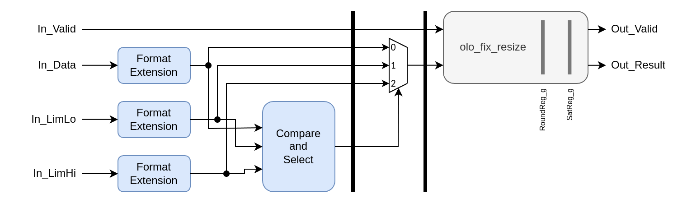

# olo_fix_limit

[Back to **Entity List**](../EntityList.md)

## Status Information


VHDL Source: [olo_fix_limit](../../src/fix/vhdl/olo_fix_limit.vhd)
Bit-true Model: [olo_fix_limit](../../src/fix/python/olo_fix/olo_fix_limit.py)

## Description

This entity limits a signal to a specified range. The range can be given through generics (at compile-time) or through
ports (at runtime).

**Latency** of this entity is two clock cycles plus optional rounding and saturation registers. The default generics
lead to a latency of 4 clock cycles.

For details about the fixed-point number format used in _Open Logic_, refer to the
[fixed point principles](./olo_fix_principles.md).

## Generics

| Name             | Type    | Default   | Description                                                  |
| :--------------- | :------ | --------- | :----------------------------------------------------------- |
| InFmt_g          | string  | -         | Data input format<br />String representation of an _en_cl_fix Format_t_ (e.g. "(1,1,15)") |
| LoLimFmt_g       | string  | "(1,1,1)" | Lower limit format<br />String representation of an _en_cl_fix Format_t_ (e.g. "(1,1,15)")<br />Default given only for the user not having to assign the generic if _UseFixedLimits_g=true_ |
| HiLimFmt_g       | string  | "(1,1,1)" | Upper limit format<br />String representation of an _en_cl_fix Format_t_ (e.g. "(1,1,15)")<br />Default given only for the user not having to assign the generic if _UseFixedLimits_g=true_ |
| ResultFmt_g      | string  | -         | Format of the result<br />String representation of an _en_cl_fix Format_t_ (e.g. "(0,1,15)") |
| Round_g          | string  | "Trunc_s" | Rounding mode<br />String representation of an _en_cl_fix FixRound_t_. |
| Saturate_g       | string  | "Sat_s"   | Saturation mode<br />String representation of an _en_cl_fix FixSaturate_t_. |
| UseFixedLimits_g | boolean | false     | true: Use _FixedLimLo_g_ and _FixedLimHi_g_ as limits.<br />false: Use ports _In_LimLo_ and _In_LimHi_ as limits. |
| FixedLimLo_g     | real    | 0.0       | Compile time set lower limit (only used if _UseFixedLimits_g=true_) |
| FixedLimHi_g     | real    | 0.0       | Compile time set upper limit (only used if _UseFixedLimits_g=true_) |
| RoundReg_g       | string  | "YES"     | Presence of rounding pipeline stage<br />"YES": Always implement register<br />"NO": Never implement register<br />"AUTO": Implement register if rounding is needed according to the formats chosen |
| SatReg_g         | string  | "YES"     | Presence of saturation pipeline stage<br />"YES": Always implement register<br />"NO": Never implement register<br />"AUTO": Implement register if saturation is needed according to the formats chosen |

## Interfaces

### Control

| Name | In/Out | Length | Default | Description                                                  |
| :--- | :----- | :----- | ------- | :----------------------------------------------------------- |
| Clk  | in     | 1      | '0'     | Clock<br />Not required if all registers are disabled (_OpRegs_g=0, RoundReg_g="NO", SatReg_g="NO"_) |
| Rst  | in     | 1      | '0'     | Reset input (high-active, synchronous to _Clk_)<br />Not required if all registers are disabled (_OpRegs_g=0, RoundReg_g="NO", SatReg_g="NO"_) |

### Input Data

| Name     | In/Out | Length              | Default | Description                                                  |
| :------- | :----- | :------------------ | ------- | :----------------------------------------------------------- |
| In_Data  | in     | _width(InFmt_g)_    | -       | Input data<br />Format: _InFmt_g_                            |
| In_LimLo | in     | _width(LoLimFmt_g)_ | -       | Input lower limit<br />Only used if _UseFixedLimits_g=false_<br>Format: _LoLimFmt_g_ |
| In_LimHi | in     | _width(HiLimFmt_g)_ | -       | Input upper limit<br />Only used if _UseFixedLimits_g=false_<br>Format: _HiLimFmt_g_ |
| In_Valid | in     | 1                   | '1'     | AXI4-Stream handshaking signal for _In_A_ and _In_B_         |

### Output Data

| Name       | In/Out | Length               | Default | Description                               |
| :--------- | :----- | :------------------- | ------- | :---------------------------------------- |
| Out_Result | out    | _width(ResultFmt_g)_ | N/A     | Result data<br />Format _ResultFmt_g_     |
| Out_Valid  | out    | 1                    | N/A     | AXI-S handshaking signal for _Out_Result_ |

## Detail

Below figure shows the implementation of _olo_fix_limit_



First, all inputs are extended to the maximum common format that allows fully representing them all. Then the data is
compared to the limits and based on the result either one of the limits or the data is selected. And at the very output
the result is resized to _ResultFmt_g_.

From the structure it is obvious that rounding and saturation are not required if _InFmt_g_, _LoLimFmt_g_, _HiLimFmt_g_
and _ResultFmt_g_ are all the same.

Because the logic does never increase the range of the signal, saturation may only be required because of rounding in
case of _LoLimFmt_g_ or _HiLimFmt_g_ having more fractional bits than _InFmt_g_. For _Saturate_g="Trunc_s"_ no
saturation is required.

For static limiting (i.e. _UseFixedLimits_g=true_), neither rounding nor saturation are required. The internal format
is equal to _InFmt_g_ in this case for obvious reasons.

As described in above paragraphs, in most cases no rounding and saturation is required. If they are not required (and
disabled by generics) the corresponding registers can be omitted as well.

### Example Dynamic Limit

Below code shows an example of dynamic limiting, i.e. limits that change at runtime.

```vhdl
i_limit : entity olo.olo_fix_limit
    generic map (
        InFmt_g          => "(1,8,8)",
        LimLoFmt_g       => "(1,8,8)",
        LimHiFmt_g       => "(1,8,8)",
        ResultFmt_g      => "(1,8,8)"
    )
    port map (
        Clk        => Clk,
        Rst        => Rst,
        In_Valid   => X_Valid,
        In_Data    => X_Data,
        In_LimLo   => X_LimLo, -- e.g. from register bank
        In_LimHi   => X_LimHi, -- e.g. from register bank
        Out_Valid  => Y_Valid,
        Out_Result => Y_Data
    );
```

### Example Static Limit

Below code shows an example of static limiting, i.e. limits that change at compile-time.

```vhdl
i_limit : entity olo.olo_fix_limit
    generic map (
        InFmt_g          => "(1,8,8)",
        ResultFmt_g      => "(1,8,8)",
        UseFixedLimits_g => true,
        FixedLimLo_g     => -100.75,
        FixedLimHi_g     => 200.125
    )
    port map (
        Clk        => Clk,
        Rst        => Rst,
        In_Valid   => X_Valid,
        In_Data    => X_Data,
        Out_Valid  => Y_Valid,
        Out_Result => Y_Data
    );
```
