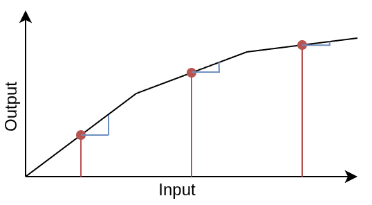
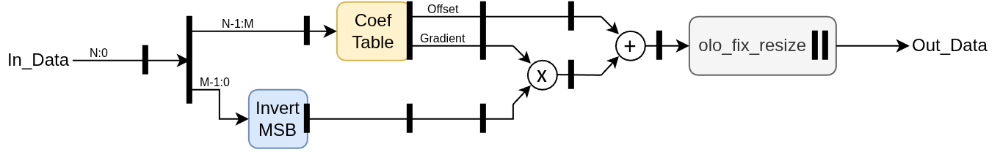

# olo_fix_lin_approx_calc

[Back to **Entity List**](../EntityList.md)

## Status Information


VHDL Source: [olo_fix_lin_approx_calc](../../src/fix/vhdl/olo_fix_lin_approx_calc.vhd)<br />
Bit-true Model: [olo_fix_lin_approx](../../src/fix/python/olo_fix/olo_fix_lin_approx.py)

## Description

This entity implements the calculation part of a piecewise linear approximation of an arbitrary function. The function
is approximated by a table which contains the function value (_offset_) and the derivative of the function (_gradient_)
for regularly spaced points. Between those points the function is approximated linearly.

The _olo_fix_lin_approx_calc_ can calculate one approximation per clock cycle.

The table itself is **not** part of this entity. It is attached through the _Tbl_Addr_ / _Tbl_Data_ interface. Normally
the table is not written by hand but generated from Python. The Python class
[olo_fix_lin_approx](./olo_fix_lin_approx.md) generates a wrapper entity that contains the table and instantiates
_olo_fix_lin_approx_calc_ - this is the normal way of using this entity.

**Latency** of this entity is 8 clock cycles. The entity is fully pipelined, hence it accepts one input sample per
clock cycle. As a result, back-pressure is not supported.

For details about the fixed-point number format used in _Open Logic_, refer to the
[fixed point principles](./olo_fix_principles.md).

### Approximation Principle

The full range of _InFmt_g_ is split into _TableSize_g_ segments of equal width. For each segment, the table contains
the value of the function at the **center** of the segment (_offset_, red) and the derivative of the function at the
same point (_gradient_, blue).



## Generics

| Name        | Type     | Default          | Description                                                  |
| :---------- | :------- | ---------------- | :----------------------------------------------------------- |
| InFmt_g     | string   | -                | Input data format<br />String representation of an _en_cl_fix Format_t_ (e.g. "(1,1,15)") |
| OutFmt_g    | string   | -                | Output data format<br />String representation of an _en_cl_fix Format_t_ (e.g. "(1,1,15)") |
| OffsFmt_g   | string   | -                | Format of the offset (function value) table entries<br />String representation of an _en_cl_fix Format_t_ |
| GradFmt_g   | string   | -                | Format of the gradient (derivative) table entries<br />String representation of an _en_cl_fix Format_t_ |
| TableSize_g | positive | -                | Number of entries in the table.<br />Must be a power of two and smaller than _2^width(InFmt_g)_ |
| Round_g     | string   | "NonSymPos_s"    | Rounding mode of the output stage<br />String representation of an _en_cl_fix FixRound_t_. |
| Saturate_g  | string   | "Sat_s"          | Saturation mode of the output stage<br />String representation of an _en_cl_fix FixSaturate_t_. |

All generics except _Round_g_ and _Saturate_g_ are defined by the table content. They must not be modified without
regenerating the table.

## Interfaces

### Control

| Name | In/Out | Length | Default | Description                                     |
| :--- | :----- | :----- | ------- | :---------------------------------------------- |
| Clk  | in     | 1      | -       | Clock                                           |
| Rst  | in     | 1      | -       | Reset input (high-active, synchronous to _Clk_) |

### Input Data

| Name     | In/Out | Length           | Default | Description                                  |
| :------- | :----- | :--------------- | ------- | :------------------------------------------- |
| In_Valid | in     | 1                | '1'     | AXI4-Stream handshaking signal for _In_Data_ |
| In_Data  | in     | _width(InFmt_g)_ | -       | Input data<br />Format: _InFmt_g_            |

### Output Data

| Name       | In/Out | Length            | Default | Description                                     |
| :--------- | :----- | :---------------- | ------- | :---------------------------------------------- |
| Out_Valid  | out    | 1                 | N/A     | AXI4-Stream handshaking signal for _Out_Result_ |
| Out_Result | out    | _width(OutFmt_g)_ | N/A     | Result data<br />Format: _OutFmt_g_             |

### Table Interface

| Name     | In/Out | Length                                    | Default | Description                                     |
| :------- | :----- | :---------------------------------------- | ------- | :---------------------------------------------- |
| Tbl_Addr | out    | _log2(TableSize_g)_                       | N/A     | Table read address                              |
| Tbl_Data | in     | _width(OffsFmt_g)+width(GradFmt_g)_       | -       | Table read data.<br />The gradient is stored in the MSBs (format _GradFmt_g_), the offset in the LSBs (format _OffsFmt_g_). |

The table must be a synchronous memory with a **read latency of exactly one clock cycle** (address registered, data
available in the next clock cycle). Reads must not be gated - the table must deliver data for every address applied.

## Details

### Architecture

Below figure illustrates how the linear approximation is implemented.



_N-M_ is the number of address bits for the table.

### Table Details

The upper _log2(TableSize_g)_ bits of _In_Data_ are used as table index, the remaining lower bits are the position
within the segment. The lower bits are unsigned and relative to the beginning of the segment. By inverting their MSB,
they are converted into the signed offset relative to the center of the segment - which is exactly what the
multiplication above requires.

For signed _InFmt_g_, negative input values wrap into the **upper half** of the table (the table index is simply the
unsigned interpretation of the upper input bits). The code generator arranges the table content accordingly.

### Precision

The multiplication and the addition are executed at full precision (no rounding, no saturation). This allows the adder
to be implemented within a DSP slice. Rounding and saturation are applied in separate pipeline stages at the output,
controlled by _Round_g_ and _Saturate_g_.

The approximation error depends on the number of table entries and the formats chosen for the table. The Python class
[olo_fix_lin_approx](./olo_fix_lin_approx.md) provides an _analyze()_ method that helps finding suitable settings.

### Usage Example

Below example shows how a table is attached manually. Normally the wrapper entity generated by
[olo_fix_lin_approx](./olo_fix_lin_approx.md) is used instead.

```vhdl
signal Tbl_Addr : std_logic_vector(7 downto 0);
signal Tbl_Data : std_logic_vector(34 downto 0);
...
-- Table with one clock cycle read latency
p_table : process (Clk) is
begin
    if rising_edge(Clk) then
        Tbl_Data <= Table_c(to_integer(unsigned(Tbl_Addr)));
    end if;
end process;

i_approx : entity olo.olo_fix_lin_approx_calc
    generic map (
        InFmt_g     => "(0, 0, 16)",
        OutFmt_g    => "(1, 0, 16)",
        OffsFmt_g   => "(1, 0, 18)",
        GradFmt_g   => "(1, 3, 12)",
        TableSize_g => 256
    )
    port map (
        Clk        => Clk,
        Rst        => Rst,
        In_Valid   => In_Valid,
        In_Data    => In_Data,
        Out_Valid  => Out_Valid,
        Out_Result => Out_Result,
        Tbl_Addr   => Tbl_Addr,
        Tbl_Data   => Tbl_Data
    );
```
