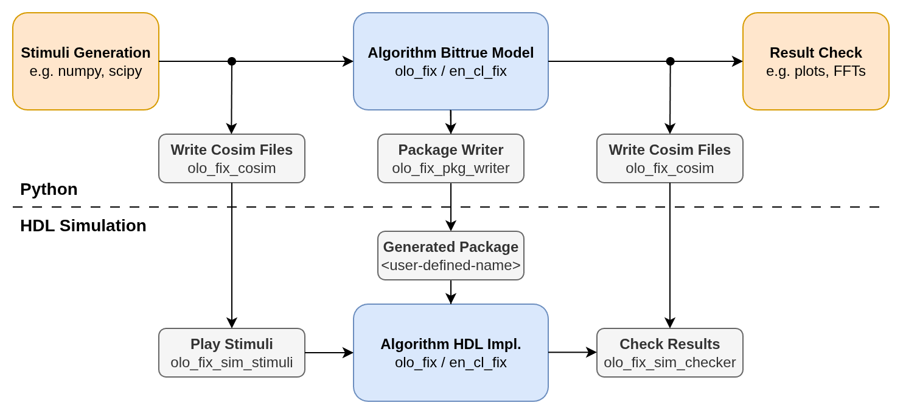
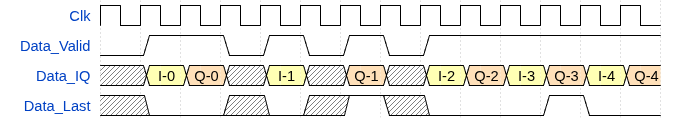

# Open Logic Fixed-Point Principles

[Back to **Entity List**](../EntityList.md)

## Based on en_cl_fix

All fixed-point mathematics related functionality in _Open Logic_ is based on the
[en_cl_fix](https://github.com/enclustra/en_cl_fix) library provided by [Enclustra](https://www.enclustra.com/en/home/)
and maintained by Dr. Harry Commin. **It is strongly recommended to read through
[en_cl_fix documentation](../../3rdParty/en_cl_fix/README.md)** before using any Open Logic fixed-point related
components.

Note that _Open Logic_ refers to a fork of [_en_cl_fix_](https://github.com/open-logic/en_cl_fix) which is under
control of _Open Logic_.

The best starting point is watching the related [Webinar](https://www.youtube.com/watch?v=DajbzQurjqI&t=346). It
explains the concepts of _en_cl_fix_ well, which are to be found everywhere in _olo_fix_.

[](https://www.youtube.com/watch?v=DajbzQurjqI&t=346)

## Instantiation from Verilog and VHDL

[en_cl_fix](https://github.com/enclustra/en_cl_fix) is targeted to VHDL only. Open Logic _olo_fix_ - like all other
_Open Logic_ content - aims to be fully usable from Verilog and VHDL, which leads to a few changes.

### Components vs. Functions

The core functionality provided by [en_cl_fix](https://github.com/enclustra/en_cl_fix) are a set of functions provided
by [en_cl_fix pkg](./en_cl_fix_pkg.md), which allow to implement fixed-point mathematics in a very concise and
well-readable way. Functionally they are exactly what is needed but unfortunately functions from VHDL packages cannot be
called from Verilog.

Therefore Open Logic wraps all basic functions like [resize](./olo_fix_resize.md), [add](./olo_fix_add.md) or
[multiply](./olo_fix_mult.md) into entities. In contrast to VHDL functions, entities can be instantiated from Verilog
easily.

Beyond simply wrapping the functions, the entities allow to add [pipeline registers](#pipeline-registers) where needed.

Verilog users are limited to using the entities provided by Open Logic. VHDL users are free to either use those entities
or to write their own processes using the [en_cl_fix pkg](./en_cl_fix_pkg.md) directly. Both options are fully supported
and allow direct interfacing with fixed-point related Open Logic components.

### String Generics

The [en_cl_fix pkg](./en_cl_fix_pkg.md) defines a number of custom types:

- FixFormat_t
  - Fixed point number format defined as record
  - Form (\<S\>, \<I\>, \<F\>) where _S_=Sign, _I_=Integer-Bits, _F_=Fractional-Bits (e.g. _(1, 8, 23)_)
- FixRound_t
  - An enum type defining different rounding options
  - Options: _Trunc_s, NonSymPos_s, NonSymNeg_s, SymInf_s, SymZero_s, ConvEven_s, ConvOdd_s_
  - Most common: _Trunc_s_ (truncate) and _NonSymPos_s_ (nearest rounding)
- FixSaturate_t
  - An enum type defining different saturation options
  - Options: _Sat_s, None_s, SatWarn_s, Warn_s_

Custom types are generally not supported when instantiating VHDL from Verilog. Some tools allow it to some extent but no
common ground is present between all the tools supported by _Open Logic_. Hence using those types on interfaces of
_Open Logic_ components is avoided to ensure all _Open Logic_ components can be instantiated in Verilog.

Instead of using custom types for generics/parameters, they are passed as strings. The notation is exactly the same as
in VHDL natively, just with quotes around it.

Verilog:

```verilog
// String representing FixFormat_t (1,8,23)
localparam string fmt = "(1,8,23)";

// String representing Round_t for Truncation (Trunc_s)
localparam string round = "Trunc_s";

// String representing Saturation (Sat_s)
localparam string saturate = "Sat_s";
```

VHDL:

```vhdl
-- String representing FixFormat_t (1,8,23)
constant fmt : string := "(1,8,23)";

-- String representing FixRound_t for Truncation (Trunc_s)
constant round : string := "Trunc_s";

-- String representing FixSaturate_t (Sat_s)
constant saturate : string := "Sat_s";
```

Note that in VHDL it is easily possible to convert the custom types defined in [en_cl_fix pkg](./en_cl_fix_pkg.md) to
their string representation using the _to_string()_ function as shown below. This is especially useful when working in
VHDL and using _en_cl_fix_ functions and types in your custom code for converting the types to string for instantiating
_Open Logic_ entities.

```vhdl
-- Convert FixFormat_t to string
constant typed_fmt  : FixFormat_t := (1,8,23);
constant string_fmt : string      := to_string(typed_fmt);

-- Convert FixRound_t to string
constant typed_round  : FixRound_t := Trunc_s;
constant string_round : string     := to_string(typed_round);

-- Convert FixSaturate_t to string
constant typed_sat  : FixSaturate_t := Sat_s;
constant string_sat : string        := to_string(typed_sat);
```

### Pipeline Registers

Open Logic basic-functions allow to configure pipeline registers in a common way.

All basic functions allow the user to define the input and output format as well as the way to convert from the format
the operation naturally produces to the result format (if rounding and saturation is applied). This splits a basic
functions into three steps - explained on the example of an addition:


Executing all three steps in one clock cycle very often can be limiting to the clock speed. Therefore the user can
configure pipeline registers.

For **rounding** and **saturation** the user can configure pipelining through a string parameter for each of them
(rounding/saturation) and choose between three options:

- "YES"
  - A pipeline register is added after the corresponding step in all cases
  - The pipeline register is also added if there is no logic (e.g. when converting from _(0,3,4)_ to _(1,5,6)_ which
    does neither require rounding nor saturation)
  - Advantage: High clock speed and fixed latency (independent of number formats)
  - Disadvantage: Needless latency for cases where there is no rounding/saturation logic needed
  - This is the **default** option because it allows for fastest clock-speeds, which often is critical in typical
    fixed-point mathematics applications like video processing or digital signal processing
- "NO"
  - No pipeline register is implemented
  - Advantage: low and constant latency (independent of number formats)
  - Disadvantage: Long combinatorial paths may limit clock-speed
- "AUTO"
  - A pipeline register is added only if rounding/saturation logic is required
  - Advantage: High clock speed and not needless latency
  - Disadvantage: Latency depends on number formats

For the **operation** the user can specify how many pipeline registers shall be added after the operation. For most
operations only the settings 0 and 1 make sense. However, other numbers can be used to compensate for latency on other
paths. Complex operations (e.g. multipliers or very wide adders) may benefit from adding 2 or more pipeline registers -
therefore the option to configure the number freely is provided.

## Co-Simulation

All _Open Logic_ fixed-point components come with Python models. This principle is inherited from
[en_cl_fix](https://github.com/enclustra/en_cl_fix) and allows analyzing the behavior of an algorithm in Python before
any effort is invested into an HDL implementation. Python offers powerful toolboxes for analyzing algorithms (e.g.
printing FFTs, using NumPy/SciPy, various plotting libraries) and therefore is a much more productive environment for
developing the algorithm and an HDL simulator.

_Open Logic_ also provides python and HDL components to exchange inputs and expected outputs between Python and the HDL
simulation. This allows easily verifying if the HDL implementation of an algorithm really exactly matches its Python
model. [olo_fix_cosim](./olo_fix_cosim.md) can be used to write data from python into co-simulation files.
[olo_fix_sim_stimuli](./olo_fix_sim_stimuli.md) can be used to read the data from the co-simulation files and apply it
as stimulus in the HDL simulation and [olo_fix_sim_checker](./olo_fix_sim_checker.md) can be used to read the expected
output from the co-simulation files and compare it with the actual output from the HDL simulation.

Additionally, _Open Logic_ provides [olo_fix_pkg_writer](./olo_fix_pkg_writer.md) to generate the HDL package with all
key design parameters defined in Python. This allows to automatically transfer things like constants, filter
coefficients or number formats from Python to HDL which significantly reduces the risk for errors and inconsistencies
between the Python model and HDL implementation.



Note that Python models only model the mathematical behavior but not the timing (e.g. latency or maximum sample rate).

Again, [en_cl_fix](https://github.com/enclustra/en_cl_fix) functions can be used - independently of whether in HDL basic
operations are coded as [en_cl_fix](https://github.com/enclustra/en_cl_fix) functions or by using the _olo_fix_
components.

All _Open Logic_ components (including the ones for basic operations) come with object oriented models that have a
common set of functions:

- Constructor
  - All formats and configuration values are passed to the constructor
- Process()
  - Processes a signal. Arrays can be passed.
  - The state of the object (e.g. accumulators) is reset before the signal is processed
  - Use case: Calculate the response of a filter to various different signals independently.
- Next()
  - Processes the _next_ sample(s) of a signal. Arrays can be passed.
  - The state of the object is not reset before the signal is processed.
  - Use case: Calculate a filter sample by sample

## Python to HDL Worklow

Instead of defining the very same number formats in Python and HDL, it is strongly suggested to use the
[olo_fix_pkg_writer](./olo_fix_pkg_writer.md) to generate the HDL package with all the formats defined and constants
defined in Python.

This way Python is the single source of truth and all definitions are automatically transferred to HDL which
significantly reduces the risk for errors and inconsistencies between the Python model and HDL implementation.

## Complex Numbers Representation

Many _Open Logic_ fixed-point components that support complex numbers implement two interface options:

- _Parallel_ I/Q handling
  - In this case the in-phase and quadrature-phase parts of the complex number are handled separately and arrive in
    parallel on separate ports (e.g. _InA_I_ and _InA_Q_).
- _TDM_ I/Q handling
  - In this case the in-phase and quadrature-phase parts of the complex number are arriving on the same port
    (e.g. _InA_IQ_) in a time-division multiplexed way.
  - In-phase is transmitted first, quadrature-phase second.
  - The _Last_ signal can be used to indicate quadrature-phase samples - this allows resynchronization in case of a
    lost sample or starting the stream at an arbitrary point.
  - In many cases reduces resource consumption to around 50% of the _Parallel_ I/Q handling version

Conversion between the two can be achieved by the entities commonly used for TDM/parallel conversion:

| Entity                                               | Description                                                  |
| ---------------------------------------------------- | ------------------------------------------------------------ |
| [olo_base_wconv_n2xn](./base/olo_base_wconv_n2xn.md) | Convert from TDM to parallel (see [Conventions](../Conventions.md))<br />This is not a pure TDM entity but it can be used for TDM purposes. |
| [olo_base_wconv_xn2n](./base/olo_base_wconv_xn2n.md) | Convert from parallel to TDM (see [Conventions](../Conventions.md))<br />This is not a pure TDM entity but it can be used for TDM purposes. |

The TDM handling follows the [TDM Conventions](../Conventions.md#tdm-time-division-multiplexing).

Below is an example waveform for TDM I/Q handling. Note that _Last_ is only applied for every second sample which
is perfectly fine according to [TDM Conventions](../Conventions.md#tdm-time-division-multiplexing).



Note that complex number handling only is implemented for operations where the separate handling of in-phase and
quadrature-phase does not lead to the same result as handling complex numbers. Operations that can be applied
to in-phase and quadrature-phase separately (e.g. FIR filters, CIC filters) do not have a complex number handling
option.
