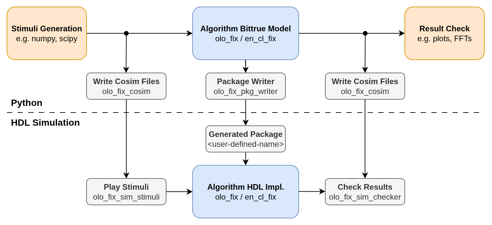

# olo_fix_sim_checker

[Back to **Entity List**](../EntityList.md)

## Status Information

VHDL Source: [olo_fix_sim_checker](../../src/fix/vhdl/olo_fix_sim_checker.vhd)
VUnit Variant: [olo_test_fix_checker_vc](../../test/tb/olo_test_fix_checker_vc.vhd)
Bit-true Model: N/A
Python co-simulation file writer: [olo_fix_cosim](../../src/fix/python/olo_fix/olo_fix_cosim.py)

## Description

This entity reads content of a co-simulation file writen by _olo_fix_cosim_ from Python and checks the output of a DUT
in a HDL simulation against it. If the output does not contain exactly the expected data, an error is thrown.

The file to check against as well as the stalling pattern (optional) can be configured through generics.

The component can work as timing-master (driving the stalling pattern by pulling _Ready_ low) or timing-slave (check
data according to the activity on _Ready_/_Valid_ driven by other components). This feature is used when a DUT has
multiple data outputs. A test-bench then usually contains one _olo_fix_sim_checker_ component per output. One configured
as timing-master and all others configured as timing-slave.

**Note:** The pure VHDL componend _olo_fix_sim_checker_ does check the file selected once and then wait. If you need
more options, consider switching to VUnit.

For details about the fixed-point number format used in _Open Logic_, refer to the
[fixed point principles](./olo_fix_principles.md).

### VUnit Variant

For VUnit users, a more elaborate variant of this component exists:
[olo_test_fix_checker_vc](../../test/tb/olo_test_fix_checker_vc.vhd)

The VUnit variant of the component allows to trigger the check against files through a procedure call. As a result,
multiple files can be checked against one after the other or the same file can be checked against several times. For
every check run the stalling pattern can be configured individually.

## Generics

| Name               | Type     | Default | Description                                                  |
| :----------------- | :------- | ------- | :----------------------------------------------------------- |
| FilePath_g         | string   | -       | Path of the file to read                                     |
| IsTimingMaster_g   | boolean  | true    | true: Component acts as timing-master false: Component acts as timing-slave |
| Fmt_g              | string   | -       | Fixed point format of the signal to generate. Must match the format written into the co-simulation file on the Python side. String representation of an _en_cl_fix Format_t_ (e.g. "(1,1,15)") |
| StallProbability_g | real     | 0.0     | Stall probability (0.0 = never stall, 1.0 = always stall). Only used for _IsTimingMaster_g=true_ |
| StallMaxCycles_g   | positive | 1       | Maximum number of clock-cycles to pull _Ready_ low when stalling. Only used for _IsTimingMaster_g=true_ |
| StallMinCycles_g   | positive | 1       | Minimum number of clock-cycles to pull _Ready_ low when stalling. Only used for _IsTimingMaster_g=true_ |

## Interfaces

### Control

| Name | In/Out | Length | Default | Description                                     |
| :--- | :----- | :----- | ------- | :---------------------------------------------- |
| Clk  | in     | 1      | -       | Clock                                           |

### Output Data

| Name  | In/Out | Length         | Default | Description                                                  |
| :---- | :----- | :------------- | ------- | :----------------------------------------------------------- |
| Data  | in     | _width(Fmt_g)_ | -       | Data Format _Fmt_g_                                     |
| Valid | in     | 1              | -       | AXI-S handshaking signal for _Data_                          |
| Ready | inout  | 1              | N/A     | AXI-S handshaking signal for _Data_  Acts as **output** for **IsTimingMaster_g=true** Acts as **input** for **IsTimingMaster_g=false** |

**Note:** In Timing-Slave mode, the _Ready_ signal _MUST_ be connected to the _Ready_ signal generated by the
Timing-Master. It cannot be left unconnected.

## Detail

No detailed description required. All details that could be mentioned here are already covered by
[fixed point principles](./olo_fix_principles.md).
