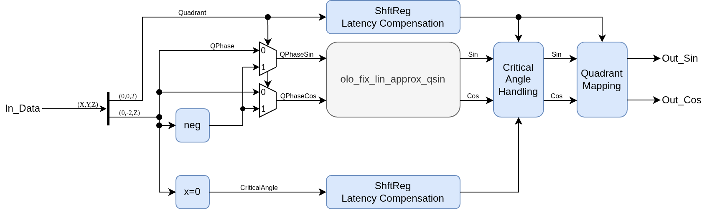

# olo_fix_sin

[Back to **Entity List**](../EntityList.md)

## Status Information


VHDL Source: [olo_fix_sin](../../src/fix/vhdl/olo_fix_sin.vhd)<br />
Bit-true Model: [olo_fix_sin](../../src/fix/python/olo_fix/olo_fix_sin.py)

## Description

This entity calculates sine and - optionally - cosine of a phase given in **rotations**, where 0.0 corresponds to
0 degrees and 1.0 corresponds to 360 degrees:

```text
Out_Sin = sin(2*pi*phase) * peak
Out_Cos = cos(2*pi*phase) * peak
```

Driven by a phase accumulator (a plain counter incremented by the frequency word), this entity forms a table based
NCO/DDS. Compared to [olo_fix_cordic_rot](./olo_fix_cordic_rot.md) it trades memory for latency and logic: it needs
a ROM but has a constant latency of 11 clock cycles instead of one iteration per output bit.

_olo_fix_sin_ implements the **range reduction** only. The approximation itself is done by
[olo_fix_lin_approx_qsin](./olo_fix_lin_approx_qsin.md), which covers one quadrant. Because the quarter phase is
expressed in the same unit (rotations), the in-quadrant part of the phase word is passed on without any rescaling.
The quarter phase and its mirrored version are applied to the two read ports of the approximation - which of the two
belongs to the sine and which one to the cosine depends on the quadrant.

**Latency** of this entity is 11 clock cycles. The entity is fully pipelined, hence it accepts one input sample per
clock cycle. As a result, back-pressure is not supported.

For details about the fixed-point number format used in _Open Logic_, refer to the
[fixed point principles](./olo_fix_principles.md).

### Output Format and Scaling

_OutFmt_g_ must be `(1, 0, N)` or `(1, 1, N)` with _N_ between 10 and 20 (22 supported formats in total). The number
of integer bits selects the scaling:

| _OutFmt_g_ | Peak value  | Description                                                                      |
| ---------- | ----------- | -------------------------------------------------------------------------------- |
| `(1, 0, N)` | `1.0 - 1 LSB` | The wave is **scaled** so that its peak is the largest representable value        |
| `(1, 1, N)` | `1.0`         | The wave is **unscaled**. One integer bit is required to represent the peak value |

### Input Format

**Any** input format is allowed. The phase is interpreted modulo one rotation, which the entity implements by simply
dropping everything above the binary point (pure wiring, no logic):

| _InFmt_g_          | Behavior                                                                            |
| ------------------ | ----------------------------------------------------------------------------------- |
| `(0, 0, M)`        | The natural case - the input covers exactly one rotation                            |
| `(S, I, M)`, _I_ > 0 | The integer bits are dropped, i.e. the phase **wraps** (the sine is periodic)      |
| `(1, I, M)`        | Negative values wrap as well, e.g. -0.25 gives the same result as 0.75              |
| `(S, I, M)`, _I_ < 0 | Only a **part** of the wave is reachable. The full table is still instantiated - this is the accepted cost of the flexible input format |

_M_ (the number of fractional bits) must be at least 3, so that the two quadrant bits and at least one bit of
in-quadrant phase are available. To keep the phase quantization below half an LSB of the output, _M_ should be at
least _N+4_. If _M-2_ is smaller than the number of table index bits, the quarter phase is zero padded at the LSB
end so that the table can still be addressed - the entity works, but the accuracy is limited by the phase
resolution instead of by the table.

Note that the full input resolution goes into the multiplier for linear approximation. Hence it is suggested to
not needlessly extend the input format. In most cases the number of fractional bits in _InFmt_g_ should be in the same
range as for _OutFmt_g_ or slightly higher (1-2 bits more).

### Critical Angles

The values at 0, 90, 180 and 270 degrees are **exact**:

| Phase | 0.0    | 0.25   | 0.5     | 0.75    |
| ----- | ------ | ------ | ------- | ------- |
| _Out_Sin_ | 0      | +peak  | 0       | -peak   |
| _Out_Cos_ | +peak  | 0      | -peak   | 0       |

### Accuracy

The overall error stays below **one LSB** of the output over the full rotation, for both outputs.

## Generics

| Name          | Type      | Default          | Description                                                  |
| :------------ | :-------- | :--------------- | :----------------------------------------------------------- |
| OutFmt_g      | string    | -                | Output format. Must be `(1, 0, 10..20)` or `(1, 1, 10..20)`. |
| InFmt_g       | string    | -                | Phase input format (in rotations). Any format with at least three fractional bits. |
| CosOutput_g   | boolean   | false            | If true, _Out_Cos_ is calculated. If false, _Out_Cos_ is driven with zeros and port _B_ of the approximation (second table read port plus second calculation) is omitted. |
| MemStyle_g    | string    | "auto"           | Resource control for the table (_auto_, _block_ or _distributed_) |
| Round_g       | string    | "NonSymPos_s"    | Rounding mode of the output stage                            |
| Saturate_g    | string    | "Sat_s"          | Saturation mode of the output stage                          |

## Interfaces

| Name       | In/Out | Length            | Default | Description                                    |
| :--------- | :----- | :---------------- | ------- | :--------------------------------------------- |
| Clk        | in     | 1                 | -       | Clock                                          |
| Rst        | in     | 1                 | -       | Reset input (high-active, synchronous to _Clk_) |
| In_Valid   | in     | 1                 | '1'     | AXI4-Stream handshaking signal for _In_Data_   |
| In_Data    | in     | _width(InFmt_g)_  | -       | Phase in rotations (0.0 = 0 degrees, 1.0 = 360 degrees) |
| Out_Valid  | out    | 1                 | N/A     | AXI4-Stream handshaking signal for _Out_Sin_ and _Out_Cos_ |
| Out_Sin    | out    | _width(OutFmt_g)_ | N/A     | Sine of the phase                              |
| Out_Cos    | out    | _width(OutFmt_g)_ | N/A     | Cosine of the phase (zeros if _CosOutput_g_ = false) |

## Architecture

The two MSBs of the phase select the quadrant, the remaining bits are the in-quadrant phase. Because the wave is
symmetric around the quadrant boundaries, the quarter phase is mirrored in the odd quadrants and the results are
negated depending on the quadrant.

Both the quarter phase and its mirrored version are calculated, and each of them is applied to one of the two read
ports of [olo_fix_lin_approx_qsin](./olo_fix_lin_approx_qsin.md). Port _A_ delivers the sine and port _B_ the
cosine, hence the two swap in the odd quadrants.



The critical angles (0, 90, 180, 270 degree) are handled separately for the angle that reaches its peak value because
the _olo_fix_lin_approx_qsin_ does only cover the range from 0 degree to just below 90°, hence the point where the
cosine reaches the exact peak value is not contained.

## Bit-True Model

```python
from olo_fix import olo_fix_sin
from en_cl_fix_pkg import *

dut = olo_fix_sin(out_fmt=FixFormat(1, 0, 16), in_fmt=FixFormat(0, 0, 20))
sin_data, cos_data = dut.process(phase)
```

The model is stateless, hence _next()_ and _process()_ are identical. It always returns both outputs, independently
of _CosOutput_g_ in the HDL.
